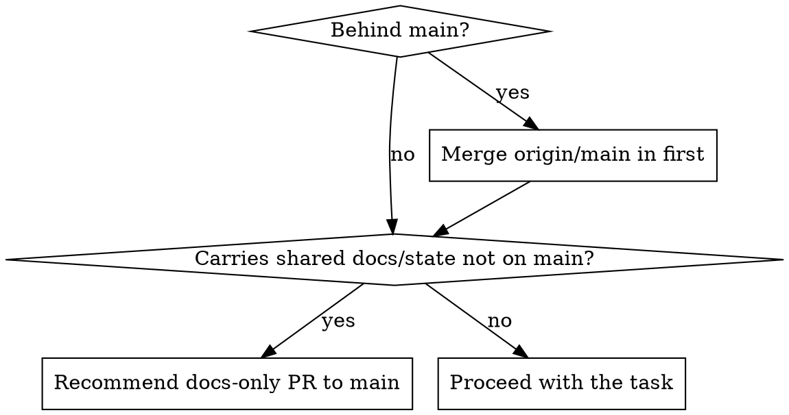

# Starting Branch Work

## Overview

When you pick up an existing branch with fresh context, its history was made out of your sight. Two silent failure modes are common:

1. **Drift** — the branch is behind `main` and missing shared updates (plans, runbooks, conventions) that landed since it forked, so you work from stale context.
2. **Trapped shared state** — the branch *contains* cross-cutting project state (deployment/architecture plans, runbooks, conventions, `CLAUDE.md`) that exists *only here*, so `main` and other branches can't see it.

Run the check below **before** you start changing things.

**REQUIRED BACKGROUND:** Use syncing-branches-with-main for the rule on where shared changes belong and how to land them on main.

## Run this check first

```bash
git fetch origin -q
git branch --show-current
git rev-list --left-right --count origin/main...HEAD          # => "<behind> <ahead>"
git diff --stat origin/main...HEAD | tail -1                  # scale of divergence
# shared state that may be trapped on this branch:
git diff --name-only origin/main...HEAD | grep -Ei 'docs?/|plan|runbook|readme|claude|conventions|\.md$'
```

## Decide



- **Behind `main`?** Merge it in before starting (`git merge origin/main`, or rebase) so the latest shared docs/conventions are in your context.
- **Branch carries shared docs/plans/state not on `main`?** Surface it to the user and recommend splitting those into a small docs-only PR to `main` (per syncing-branches-with-main) so every branch can pull them. Do **not** hand-copy them into other branches.
- **Only feature-specific changes?** Proceed with the task.

## Common mistakes

| Mistake | Fix |
| --- | --- |
| Assuming the branch is current | Always `git fetch` and compare to `origin/main` first |
| Treating a plan/doc on the branch as authoritative | Confirm it's also on `main`; the branch copy may be ahead of or behind the shared one |
| Hand-copying a doc into other branches "for context" | Land it on `main` once; branches `git merge origin/main` to pull it |
| Merging the whole branch to `main` just to ship a doc | Split the shared doc into its own PR cut from `main` |
| Skipping the check because "it's a small change" | Drift and trapped state are silent; the check is three commands |
