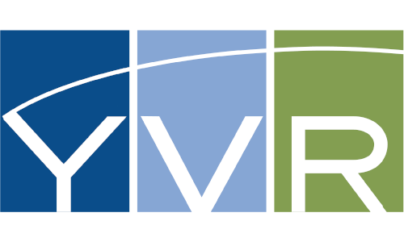
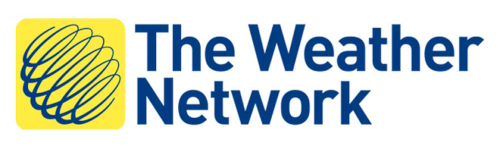

# What is FME?

**FME (the Feature Manipulation Engine)** is a data translation and transformation tool for solving problems of data interoperability, without the need for coding.

<iframe width="770" height="433" src="https://www.youtube.com/embed/5BtMsgRIiAA" frameborder="0" allow="autoplay; encrypted-media" allowfullscreen></iframe>

## History

Safe Software began in a basement in 1993, helping forestry companies exchange maps with the provincial government. Sure, it was technically possible to share the maps back then, but only after hours fighting with the data. Often, an incredible amount of information was lost in the process.

In short, nobody was happy. We built FME to change that.

We didn't start out with a business plan, but we did have a desire to help. Our passion for freeing data was ignited, and we've been on a mission to help people experience that freedom ever since. We're continuing to expand what’s possible with FME, the data integration software with the best spatial support in the world.

## Extract, Transform, and Load (these sections to be updated according to new marketing language)

<!-- Re-write this with updated marketing language -->

FME is sometimes classed as an **ETL** application. ETL stands for Extract, Transform and Load. It is a data warehousing tool that extracts data from multiple sources (here A and B), transforms it to fit the users’ needs and loads it into a destination (C):

While most ETL tools process only spreadsheet (i.e. tabular) data, FME also has the processing capabilities required to handle spatial data, hence the term **Spatial ETL**.

## How FME Works

At the heart of FME is an engine that supports an array of spatial and tabular data types and formats; GIS, CAD, BIM, Point Cloud, XML, Raster, databases, [and many more](https://www.safe.com/integrate/#!).

The capability to support so many data types is made possible by a rich data model that handles all possible geometry and attribute types.

Most importantly, the data translation process is seamless to the user; FME automatically converts between data types as required, and automatically substitutes one attribute or geometry type for another where the destination format does not support it.

## Who Uses FME?

FME has helped thousands of customers worldwide leverage their data so it can be used exactly where, when, and how it’s needed. Many of our customers are in the following industries:

- Architecture & Engineering
- Federal Government
- Local Government
- Oil & Gas
- Telecommunications
- Utilities

Here are a few examples of how people use FME.

### Vancouver International Airport

The Vancouver International Airport (YVR) wanted to provide passengers with indoor mapping data via their mobile app. To get to the airport from your home, you can use Google Maps to obtain driving directions or transit options, but what about once you get to the airport? How are you going to locate and get to your check-in counter and the appropriate security gate? After security, how are you going to find the nearest water fountain or café? Mapping the interior of building, or indoor mapping, is increasingly important to organizations who want to help their customers navigate inside spaces. YVR is one of the first airports to provide its indoor mapping data to Apple Maps, and its GIS team has proven their innovation by providing a variety of ways to navigate the public indoor spaces of the airport using digital technology. All of this is made possible by using FME.

### The Weather Network or Pelmorex Corp.

The Weather Network or Pelmorex Corp. used FME to create the [Pelmorex Lightning Detection Network (PLDN)](http://data.twncs.com/Solutions/Lightning/lightning.html). With FME Server’s data streaming and data download services, lightning strike data from their sensors all over Canada is restructured. It is then made accessible via [Google Earth™](https://www.google.com/earth/), an [ArcGIS® Flex™ Viewer](http://resources.arcgis.com/en/communities/flex-viewer/), email alerts, and more. This network required only 3 weeks to set up and runs automatically. Both real-time and archived strike data is immediately accessible for critical decision-making by Pelmorex clients, including insurance companies, government agencies, transportation companies, and public utilities.

### Tetrad Sitewise

[Tetrad](http://www.tetrad.com/) provides market analysis solutions to help their clients select sites for new business locations. They provide [Sitewise](http://www.tetrad.com/software/sitewisepro/) software using FME. Using FME, Sitewise can conduct analysis of competition, parking, transit accessibility, combining multiple datasets to make an educated assessment. Using FME, Sitewise provides custom tools to allow show their clients where their customers are travelling from, generate their trade area profile, and calculate market penetration by neighborhood. For more information, see [this recorded webinar](https://www.safe.com/webinars/market-analysis/).

Visit our website for more [customer stories](https://www.safe.com/customers/).

## Data Integration Platform

This module covers using FME Desktop for data translations and transformations at the desktop level. FME Desktop is one piece of software in the FME  data integration platform:

- [**FME Desktop**](https://www.safe.com/fme/fme-desktop/) lets you connect and transform data.
  - For example, taking an Excel spreadsheet of business information and addresses and adding it to a MySQL database that is the backend to a citizen data access portal that allows searching for business license information.
- [**FME Server**](https://www.safe.com/fme/fme-server/) provides enterprise-level automation.
  - For example, allowing business licensing officers working for a city government to add new business licenses to the database in real time by sending an email or filling out a web form.
- [**FME Cloud**](https://www.safe.com/fme/fme-cloud/) is the hosted version of FME Server in the cloud.
  - For example, the server that carries out the operation in the example above could be hosted in the cloud, rather than directly by the City.
