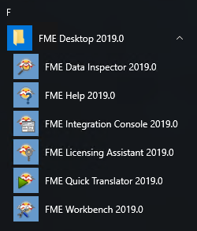
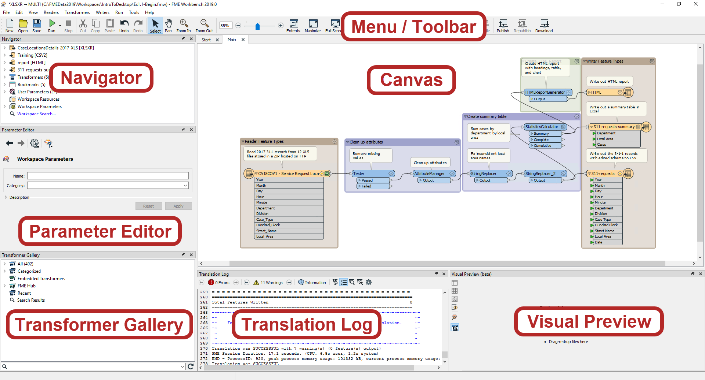
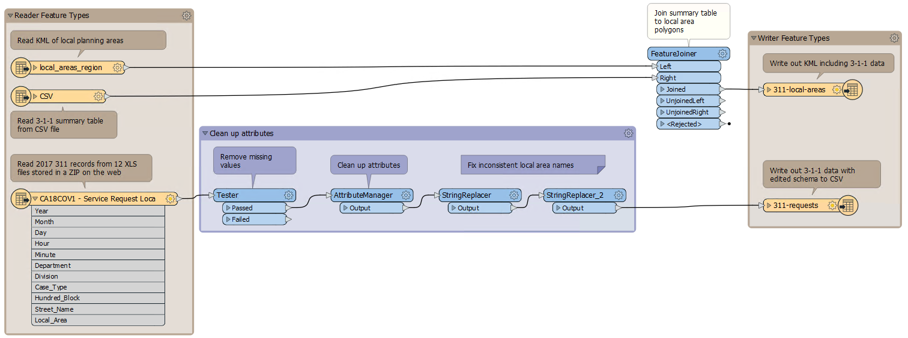
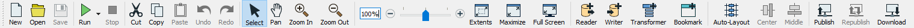
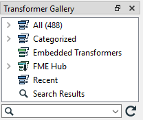
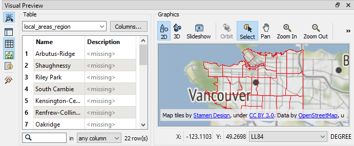

# FME Workbench

Let's take a closer look at FME Workbench. You can locate Workbench in the Windows start menu:





Feel free to follow along in Workbench during these informational sections if you wish. Alternatively, you can just complete the hands-on exercises in each unit, which will illustrate the concepts shown between exercises.

If you are using a virtual machine provided for training, we recommend opening Workbench now, as the first time opening on a new machine takes a moment.



## Major Components of FME Workbench

The FME Workbench user interface has many major components:

### Canvas

The FME Workbench canvas is where you define the translation. It is the primary window within Workbench:

By default the workspace reads from left to right; data source on the left, transformation tools in the center, and data destination on the right. Connections between each item represent the flow of data and may branch in different directions, merge together, or both.

### Menu/Toolbar

The menu bar and toolbar contain many tools: for example, tools for navigating around the Workbench canvas, controlling administrative tasks, and adding or removing readers/writers:

### Navigator

The Navigator window is a structured list of parameters that represent and control all of the components of a translation:

### Transformer Gallery

The transformer gallery is a tool for the location and selection of FME transformation tools. The number of transformers (below, 497) will vary depending on the version of FME and any optional custom transformers installed:

### Translation Log

The translation log reports on translations and other actions. Information includes any warning or error messages, translation status, length of translation, and the number of features processed:

### Parameter Editor Window

The Parameter Editor window is for editing parameters for objects on the canvas window:

### Visual Preview

Visual Preview is an embedded version of the FME Data Inspector that displays features in a table or on a map. This window lets you track how your data is changing as you build your translation. Many of the features available in the stand-alone Data Inspector application are available in Visual Preview. We'll discuss it more in a later section.

 <!-- update with map -->
