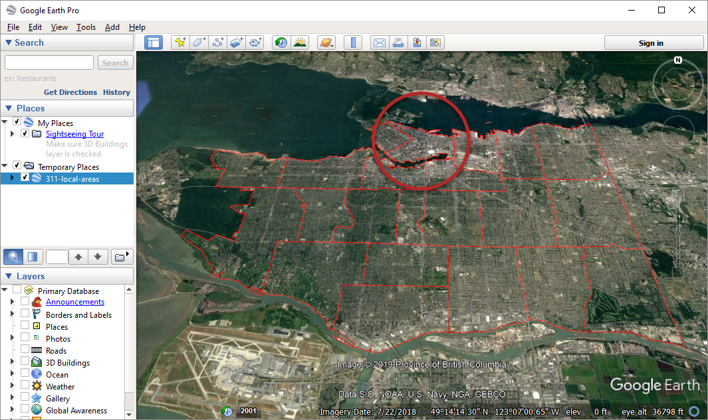

# FME Concepts Quiz

Each unit ends with a quiz to test your new knowledge. Make your selection and click "Check my answers" to check each individual question. If you want an explanation for the answer, click "Explain".

**Note**: your score won't be tallied; this is just for review purposes.

<quiz name="">
  <question>
    

      Which FME product lets you host your own server to automate workflows and run them on a schedule or in response to triggers?
    

      <answer>FME Desktop</answer>
      <answer correct>FME Server</answer>
      <answer>FME Cloud</answer>
    <explanation>Workspaces are built in FME Desktop, hosted by FME Server, and can be fully hosted in an AWS cloud environment using FME Cloud.</explanation>
  </question>
  <question>
    

      Which FME product offers a pay-as-you-go, fully hosted AWS cloud environment for your data integration workflows?
    

      <answer>FME Desktop</answer>
      <answer>FME Server</answer>
      <answer correct>FME Cloud</answer>
    <explanation>Workspaces are built in FME Desktop, hosted by FME Server, and can be fully hosted in an AWS cloud environment using FME Cloud.</explanation>
  </question>
  <question>
    

      Which FME product lets you build repeatable data conversion and transformation workflows using a drag-and-drop interface.
    

      <answer correct>FME Desktop</answer>
      <answer>FME Server</answer>
      <answer>FME Cloud</answer>
    <explanation>Workspaces are built in FME Desktop, hosted by FME Server, and can be fully hosted in an AWS cloud environment using FME Cloud.</explanation>
  </question>
  <question>
    

      Most data is divided or categorized into tables, layers, sheets, or classes. What is the FME umbrella term for these subdivisions?
    

    <answer>Data Types</answer>
    <answer correct>Feature Types</answer>
    <answer>Object Types</answer>
    <answer>Record Types</answer>
    <explanation>The basic unit of translation in FME is the feature. Groups of these are known as feature types.</explanation>
  </question>
  <question>
    
What is the hierarchy of FME components, going from largest to smallest?

    <answer>
        <option>Features</option>
        <option>Readers and Writers</option>
        <option correct>Workspaces</option>
        <option>Feature Types</option>
    </answer>
    <answer>
        <option>Features</option>
        <option correct>Readers and Writers</option>
        <option>Workspaces</option>
        <option>Feature Types</option>
    </answer>
    <answer>
        <option>Features</option>
        <option>Readers and Writers</option>
        <option>Workspaces</option>
        <option correct>Feature Types</option>
    </answer>
    <answer>
        <option correct>Features</option>
        <option>Readers and Writers</option>
        <option>Workspaces</option>
        <option>Feature Types</option>
    </answer>
    <explanation>
      Workspaces define translations. Workspaces contain reader(s) and writer(s), which control how data is read and written. Each reader and writer has feature type(s), which are logical groupings of features, the atom of FME data. For spreadsheet data, feature types are tables and features are rows; for spatial data, feature types are layers and features are single geometric features like points, lines, or polygons.
    </explanation>
  </question>
  <question>
    
Examine the output from Exercise 1.1. How many ENG - Streets cases were filed in the Downtown local planning area?

    <answer>3,351</answer>
    <answer>1,569</answer>
    <answer correct>2,541</answer>
    <answer>1,431</answer>
    <explanation>
      If you inspect C:\FMEData2020\Output\Training\311-local-areas.kml by opening it in a Google Earth Pro, you should be able to find the table for the Downtown local planning area. If you look at the table, you can see there are 2,541 cases listed under ENG - Streets.
    </explanation>
  </question>
</quiz>

  Downtown local planning area shown here:

  

