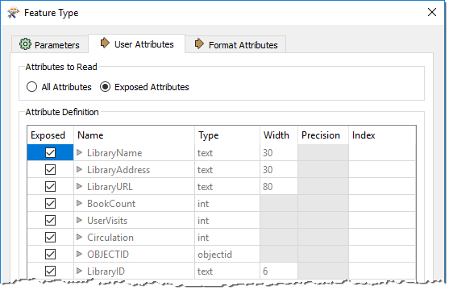

# Schema and Data Model

# Structural Transformation #
Transforming a dataset's structure requires using FME to manipulate *schemas*. FME uses the term "schema," but you may know this as *data model*.

## Schema Concepts ##
A ***schema*** defines the structure of a dataset. Each dataset has its unique schema; it includes layers, attributes, and other rules that define or restrict its content.

### Schema Representation ###
When a new workspace is created, FME scans the source datasets. It creates a ***reader*** whose layers are illustrated on the left side of the workspace canvas and a ***writer*** whose layers are illustrated on the right side of the workspace canvas:





Each object in this illustration represents a subdivision in the source dataset. In FME terminology these objects are called <strong>feature types</strong>. Multiple feature types means there are multiple layers in the source dataset.



### Reader Schema ###
For the reader, more information about the schema is revealed by clicking the cog-wheel icon on each feature type object:

This Feature Type dialog has a number of tabs. Under the Parameters tab is a set of general parameters, such as the name of the feature type (in this case Libraries) the allowed geometry types, and the name of the parent dataset:

The User Attributes tab shows a list of attributes. Each attribute is defined by its name, data type, width, and number of decimal places:

Each layer has a different name and can also have a completely different set of attributes. All of this information goes to make up the reader schema. It is literally ***"what we have"***.

### Writer Schema ###
As with the reader, each writer has a set of detailed schema information accessed by opening the dialog for a feature type:

By default, the writer schema (***"what we want"***) is a mirror image of the source, so the output from the translation will be a duplicate of the input. This feature allows users to translate from format to format without further edits (*Quick Translation*).

If *"what we want"* is different to the default schema definition, we have to change it using a technique called ***Schema Editing***.



FME supports 400+ formats and there are almost as many terms for the way data is subdivided. The most common terms are layer, table, class, category, level, or object.   Although the general FME term for these subdivisions is <strong>feature type</strong>, all dialogs in FME Workbench use format-specific terminology where the correct term is applicable.



## Exercise 2

<!-- Data Transformation Ex 1-3 shortened with tabular data -->

{{ template.exercise(2,
               "Schema Editing and Mapping",
               "?",
               "?",
               "Structural Transformation, Schema Editing, Schema Mapping",
               "None",
               "C:\FMEData2018\Workspaces\DesktopBasic\Transformation-Ex1-Complete.fmw")
}}

<!-- Edit and combine -->
<!-- Take generated CSV -> XLSX, show manual schema editing, show manual schema mapping, show editing + mapping with AttributeManager  -->

You have just landed a job as technical analyst in the GIS department of your local city.

The team responsible for maintaining parks and other grassed areas needs to know the area and facilities of each park in order to plan their budget for the upcoming year. You have been assigned to this project and will use FME to provide a dataset of this information.

The first step in this example is to rename existing attributes and create new ones in preparation for the later area calculations.

 **1) Start Workbench**
 Use the Generate Workspace dialog to create a workspace using these parameters:

<table style="border: 0px">

<tr>
<td style="font-weight: bold">Reader Format</td>
<td style="">MapInfo TAB (MITAB)</td>
</tr>

<tr>
<td style="font-weight: bold">Reader Dataset</td>
<td style="">C:\FMEData2018\Data\Parks\Parks.tab</td>
</tr>

<tr>
<td style="font-weight: bold">Writer Format</td>
<td style="">MapInfo TAB (MITAB)</td>
</tr>

<tr>
<td style="font-weight: bold">Writer Dataset</td>
<td style="">C:\FMEData2018\Output\Training</td>
</tr>

</table>

Yes! Here we write back to the same format of data we are reading from! You may click the Parameters buttons in the Generate Workspace dialog to check the reader/writer parameters, but none of them need changing in this exercise. Note that the writer needs only a folder and not a specific file name.

 **2) Rename Feature Type**
 FME creates a workspace where the destination schema matches the source. However, the end user of the data has requested parts of the schema are cleaned up.

Inspect the writer feature type parameters. Click in the field labelled Table Name (remember this label is format-specific and in MapInfo we deal with "tables") and change the name from Parks to ParksMaintenanceData:

 **3) Update Attributes**
 Now inspect the user attributes. They will look like this:

These must be cleaned up so that unnecessary information is removed. Other attributes need to be updated and some extra ones added to store the calculation results. So carry out the following actions:

<table style="border: 0px">

<tr>
<td style="font-weight: bold">Delete Attribute</td>
<td style="">RefParkID</td>
</tr>

<tr>
<td style="font-weight: bold">Delete Attribute</td>
<td style="">DogPark</td>
</tr>

<tr>
<td style="font-weight: bold">Delete Attribute</td>
<td style="">Washrooms</td>
</tr>

<tr>
<td style="font-weight: bold">Delete Attribute</td>
<td style="">SpecialFeatures</td>
</tr>

<tr>
<td style="font-weight: bold">Rename Attribute</td>
<td style="">from: NeighborhoodName</td>
<td style="">to: Neighborhood</td>
</tr>

<tr>
<td style="font-weight: bold">Change Type (VisitorCount)</td>
<td style="">from: smallint</td>
<td style="">to: integer</td>
</tr>

<tr>
<td style="font-weight: bold">Add Attribute</td>
<td style="">ParkArea</td>
<td style="">type: Float</td>
</tr>

<tr>
<td style="font-weight: bold">Add Attribute</td>
<td style="">AverageParkArea</td>
<td style="">type: Float</td>
</tr>

</table>

...and click the Parameter Editor "Apply" button. The attribute list should now look like this:

Now when the workspace is run the output will be named ParksMaintenanceData.tab and will contain an updated attribute schema.

 **4) Un-Expose Source Attributes**
 The workspace will now look like this:



Objects on the canvas can be resized (as in the above screenshot) if the feature type name or attribute names are too large to be displayed properly at the default size. The brown markers around the feature types are called <strong>bookmarks</strong>. They too can be resized to better fit their contents.



Notice there are several source attributes that are not going to be used in the workspace or sent to the output. We can tidy the workspace by hiding these.

Inspect the User Attributes tab on the reader feature type parameters. It will look like this:

Uncheck the check box for the following attributes, which we do not need:

- RefParkID
- Washrooms
- SpecialFeatures

This is the list of attributes we deleted, except for DogParks, which we will make use of in the translation.

Click Apply/OK to confirm the changes.

 **5) Save the Workspace**
 Save the workspace – it will be completed in further examples. It should now look like this:

So far we have been handling schema mapping manually. Let's do this using a **transformer** instead, which is a more systematic and reproducible way to handle attributes. Transformers are objects we add to the canvas to modify our data during the translation. We'll cover them in more detail in the next unit.

 **5) Add Transformer**
 Let's first handle the source attribute NeighborhoodName, which was renamed Neighborhood on the writer but not yet connected.

We could do this by simply drawing a connection, but it's generally better to use a transformer. There are two transformers we could use. One is called the AttributeRenamer and the other - which we shall use here - is the AttributeManager.

Therefore click on the feature connection from reader to writer feature type:

Start to type the phrase "AttributeManager." This method is how we can place a transformer in the workspace. As you type, FME searches for a matching transformer. When the list is short enough for you to see the AttributeManager, select it from the dialog (double-click on it):

Doing so will place an AttributeManager transformer:



For a great tip on adding transformers see #5 in our list of <strong><a href="http://blog.safe.com/2014/10/fmeevangelist128/">The Top Ten FME Tips of All Time!</a></strong>



 **6) Set Parameters**
 View the AttributeManager parameters (either its dialog or in the Parameter Editor window). It will look like this:

Notice that all of the attributes on the stream in which it is connected will automatically appear in the dialog.

Where the Input Attribute field is set to NeighborhoodName, click in the Output Attribute field. Click on the button for the drop-down list and in there choose Neighborhood as the new attribute name to use:

In response, the Action field will change to read *Rename*.



Neighborhood only appears in the list because it already exists on the writer schema. If we had done this step before editing the writer schema, we would have had to manually enter the new attribute name in this dialog.



Click OK to close the dialog. Now in the Workbench canvas window, you will see the Neighborhood attribute is flagged with a green arrow, to confirm that a value is being provided to that attribute.

 **7) Run Workspace**
 Save and run the workspace. It is not yet complete, but running it will prove that everything is working correctly up to this point. We'll inspect the output in the next section.
