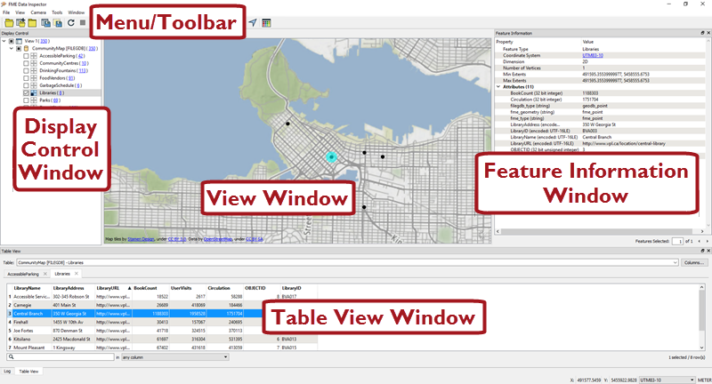
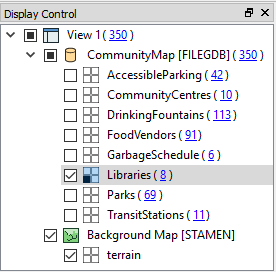
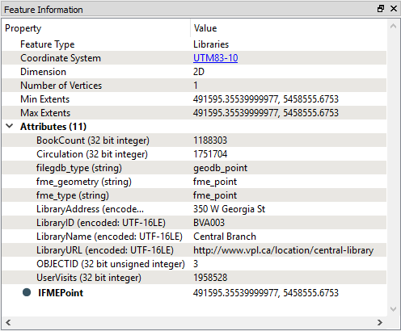
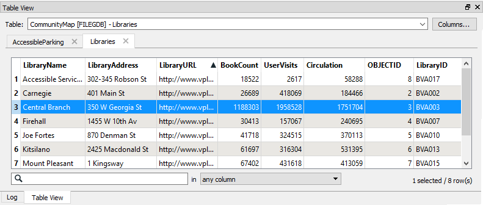
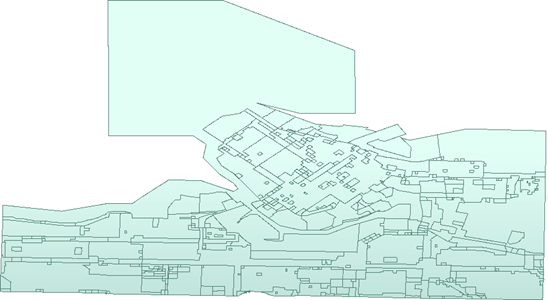
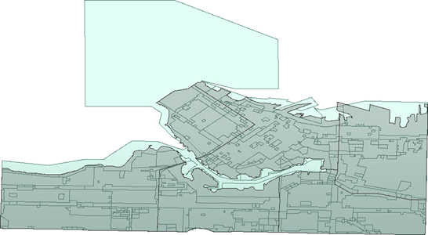

# Inspecting Data

# Introduction to Data Inspection #

To ensure that you're dealing with the right information you need a clear view of your data at every stage of the transformation process.

Data Inspection meets this need: it is the act of viewing data for verification and debugging purposes, before, during, or after a translation.

## What Can Be Inspected? ##
A number of different aspects of data may be inspected, including the following:

- **Format**: Is the data in the expected format?
- **Schema**: Is the data subdivided into the correct layers, categories or classes?
- **Geometry**: Is the geometry in the correct spatial location? Are the geometry types correct?
- **Symbology**: Is the color, size, and style of each feature correct?
- **Attributes**: Are all the required attributes present? Are all integrity rules being followed?
- **Quantity**: Does the data contain the correct number of features?
- **Output**: Has the translation process restructured the data as expected?

# Introduction to the FME Data Inspector #

The best place to start inspecting data in FME is in a complementary application called the FME Data Inspector.

## What is the FME Data Inspector? ##
The FME Data Inspector is a utility that allows viewing of data in any of the FME supported formats. It is used primarily to preview data before translation or to verify it after translation.

The FME Data Inspector is closely tied to FME Workbench so that Workbench can send data directly to the Inspector. It's also embedded inside FME Workbench too, to help set up and debug workspaces by inspecting data *during* the translation.

## What the FME Data Inspector Is Not! ##
The FME Data Inspector isn’t designed to be a form of GIS or mapping application. It has no analysis functionality, and the tools for symbology modification or printing are intended for data validation rather than producing map output.

## Starting the FME Data Inspector ##
To start the Data Inspector locate it in the Windows start menu:

## Major Components of the FME Data Inspector ##

When the FME Data Inspector is started, and a dataset is opened, it looks something like this:

 Map tiles by <a href="https://stamen.com">Stamen Design</a>, under <a href="https://creativecommons.org/licenses/by/3.0">CC-BY-3.0</a>. Data by <a href="http://openstreetmap.org">OpenStreetMap</a>, under <a href="http://creativecommons.org/licenses/by-sa/3.0">CC-BY-SA</a>.

### View Window ###
The View window is the spatial display area of the FME Data Inspector. Multiple views of different datasets may be opened at any one time.

 Map tiles by <a href="https://stamen.com">Stamen Design</a>, under <a href="https://creativecommons.org/licenses/by/3.0">CC-BY-3.0</a>. Data by <a href="http://openstreetmap.org">OpenStreetMap</a>, under <a href="http://creativecommons.org/licenses/by-sa/3.0">CC-BY-SA</a>.

## Menu bar and Toolbar ###
The menu bar and toolbar contain a number of tools. Some are for navigating around the View window, some control administrative tasks such as opening or saving a dataset, and others are for special functionality such as selective filtering of data or the creation of dynamic attributes.

### Display Control Window ###
The Display Control window shows a list of the open datasets and their feature types. Tools here let users turn these on or off in the display, alter their symbology, and adjust the display order.

### Feature Information Window ###
When users query a feature in the View window, information about that feature is shown in the Information window. This information includes the feature’s feature type, attributes (both user and format attributes), coordinate system and details about its geometry.

### Table View Window ###
The Table View window is a spreadsheet-like view of a dataset and includes all of the features and all of the attributes, with a separate tab for each feature type (layer).

# Exercise 3



{{ template.exercise(3,
               'Basic Data Inspection',
               '?,
               '?',
               'Inspect data, including feature caches and workspace output',
               "None",
               "None")
}}

<iframe width="770" height="433" src="https://www.youtube.com/embed/?listType=playlist&list=PLFxZDg3GNCguPKqew9ZvqCNZCZOoiwtC5&index=3" frameborder="0" allow="autoplay; encrypted-media" allowfullscreen></iframe>
_Video covering use of the FME Data Inspector_

<!-- Inspect data from previous exercise, then with feature caching, then normal? -->

In the previous exercise, you were asked to convert some data between formats. Before you send the converted data out, you should inspect it to make sure it is correct. Let’s see how the FME Data Inspector interface works by inspecting the output from that quick translation.

**1) Start FME Data Inspector**
 Start the FME Data Inspector by selecting it from the Windows start menu. You’ll find it under Start > FME Desktop 2018.0 > FME Data Inspector 2018.0.

 **2) Open Dataset**
 The FME Data Inspector will start up and begin with an empty view display.

To open a dataset, select File > Open Dataset from the menubar.
When prompted, fill in the fields in the Select Dataset dialog as follows:

<table style="border: 0px">

<tr>
<td style="font-weight: bold">Reader Format</td>
<td style="">GeoJSON (Geographic JavaScript Object Notation)</td>
</tr>

<tr>
<td style="font-weight: bold">Reader Dataset</td>
<td style="">C:\FMEData2018\Output\Training\Zones.json</td>
</tr>

</table>

***NB:*** *If you can't find the dataset - maybe you didn't complete the first exercise, or wrote the data to a different location - then you can open the original zoning dataset as described in Exercise 2.*

The GeoJSON dataset looks like this:

 **3) Browse Data**
 Use the windowing tools on the toolbar to browse through the dataset, inspecting it closely. Use the Query tool to query individual features and inspect the information in the Feature Information Window.

Try right-clicking in the different Data Inspector windows, to discover functionality that exists on context menus.

 **4) Add Dataset**
 Let's add a second dataset to the display to compare to our zoning data. This dataset will be a KML file of neighborhood boundaries. Then we'll be able to see which neighborhood each zone overlaps.

To add a dataset, select File > Add Dataset from the menubar. When prompted, fill in the fields in the Select Dataset dialog as follows:

<table style="border: 0px">

<tr>
<td style="font-weight: bold">Reader Format</td>
<td style="">Google KML</td>
</tr>

<tr>
<td style="font-weight: bold">Reader Dataset</td>
<td style="">C:\FMEData2018\Data\Boundaries\VancouverNeighborhoods.kml</td>
</tr>

</table>

The display now looks like this:

Use the Table View to practice inspecting the tabular data for each feature type. Click on the dropdown arrow at the top of Table View and switch back and forth between the Zones.json and Neighborhoods.kml tables:

<!-- Symbology? -->
