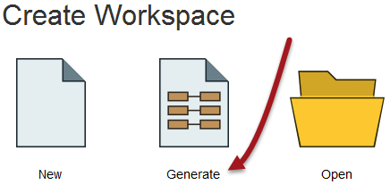
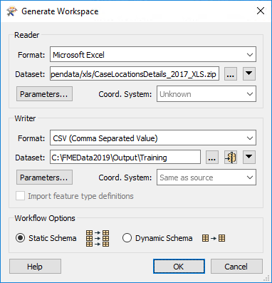
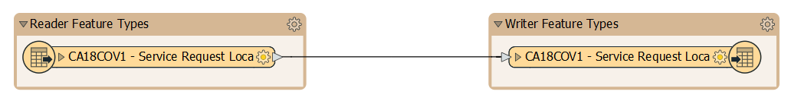
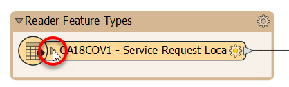
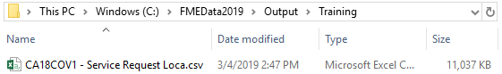

<!-- Question of if we want to start from Generate Workspace or Add Reader Add Writer -->



{{ template.exercise(2.1,
               "Basic Workspace Creation",
               "3-1-1 case location details (XLS hosted on FTP)",
               "Create a workspace to translate XLS to CSV",
               "Basic workspace creation with FME Workbench",
               "None",
               "C:\\FMEData2018\\Workspaces\\IntroToDesktop\\Ex2.1-Complete.fmw")
}}

Congratulations! You have just landed a job as a technical analyst in the Digital and Contact Centre Services department of your local city. You will be working to manage and analyze the data they collect from their 3-1-1 Contact Centre. [3-1-1](https://en.wikipedia.org/wiki/3-1-1) is a local phone number used widely across cities in the United States and Canada for citizens to call in and request services. Most cities also collect this data online now as well.

On your first day, you've been asked to do a simple file format translation. The 3–1–1 case data is currently stored as XLS files, one for each past month. These files are stored on the city's [FTP server](https://en.wikipedia.org/wiki/File_Transfer_Protocol). To host this public data in a format anyone can access, your manager wants you to translate the 12 XLS files from 2017 into a single CSV file covering the entire year.

We’ve outlined all of the actions you need to take, though FME's interface is so intuitive you should be able to carry out the exercise without the need for these step-by-step instructions.

# 1) Start FME Workbench

If it is not open already, start FME Workbench by selecting it from the Windows start menu. You’ll find it under Start > FME Desktop 2018.1 > FME Workbench 2018.1.

If Workbench is already open, click on the Start tab above the main canvas.

# 2) Select Generate Workspace

In the Create Workspace section of the Start page, select the option to Generate (Workspace). Alternatively, you can use the shortcut <kbd>Ctrl</kbd>+<kbd>G</kbd>.

<!--Repeat of Image 15-->


# 3) Define Translation

The Generate Workspace tool opens up a dialog in which to define the translation to be carried out. Fill in the fields in this dialog as follows:

<table style="border: 0px">

  <tr>
    <td style="font-weight: bold">Reader Format</td>
    <td style="">Microsoft Excel</td>
  </tr>

  <tr>
    <td style="font-weight: bold">Reader Dataset</td>
    <td style=""><a href="ftp://webftp.vancouver.ca/opendata/xls/CaseLocationsDetails_2017_XLS.zip">ftp://webftp.vancouver.ca/opendata/xls/CaseLocationsDetails_2017_XLS.zip</a><br><i>Note:</i> You can access the data locally at C:\FMEData2018\Resources\311\CaseLocationsDetails_2017_XLS.zip instead</td>
  </tr>

  <tr>
    <td style="font-weight: bold">Writer Format</td>
    <td style="">CSV (Comma Separated Value)</td>
  </tr>

  <tr>
    <td style="font-weight: bold">Writer Dataset</td>
    <td style="">C:\FMEData2018\Output\Training\</td>
  </tr>

</table>

The dialog will look like this:



Remember, you can set a format by typing its name, by selecting it from the drop-down list, or by choosing “More Formats” and selecting the format from the full table of formats. Note that the writer needs only a folder and not a specific file name.

You may click the Parameters buttons in the Generate Workspace dialog to check the reader/writer parameters, but none of them need changing in this exercise. For now, you can also ignore the Coordinate System setting and the Workflow Options.

# 4) Generate and Examine Workspace

Click OK to close the Generate Workspace dialog. FME Workbench generates a new workspace on the canvas:



You can expose the list of attributes by clicking the arrow icon on each object:



You can also expand the feature type to fit the entire name by hovering over its side until you get an expander arrow and then double-clicking:


# 5) Examine Bookmarks

Now that you've expanded your feature type, you might notice it no longer fits in the brown rectangle it was formerly contained in, labelled Reader Feature Types. This is a **bookmark**. Two were automatically created with Generate Workspace, but to follow FME best practice, we recommend using these to enclose sections of your workspace. Objects contained within them are grouped in the Navigator window and can be moved together on the canvas.

Bookmarks act like paragraphs for your workspaces, separating them into sections to keep them organized and help other users understand what each section does.

We'll use bookmarks later in the module, but for now let's just resize this one to contain the entire feature type. You can simply mouse over the bottom right corner until you see an expander arrow, and then click and drag to change the bookmark size to encompass the feature type:


Try moving the bookmark by clicking where it says "Reader Feature Types" and dragging. You'll notice the objects move with the bookmark.


Now your reader feature type should look like this:


# 6) Save Workspace

Save the workspace where ever you want. We will be using it in a later exercise. Remember there is a toolbar save button, and on the menu, there is File &gt; Save As.



When a translation is run immediately without adjustment it's known as a "Quick Translation." Because FME is a 'semantic' translator, with an enhanced data model, the output from a quick translation is as close to the source data in structure and meaning as possible, given the capabilities of the destination format.



# 7) Run Workspace

Run the workspace by clicking the run button on the toolbar, or by using Run > Run Translation on the menu bar. The workspace runs and the Translation Log window reports a successful translation:

```
=-=-=-=-=-=-=-=-=-=-=-=-=-=-=-=-=-=-=-=-=-=-=-=-=-=-=-=-=-=-=-=-=-=-=-=-=-=-=-
Feature output statistics for `CSV2' writer using keyword `CSV2_1':
=-=-=-=-=-=-=-=-=-=-=-=-=-=-=-=-=-=-=-=-=-=-=-=-=-=-=-=-=-=-=-=-=-=-=-=-=-=-=-
                               Features Written
=-=-=-=-=-=-=-=-=-=-=-=-=-=-=-=-=-=-=-=-=-=-=-=-=-=-=-=-=-=-=-=-=-=-=-=-=-=-=-
CA18COV1 - Service Request Loca                                          97345
==============================================================================
Total Features Written                                                   97345
=-=-=-=-=-=-=-=-=-=-=-=-=-=-=-=-=-=-=-=-=-=-=-=-=-=-=-=-=-=-=-=-=-=-=-=-=-=-=-
=-=-=-=-=-=-=-=-=-=-=-=-=-=-=-=-=-=-=-=-=-=-=-=-=-=-=-=-=-=-=-=-=-=-=-=-=-=-=-
                            Features Read Summary
=-=-=-=-=-=-=-=-=-=-=-=-=-=-=-=-=-=-=-=-=-=-=-=-=-=-=-=-=-=-=-=-=-=-=-=-=-=-=-
CA18COV1 - Service Request Loca                                          97345
==============================================================================
Total Features Read                                                      97345
=-=-=-=-=-=-=-=-=-=-=-=-=-=-=-=-=-=-=-=-=-=-=-=-=-=-=-=-=-=-=-=-=-=-=-=-=-=-=-
=-=-=-=-=-=-=-=-=-=-=-=-=-=-=-=-=-=-=-=-=-=-=-=-=-=-=-=-=-=-=-=-=-=-=-=-=-=-=-
                           Features Written Summary
=-=-=-=-=-=-=-=-=-=-=-=-=-=-=-=-=-=-=-=-=-=-=-=-=-=-=-=-=-=-=-=-=-=-=-=-=-=-=-
CA18COV1 - Service Request Loca                                          97345
==============================================================================
Total Features Written                                                   97345
=-=-=-=-=-=-=-=-=-=-=-=-=-=-=-=-=-=-=-=-=-=-=-=-=-=-=-=-=-=-=-=-=-=-=-=-=-=-=-
Translation was SUCCESSFUL with 0 warning(s) (97345 feature(s) output)
FME Session Duration: 9.6 seconds. (CPU: 7.9s user, 1.1s system)
END - ProcessID: 21560, peak process memory usage: 98484 kB, current process memory usage: 50760 kB
Translation was SUCCESSFUL
```

# 8) Locate Output

Locate the destination data in Windows Explorer to prove that it's been written as expected (do not forget the Open Containing Folder button from Exercise 1):



For now, let's use Notepad to ensure the data looks as we would expect. Right-click on *CA18COV1 - Service Request Loca.csv* and choose Open With > Notepad. If you look at the top row, you should see the attribute names we saw under the writer feature type:

`Year,Month,Day,Hour,Minute,Department,Division,Case_Type,Hundred_Block,Street_Name,Local_Area`

In the next exercise, we’ll cover how to inspect the data using FME Data Inspector.



<ul>
  <li>Generate an FME workspace</li>
  <li>Run an FME workspace</li>
</ul>


