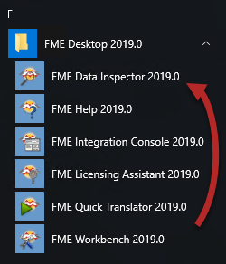
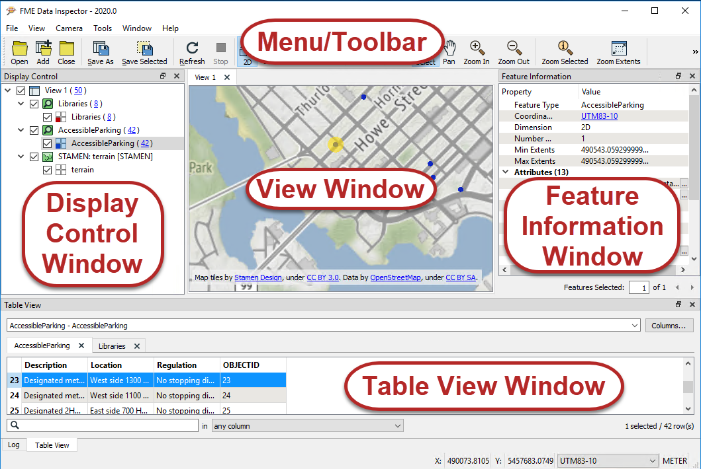
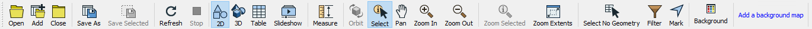

# Inspecting Data

# Introduction to Data Inspection

To ensure that you're dealing with the right information you need a clear view of your data at every stage of the transformation process.

Data Inspection meets this need: it is the act of viewing data for verification and debugging purposes, before, during, or after a translation.

# Introduction to the FME Data Inspector

The best place to start inspecting data in FME is in a complementary application called the FME Data Inspector.

## What is the FME Data Inspector?

The FME Data Inspector is a utility that allows viewing of data in any of the FME supported formats. It is used primarily to preview data before translation or to verify it after translation.

The FME Data Inspector is closely tied to FME Workbench so that Workbench can send data directly to the Inspector. It's also closely connected to FME Workbench, to help set up and debug workspaces by inspecting data *during* the translation.

## What the FME Data Inspector Is Not!

The FME Data Inspector isn’t designed to be a form of GIS or mapping application. It has no analysis functionality, and the tools for symbology modification or printing are intended for data validation rather than producing map output.

## Starting the FME Data Inspector

To start the Data Inspector locate it in the Windows start menu:

## Major Components of the FME Data Inspector

When FME Data Inspector opens a dataset, it looks something like this:

 Map tiles by <a href="https://stamen.com">Stamen Design</a>, under <a href="https://creativecommons.org/licenses/by/3.0">CC-BY-3.0</a>. Data by <a href="http://openstreetmap.org">OpenStreetMap</a>, under <a href="http://creativecommons.org/licenses/by-sa/3.0">CC-BY-SA</a>.

### View Window

The View window is the spatial display area of the FME Data Inspector. Multiple views of different datasets may be open at any one time.

 Map tiles by <a href="https://stamen.com">Stamen Design</a>, under <a href="https://creativecommons.org/licenses/by/3.0">CC-BY-3.0</a>. Data by <a href="http://openstreetmap.org">OpenStreetMap</a>, under <a href="http://creativecommons.org/licenses/by-sa/3.0">CC-BY-SA</a>.

## Menu bar and Toolbar

The menu bar and toolbar contain many tools. Some are for navigating around the View window, some control administrative tasks such as opening or saving a dataset, and others are for particular functions such as selective filtering of data or the creation of dynamic attributes.

### Display Control Window

The Display Control window shows a list of the open datasets and their feature types. Tools here let users turn these on or off in the display, alter their symbology, and adjust the display order.

### Feature Information Window

When you query a feature in the View window, the Information window shows information about that feature. This information includes the feature’s feature type, attributes (both user and format attributes), coordinate system and details about its geometry.

### Table View Window

The Table View window is a spreadsheet-like view of a dataset and includes all of the features and all of the attributes, with a separate tab for each feature type (layer).

