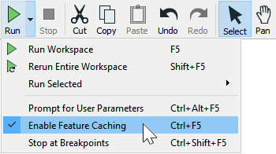
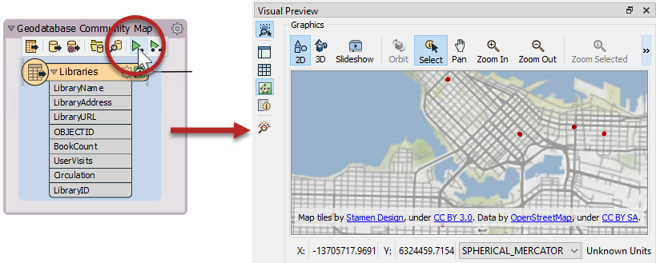
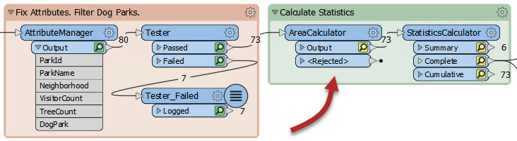
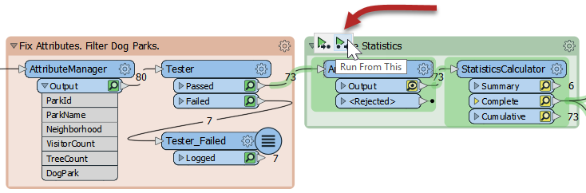
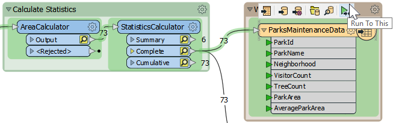

# Feature Caching

Sometimes it's important to be able to inspect data at any step of the translation. FME has an option to cache data automatically: **feature caching**. You can turn it on or off (it defaults on) by clicking the dropdown next to the Run button on the toolbar and clicking **Enable Feature Caching**:

When caching is turned on, running a translation causes data to cache at every part of the workspace. In subsequent runs, those caches can be used instead of having to re-run entire sections of the workspace.

Here, for example, a workspace has been run with caching turned on:

You can click the green magnifying glass icon to inspect the features at that point of the translation.





Notice the numbers along feature connection lines? They are called <a href="https://docs.safe.com/fme/html/FME_Desktop_Documentation/FME_Workbench/Workbench/Setting_the_Feature_Count_Display.htm"><strong>feature counts</strong></a>. They show the number of features that passed through that connection. These numbers are useful for debugging purposes, so pay attention to them as you build and run your workspace.



## Feature Caching and Visual Preview

With feature caching and Toggle Automatic Inspect on Selection both enabled, if you click a feature type or transformer with a cache, it will automatically be displayed in Visual Preview:

Inspecting data this way can allow you to quickly debug and develop workspaces, but keep in mind that if you are inspecting a large number of features or features with complex geometry, automatic inspection might introduce performance challenges.

# Partial Runs

A partial run is when only one section of a workspace executes.

Consider if the author above makes a change to the AreaCalculator parameters:

Notice that the caches change color (to yellow) on the AreaCalculator transformer and subsequent transformers. This color denotes that caches are stale; their data contents no longer match what the workspace would produce.

To get the new results, the author must re-run the workspace. However, they do not have to re-run the entire workspace; they can start the workspace at the point of change - the AreaCalculator:

**Run From This** causes the workspace to run from that point only, using data cached up until that point. Notice how hovering over the option highlights all "downstream" transformers. They are the only ones that will run. That makes the translation quicker.

The other option is **Run To This**. The author could use that option on the writer feature type and get much the same effect:

...but notice how the second branch from the StatisticsCalculator does not get highlighted. It will not run. That shows how you can avoid running a particular section of workspace.



A partial run is particularly useful in avoiding re-reading data from its source; especially when the data comes from a slow, remote location such as a web service.

Also, caches can be saved with the workspace when saved as a template. That means the workspace can be re-run using the caches from a previous session or even from another author!




  

  Be aware that while using feature caching and partial runs can speed up your development of a workspace, caching data obviously causes the translation to be slower and to use system resources such as disk space. Caching is very useful while developing a workspace, but should be turned off before putting a workspace into production.

  


{{ fcwarning | replace("---", "") }}
