

{{ template.exercise(2.4,
               "Schema Editing and Mapping",
               "3-1-1 case location details (XLS hosted on the web)",
               "Edit attribute names and remove attributes",
               "Schema editing and schema mapping",
               "C:\\FMEData2019\\Workspaces\\IntroToDesktop\\Ex2.4-Begin.fmw",
               "C:\\FMEData2019\\Workspaces\\IntroToDesktop\\Ex2.4-Complete.fmw")
}}

Now that you created a workspace to translate the 3-1-1 data to CSV, the 3-1-1 department has requested that you remove the underscores from the attribute names and add a `Date` attribute. We can use a transformer to make these changes to the schema.

**1) Start Workbench**

Start Workbench (if necessary) and open the completed workspace from [Exercise 2.1](..\2.translations\2.03.ex2.1.md). Alternatively you can open C:\FMEData2019\Workspaces\IntroToDesktop\Ex2.3-Begin.fmw.

**2) Rename Feature Type**

Currently, the writer feature type schema matches the reader feature type schema. However, the end user of the data has requested changes to the schema.

Inspect the writer feature type parameters by double-clicking it or clicking its cogwheel:

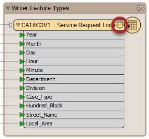

In the Feature Type dialog that opens, click in the field labelled CSV File Name and change the name from "CA18COV1 - Service Request Loca" to "311-requests":

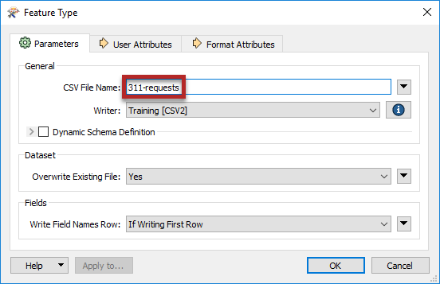

Now when the workspace runs, the output will be named **311-requests.csv**.

**3) Update Attributes**

Inspect the user attributes by clicking on the User Attributes tab. They will look like this:

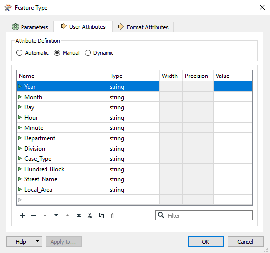

Let's get rid of those underscores in the attribute names and add a new attribute, called `Date`, that we will supply values to later.

You can rename attributes by clicking in the Name cell and making your edit. You can add an attribute by clicking in the blank Name cell at the bottom of the table and entering a new attribute name. Alternatively, you can use the `+` button to add a new row.  You can give it the Type `string` by clicking the drop-down menu under Type and selecting `string`.

Carry out the following actions:

|Name|Action|
|-|-|
|`Case_Type`|Rename attribute to `Case Type`|
|`Hundred_Block`|Rename attribute to `Hundred Block`|
|`Street_Name`|Rename attribute to `Street Name`|
|`Local_Area`|Rename attribute to `Local Area`|
|`Date`|Create attribute `Date` of Type `string`|

Once you have made these changes to the writer schema, the attribute list should now look like this:

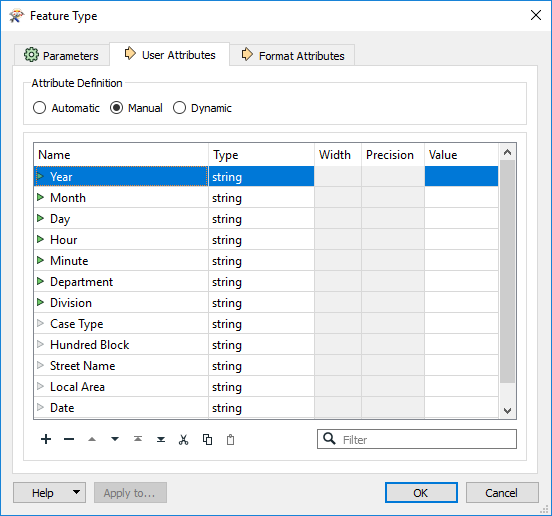

Now click OK.

Notice that the triangles next to the attribute names we edited and created on the writer feature type have changed color to red! We call these triangles **ports**. When they are on the left side of an object, they are called **input ports**, while triangles on the right side are called **output ports**. You can notice that on the reader feature type, the attributes we edited have changed color to yellow.



Colored ports are used to aid schema mapping visually:

<ul>
  <li>Green &#9654;: this attribute is connected.</li>
  <li>Yellow &#9654;: this reader feature type attribute is not mapped to any writer feature type; therefore, this attribute will not be in the output.</li>
  <li>Red &#9654;: this writer feature type attribute is not connected; while it exists in the schema, it will not receive any data and therefore will not have any values in the written data.</li>
</ul>



**4) Save the Workspace**

Save the workspace. It should now look like this:

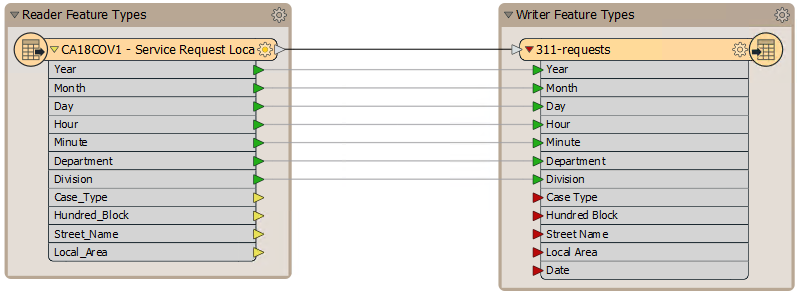

**5) Add a Transformer for Schema Mapping**

Let's use a **transformer** to map our old schema onto our new one. Transformers are objects we add to the canvas to modify our data during the translation. We can use the [AttributeManager](http://docs.safe.com/fme/html/FME_Desktop_Documentation/FME_Transformers/Transformers/attributemanager.htm).

To add a transformer, click on the feature connection (dark black line) from reader to writer feature type:

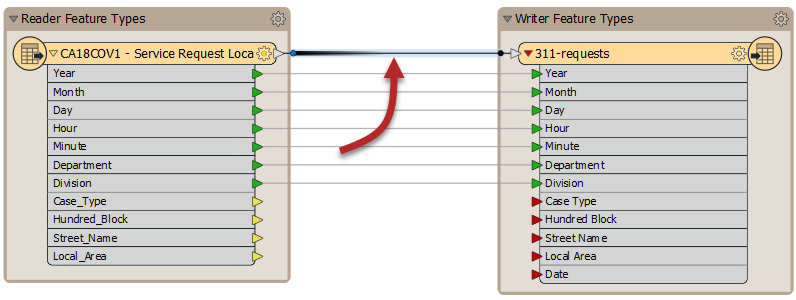

Start to type the phrase "AttributeManager." As you type, FME searches for a matching transformer, a feature called **Quick Add**. When the list is short enough for you to see the AttributeManager, select it from the dialog (double-click on it, or hit <kbd>Enter</kbd>):

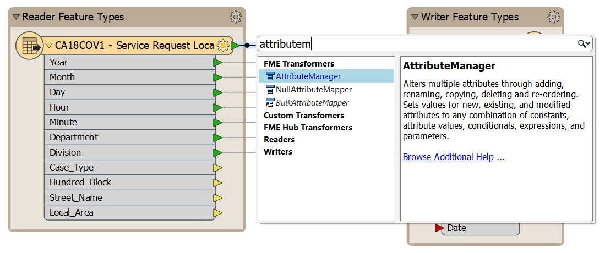

Doing so will place an AttributeManager transformer:

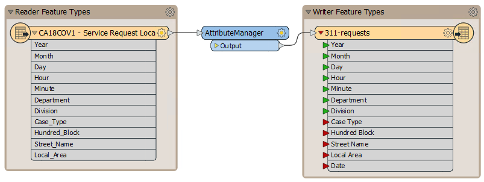



For a great tip on adding transformers, see #5 in our list of <strong><a href="http://blog.safe.com/2014/10/fmeevangelist128/">The Top Ten FME Tips of All Time!</a></strong>



**6) Set Parameters**

View the AttributeManager parameters by double-clicking it. It will look like this:

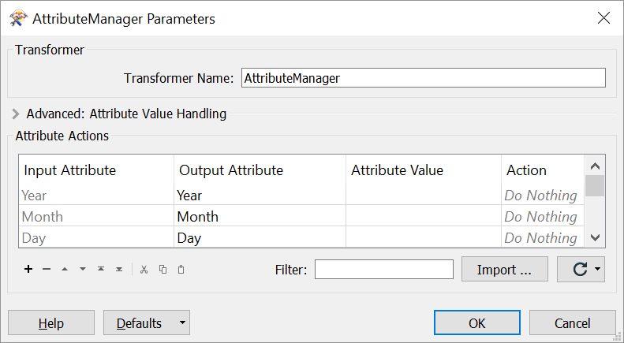

You might have to resize your AttributeManager dialog to see all four columns. You can resize dialogs by hovering over the bottom right corner until you see an expander cursor, and then clicking and dragging:

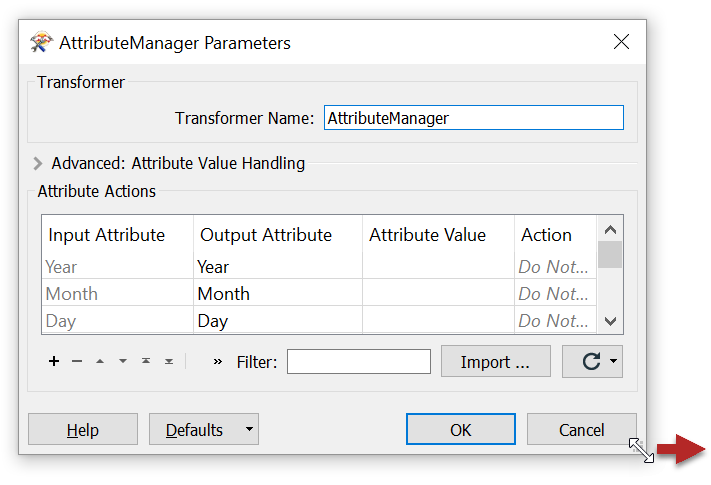

Notice that all of the attributes on the stream in which it is connected automatically appear in the dialog.

Where the Input Attribute field is `Case_Type`, click in the Output Attribute field. Click on the button for the drop-down list and in there choose `Case Type` as the new attribute name to use:

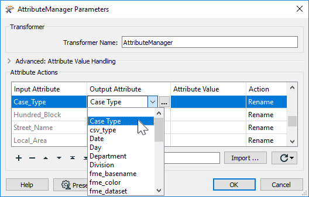

In response, the Action field will change to read *Rename*.



`Case Type` appears in the list because it already exists on the writer feature type. If we had done this step before editing the writer schema, we would have had to enter the new attribute name in this dialog manually.

Note that this feature (looking ahead to the attributes on the writer feature type) is only needed in some related transformers, e.g. AttributeRenamer and AttributeCopier. Normally drop-down attribute lists contain just the attributes on incoming features.



Click OK to close the dialog. Now in the Workbench canvas window, you will see the `Case Type` attribute is flagged with a green arrow, to confirm that the attribute has a value.

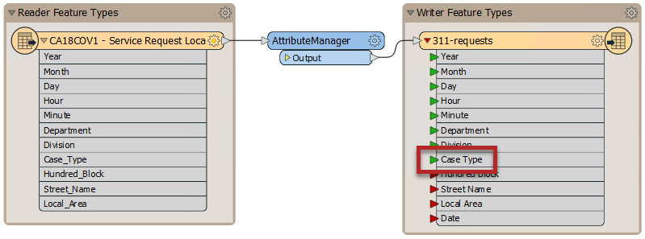

Reopen the AttributeManager dialog and repeat this step for the remaining attributes with underscores.

**8) Create a `Date` Attribute**

We also want to add a new attribute, `Date`. We could use several different transformers to accomplish this; again, there are often many solutions to a problem in FME. For example, we could use the [ExpressionEvaluator](http://docs.safe.com/fme/html/FME_Desktop_Documentation/FME_Transformers/Transformers/expressionevaluator.htm) or [StringConcatenator](http://docs.safe.com/fme/html/FME_Desktop_Documentation/FME_Transformers/Transformers/stringconcatenator.htm). In this case, let's keep our workspace efficient by creating the attribute within the AttributeManager.

Go to the bottom of the Attribute Actions table and notice the last row is empty except for the text `<Add new Attribute>`. Click this text and type in `Date`. You might see it appears as an option in the drop-down menu; FME will look ahead to your writer schema to help you find attributes. After you type in or select `Date` and then click somewhere else, the Action cell updates to `Set Value`:

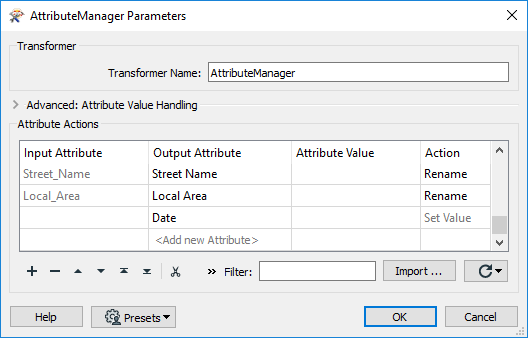

After clicking OK, you should see the input ports on the writer feature type all turn green. You have successfully mapped the schema.

**9) Run Workspace and Inspect the Output**

Save the workspace.

Then, let's use the feature caching and partial runs. Click on the AttributeManager to select it, and then click Run To This:

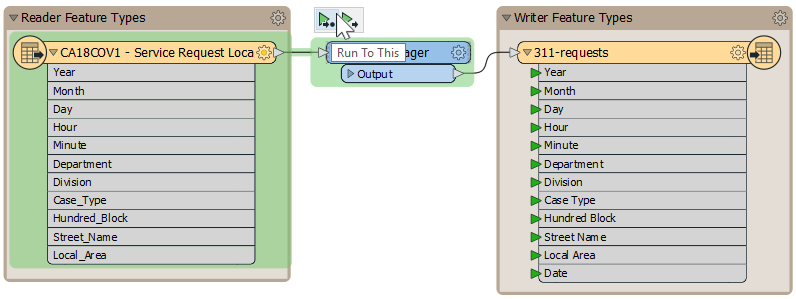

Once the cache updates, select the AttributeManager to inspect the changes to your schema in Visual Preview:

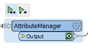

Looking at the Table View, we can see our schema has been edited to remove the underscores from attribute names and to add a Date attribute (which is empty for now):



<ul>
  <li>Edit the attributes of a writer schema</li>
  <li>Edit the output layer name on a writer schema</li>
  <li>Add transformers to a workspace</li>
  <li>Carry out schema mapping with the AttributeManager transformer</li>
</ul>


