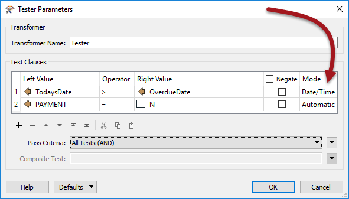
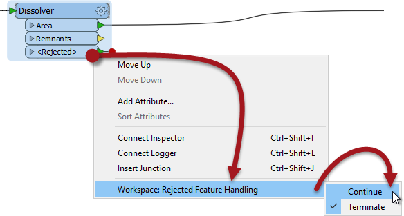
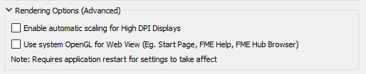

# 2018 Overview #

FME Desktop 2018 introduces many new tools and functionality to both FME Workbench and the FME Data Inspector. These tools make wide-ranging changes to the methods workspace authors use in designing and creating workspaces.

## Top Tools ##
The most important new tools will be covered during this course. They are:

- **Caches and Partial Runs**
	- The ability for FME to cache data at each point of a translation, and to re-use that cached data.
- **Collapsible Bookmarks**
	- The ability for bookmarks to be collapsed to simple input/output ports, to hide the contents.
- **Precision and Tolerance Parameters**
	- The ability to set tolerance on a number of spatial operations, to work around coordinate precision differences.
- **Microsoft Formats**
	- The ability to write data to Microsoft PowerPoint and Microsoft Word, and the addition of styling transformers for all Microsoft formats
- **FeatureJoiner**
	- A SQL-based transformer for carrying out joins in a more powerful version of the FeatureMerger

## Other Updates ##
Besides these top tools, it is also worth mentioning other highlights from the FME2018 release:

### New Formats ###
There are multiple new formats supported in FME2018, with over 50 new raster formats based on GDAL technology. Some of the key formats are:

- Apple Venue Format (AVF) Reader and Writer
- Bentley i-Model Reader
- Esri Indexed 3D Scene Layer (I3S)
- LDAP (Active Directory) Reader
- PCD (Point Cloud Data) Reader and Writer
- PDF Reader (2D/Raster/Text)
- Qlik Data Exchange Writer
- Well Log ASCII Standard (WLAS) Reader

### New Transformers ###
Aside from Microsoft-related functionality, new transformers in 2018 mostly revolve around connecting to web services:

- HDFSConnector (Hadoop)
- ProjectWiseConnector
- S3Connector
- SalesforceConnector

### Workbench Updates ###
FME Workbench includes a number of upgrades - some small, some large - separate to what this course covers. These include:

- Copy/paste transformer parameters
- Dynamic log window filtering
- FeatureWriter output ports
- New geometry type support (clothoids and 3D arcs)
- Support for new German and Australian coordinate system datums
- Tester DateTime support

- Change Rejected Feature handling with a right-click

- Annotation word wraps by default. Bookmarks filled by default
- New Windows rendering options for high DPI displays and web views

---

## Further Reading ##

For more information on what else is new and great in FME 2018, see the **[FME2018 unveiling webinar](https://www.safe.com/webinars/unveiling-fme-2018/)**, the **[FME Desktop Deep Dive webinar](https://www.safe.com/webinars/deep-dive-fme-desktop-2018/)**, and the **[FME Server Deep Dive webinar](https://www.safe.com/webinars/deep-dive-fme-server-2018/)**

