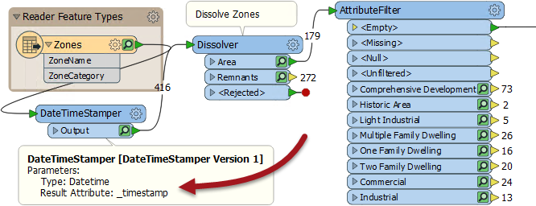
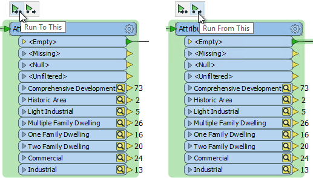
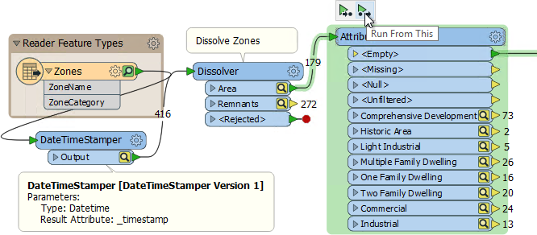
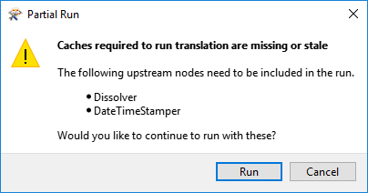

## Cached Data Status ##
When the cache on a transformer or feature type is green, it means that the cache is up-to-date; i.e. the cache represents the data that would be produced were the workspace to be run at that point.

Here the workspace creates a datetime attribute and the workspace is run to fill the caches:

However, when the workspace is edited, caches can change color to yellow. This means the cache is no longer up-to-date; i.e. the cache no longer represents the data that would be produced were the workspace to be run.

Here the DateTimeStamper has been changed to create a date only attribute:

All caches after (downstream of) the DateTimeStamper turn to yellow to indicate they no longer represent the workspace. But caches before (upstream of) the DateTimeStamper remain green, because they are no longer affected.

---

## Reusing Cached Features ##
The main reason the functionality changed name from Full Inspection to Feature Caching, is that the cached data can now be used for purposes other than inspection.

When it is time to run a workspace, data can be automatically retrieved from green caches and used downstream of that point. For example, in the above workspace data does not need to be read from the source dataset because it is already available in an up-to-date cache.

This is achieved by clicking on the transformer you wish to run, and using one of the two pop-up actions:

The two options are **Run to This** and **Run from This**.

**Run To This** runs the workspace up to, and including, the chosen transformer. It's perfect for when that transformer has been edited, and you want to see what the result that transformer alone is.

**Run From This** (shortcut F6) runs the workspace from the chosen transformer onwards. It's perfect for when that transformer has been edited, and you want to see what the final workspace results will be.

Hovering over one of these options causes the section of workspace to be run to highlight in green:

Here the AttributeFilter transformer is being run, the data being fetched from the prior cache. However, because the prior cache is yellow, and out-of-date, FME will inform the user that it must go back further to obtain a valid cache and run the extra transformers in between:

If the author wishes to re-run the entire workspace, they can do that using the usual run button (or F5), which will re-run the workspace and (assuming the Feature Caching option is turned on) refill all of the caches.

---

<!--Tip Section--> 

<table style="border-spacing: 0px">
<tr>
<td style="vertical-align:middle;background-color:darkorange;border: 2px solid darkorange">
<i class="fa fa-info-circle fa-lg fa-pull-left fa-fw" style="color:white;padding-right: 12px;vertical-align:text-top"></i>
TIP
</td>
</tr>

<tr>
<td style="border: 1px solid darkorange">

A Junction transformer can play a useful part in Partial Runs. For example, here the workspace is split into two streams. If I wish to run both streams simultaneously, then the only command would be Run From This on the SpatialSorter. 
  
  But that means the SpatialSorter will also be run. If I want to run both streams but not the SpatialSorter, then a Junction transformer in the appropriate location will allow me to do that. I can Run From This on the Junction transformer itself, which has little overhead.

</td>
</tr>
</table>

---

### Why Reuse Cached Data? ###
The obvious reason for using cached data is one of performance. If the workspace can use data that was cached in a previous transformer, then that transformation does not need to occur again. When building a workspace one transformer at a time, the workspace can be tested at each step and only the current transformer needs to be executed.

Similarly this can prevent excess reading of data. If data is being read from a database on a network, for example, then a cache of data prevents FME from having to make subsequent calls to that database. It saves on both network traffic and query time.

Additionally, this is a great tool to use for caching the results of web services. For example, records being sent to a web service for geocoding might incur an actual monetary cost for that service. But now FME is able to cache that data and reuse it, avoiding the need to repeatedly use that web service.

---

<!--Person X Says Section-->

<table style="border-spacing: 0px">
<tr>
<td style="vertical-align:middle;background-color:darkorange;border: 2px solid darkorange">
<i class="fa fa-quote-left fa-lg fa-pull-left fa-fw" style="color:white;padding-right: 12px;vertical-align:text-top"></i>
Ms Analyst says...
</td>
</tr>

<tr>
<td style="border: 1px solid darkorange">

Obviously data caching takes no account of what might have changed in the source dataset. It only knows what has been changed in the workspace. It's up to the workspace author to be aware of if the source dataset has changed and therefore needs to be refreshed with a new run.

</td>
</tr>
</table>