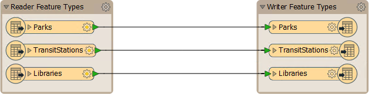

# Structural Transformation #
Transforming a dataset's structure requires using FME to manipulate *schemas*. FME uses the term "schema", but you may know this as *data model*.

## Schema Concepts ##
A ***schema*** defines the structure of a dataset. Each dataset has its own unique schema; it includes layers, attributes, and other rules that define or restrict its content.

### Schema Representation ###
When a new workspace is created, FME scans the source datasets. It creates a ***reader*** whose layers are illustrated on the left side of the workspace canvas, and a ***writer*** whose layers are illustrated on the right side of the workspace canvas:

<!--Tip Section--> 

<table style="border-spacing: 0px">
<tr>
<td style="vertical-align:middle;background-color:darkorange;border: 2px solid darkorange">
<i class="fa fa-info-circle fa-lg fa-pull-left fa-fw" style="color:white;padding-right: 12px;vertical-align:text-top"></i>
TIP
</td>
</tr>

<tr>
<td style="border: 1px solid darkorange">

Each object in this illustration represents a subdivision in the source dataset. In FME terminology these objects are called <strong>feature types</strong>. Multiple feature types means there are multiple layers in the source dataset.

</td>
</tr>
</table>

---

### Reader Schema ###
For the reader, more information about the schema is revealed by clicking the cog-wheel icon on each feature type object:

This Feature Type dialog has a number of tabs. Under the Parameters tab is a set of general parameters, such as the name of the feature type (in this case Libraries) the allowed geometry types, and the name of the parent dataset:

The User Attributes tab shows a list of attributes. Each attribute is defined by its name, data type, width, and number of decimal places:

Each layer has a different name and can also have a completely different set of attributes. All of this information goes to make up the reader schema. It is literally ***"what we have"***.

### Writer Schema ###
As with the reader, each writer has a set of detailed schema information accessed by opening the dialog for a feature type:

By default, the writer schema (***"what we want"***) is a mirror image of the source, so the output from the translation will be a duplicate of the input. This allows users to translate from format to format without further edits (*Quick Translation*).

If *"what we want"* is different to the default schema definition, we simply have to change it using a technique called ***Schema Editing***.

---

<!--Tip Section--> 

<table style="border-spacing: 0px">
<tr>
<td style="vertical-align:middle;background-color:darkorange;border: 2px solid darkorange">
<i class="fa fa-info-circle fa-lg fa-pull-left fa-fw" style="color:white;padding-right: 12px;vertical-align:text-top"></i>
TIP
</td>
</tr>

<tr>
<td style="border: 1px solid darkorange">

FME supports 400+ formats and there are almost as many terms for the way data is subdivided. The most common terms are layer, table, class, category, level, or object.
  Although the general FME term for these subdivisions is <strong>feature type</strong>, all dialogs in FME Workbench use format-specific terminology where the correct term is applicable.

</td>
</tr>
</table>
