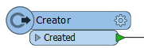
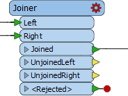
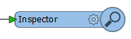
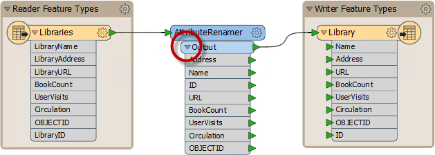

# Transformation with Transformers #

Besides Schema Editing and Schema Mapping, transformation can be carried out using objects called ***transformers***.

## What is a Transformer? ##

As the name suggests, a transformer is an FME Workbench object that carries out transformation of features. There are lots of FME transformers, each of which carry out many different operations.

Transformers are connected somewhere between the reader and writer feature types, so that data flows from the reader, through a transformation process, and on to the writer.

Transformers usually appear in the canvas window as rectangular, light-blue objects.

## Transformer Parameters ##
Each transformer may have a number of parameters (settings). Parameters can be accessed (like feature types) by clicking the cogwheel icon:

Alternatively, if the Parameter Editor window is open, parameters can be found there simply by clicking on the transformer (or any other canvas object):

---

## Color-Coded Parameter Buttons ##
The parameter button on a transformer is color-coded to reflect the status of the settings.

A blue parameter button indicates that the transformer parameters have been checked and amended as required, and that the transformer is ready to use.

A yellow parameter button indicates that the default parameters have not yet been checked. The transformer can be used in this state, but the results may be unpredictable.

<!--Tip Section--> 

<table style="border-spacing: 0px">
<tr>
<td style="vertical-align:middle;background-color:darkorange;border: 2px solid darkorange">
<i class="fa fa-info-circle fa-lg fa-pull-left fa-fw" style="color:white;padding-right: 12px;vertical-align:text-top"></i>
TIP
</td>
</tr>

<tr>
<td style="border: 1px solid darkorange">

If the Parameter Editor window is open then you will rarely see a yellow icon, because a transformer's parameters are automatically opened and assumed to be reviewed. If that window is open, you should be sure to check it to ensure you don't miss setting a parameter that you need.

</td>
</tr>
</table>

---

A red parameter button indicates that there is at least one parameter for which FME cannot supply a default value. The parameter must be provided with a value before the transformer can be used.

---

<!--Person X Says Section-->

<table style="border-spacing: 0px">
<tr>
<td style="vertical-align:middle;background-color:darkorange;border: 2px solid darkorange">
<i class="fa fa-quote-left fa-lg fa-pull-left fa-fw" style="color:white;padding-right: 12px;vertical-align:text-top"></i>
First-Officer Transformer says...
</td>
</tr>

<tr>
<td style="border: 1px solid darkorange">

Good morning everyone, I'm First Officer Transformer and I'd like to welcome you aboard today's training.
  Please be sure to check your parameters before your try to take off. Your workspaces just won't fly if there are any red-flagged transformers in them!

</td>
</tr>
</table>

---

## Transformer Ports ##
Far from having just a single input and/or output, a transformer can have multiple input ports, multiple output ports, or both.

This 2DForcer transformer has a single input and output port.

This Clipper has multiple input and output ports. Notice that not all of them are – or need to be – connected.

This Inspector has just a single input port...

…whereas this Creator has only a single output port!

### Transformer Attributes ###
Click on the drop-down arrow of a transformer output port to see all of the attributes that exit the transformer. This includes all changes applied within the transformer.

This is a good way to visualize which attributes have been created, lost, or otherwise transformed within the transformer.