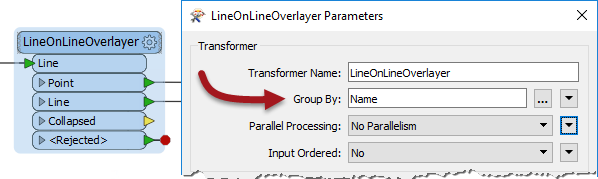

# Group-By Processing #
Group-By parameters allow features to be processed in groups by a single FME transformer.

## What is a Group? ##
FME transformers carry out transformations on either one feature at a time, or on a whole set of features at once.

For example, the *AreaCalculator* transformer operates on one feature at a time (to measure the area of a single  polygon feature). We call it a ***feature-based transformer***.

The *StatisticsCalculator* operates on multiple features at a time (to calculate an average value for them all). In FME we call this set of features a ***group*** and the transformer is a ***group-based transformer***. 

## Creating Groups ##
So a group is simply a defined set of features being processed by a transformer. By default a group-based transformer treats ALL the features that it is fed as a single group.

However, such transformers also have a ***Group-By*** parameter. This parameter lets the user define several groups based upon the value of an attribute.

---

<!--Person X Says Section-->

<table style="border-spacing: 0px">
<tr>
<td style="vertical-align:middle;background-color:darkorange;border: 2px solid darkorange">
<i class="fa fa-quote-left fa-lg fa-pull-left fa-fw" style="color:white;padding-right: 12px;vertical-align:text-top"></i>
Mr. Statistics-Calculator, CFO says...
</td>
</tr>

<tr>
<td style="border: 1px solid darkorange">

Hi. I don't think we've met yet. I'm Mr. Statistics-Calculator. I bet you can't guess my favourite transformer!
  To illustrate groups let's consider calculating the mean age of FME users. Don't worry - I'll be discrete (ha ha)! The default group for the calculation includes <strong>all</strong> FME users.
  But you could instead divide everyone up on into men and women, creating two groups, and calculate average age per gender. Or you could divide everyone into their nationality, and calculate average age per country.
  This is the same as having a gender (or nationality) attribute in a dataset and selecting that in an FME group-by parameter.

</td>
</tr>
</table>

---

Here, a LineOnLineOverlayer transformer is being used to intersect a number of line features. The selected Group-By attribute is *Name*:

FME creates a series of groups for overlaying, where the features in each group share the same value for the *Name* attribute. The practical outcome is that intersection takes place only where line features share the same name.

---

<!--Person X Says Section-->

<table style="border-spacing: 0px">
<tr>
<td style="vertical-align:middle;background-color:darkorange;border: 2px solid darkorange">
<i class="fa fa-quote-left fa-lg fa-pull-left fa-fw" style="color:white;padding-right: 12px;vertical-align:text-top"></i>
Miss Vector says...
</td>
</tr>

<tr>
<td style="border: 1px solid darkorange">

Let's see if you've picked up the idea of what a group-based transformation is.
  Which of the following transformers do you think is "group-based"? Feel free to use Workbench to help you answer this question.
  <a href="http://52.73.3.37/fmedatastreaming/Manual/QAResponse2017.fmw?chapter=2&question=4&answer=1&DestDataset_TEXTLINE=C%3A%5CFMEOutput%5CQAResponse.html">1. StringFormatter</a>
 <a href="http://52.73.3.37/fmedatastreaming/Manual/QAResponse2017.fmw?chapter=2&question=4&answer=2&DestDataset_TEXTLINE=C%3A%5CFMEOutput%5CQAResponse.html">2. Clipper</a>
 <a href="http://52.73.3.37/fmedatastreaming/Manual/QAResponse2017.fmw?chapter=2&question=4&answer=3&DestDataset_TEXTLINE=C%3A%5CFMEOutput%5CQAResponse.html">3. Rotator</a>
 <a href="http://52.73.3.37/fmedatastreaming/Manual/QAResponse2017.fmw?chapter=2&question=4&answer=4&DestDataset_TEXTLINE=C%3A%5CFMEOutput%5CQAResponse.html">4. AttributeRounder</a>

</td>
</tr>
</table>