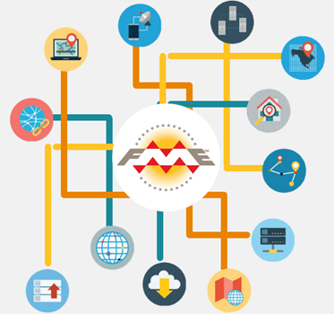

# Workspace Design #

A basic workspace in FME is constructed and laid out strictly to the concept of ETL: Extract-Transform-Load

However, there are multiple other methods for constructing more advanced workspaces, and for directing the flow of data through a workspace in unique ways. 

Some example uses for these techniques might be:

- To design large-scale workspaces a small section at a time
- To read data from multiple formats within a single workspace
- To carry out actions *after* a dataset has been written
- To use data stored on web services
- To test run individual parts of a workspace

