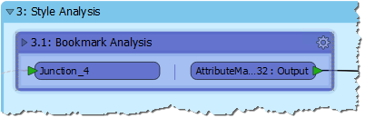
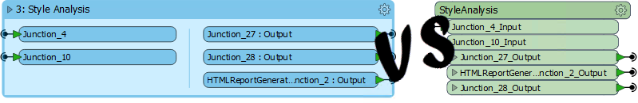

## Bookmarks ##
As we know, a bookmark, like its real-world namesake, is a means of putting a marker down for easy access.

With FME the bookmark covers an area of workspace that is usually carrying out a specific task, so a user can pick it out of a larger set of transformers and move to it with relative ease.

As one user has put it, bookmarks are like paragraphs for your workspace!

The above workspace illustrates nicely how to mark up different sections of a workspace using bookmarks. As you can see, it's permitted to subdivide bookmarks further by *nesting* one bookmark inside another.

But in FME 2018 there is functionality to take this one step further...

---

### Collapsing Bookmarks ###

In FME 2018, each bookmark has a small icon in the top-left corner that allows it to be collapsed:

Collapsing a bookmark means it is compressed down to the size of a single transformer, displaying none of the contents except for where data enters or exits the bookmark:

Clicking the icon a second time re-opens the bookmark to its previous size.

This functionality allows large sections of workspace to be rendered in a much smaller area, and only opened up when editing is required.

For example the section of workspace displayed above might be reduced to this:

This is obviously a huge saving of space on a large canvas. 

### Collapsing Bookmarks vs Custom Transformers ###

It's easy to see collapsing bookmarks as a replacement for custom transformers, especially where the custom transformer was intended only as a means to save space on canvas:

However, collapsible bookmarks are not such a good replacement where the content is intended to be reused in multiple locations. That's because each custom transformer inherits its behaviour from a master custom transformer definition. Editing the definition updates all the custom transformers.

The same is not true of a collapsed bookmark. There is no master definition and editing the contents of a bookmark does not automatically update the contents in any other bookmarks, even if it was a direct copy. 

Additionally, a collapsed bookmark cannot be shared with other users and doesn't have the ability to set published parameters, in the same way that a custom transformer would.

So while a collapsed bookmark can replace some aspects of a custom transformer, it can't fully replace them.