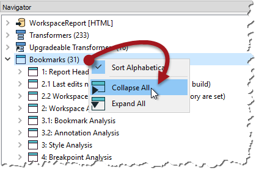
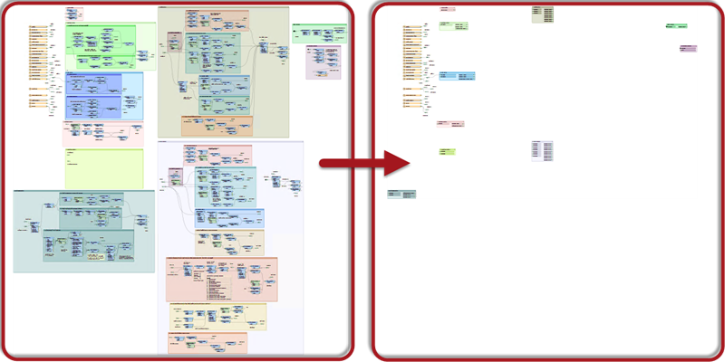
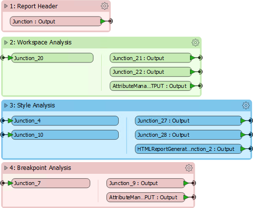
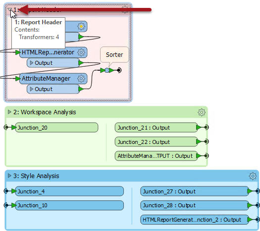

## Collapsed Bookmark Style ##
With new collapsible bookmarks, there are aspects of Best Practice and style that need to be considered.

### Renaming Ports ###

The input and output ports on collapsed bookmarks can be renamed to help clarify the data entering and exiting:

It's not obvious that this capability exists, but in fact it can be accessed in *three* different ways!

- Double-clicking the object
- Selecting the object and pressing F2
- Using the Rename option on the context menu (as pictured above)

The obvious benefit here is one of clarity. By knowing what each input and output port is for, extra connections can be made to it without having to expand the bookmark contents.

---

### Rearranging Bookmarks ###

Although you can collapse one bookmark at a time, an option on the Navigator window allows you to collapse all bookmarks at once:

Doing so illustrates how much space can be saved in a single canvas:

Of course it helps to then move the bookmarks closer together to reuse that space:

But besides reusing the space, there is another reason for this reorganization. 

When bookmarks are positioned close to each other, re-opening a collapsed bookmark adjusts the layout of the workspace, moving other transformers or bookmarks out of the way so that its contents are shown without overlap. Re-closing the bookmark causes the opposite to occur.

For example, in the above screenshot:

...if any bookmark is expanded, then the bookmarks around it are moved to one side to accommodate the new space requirements. When the bookmark is collapsed again, the reverse takes place, to give the same compact layout as before.