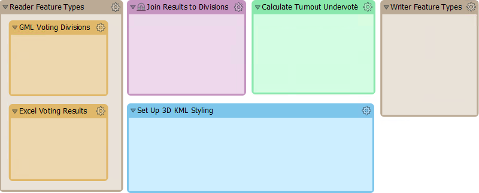
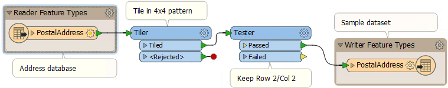

## Incremental Development ##

The key development technique for FME workspaces is [incremental updates](https://en.wikipedia.org/wiki/Incremental_build_model). 

The steps to this technique are:

- Plan your project as a series of small sections, each of which would fit inside a bookmark in FME
- Design and implement a section in FME Workbench. It should ideally be between 3-10 transformers.
- Test each section immediately after it is completed. That way you can identify problems at an early stage, and identify them more easily because only a few changes are being made in any increment.
- Repeat the process, saving the workspace and testing it whenever you've added a new section

Although a range of 3-10 transformers is an arbitrary number, the more transformers you add the more difficult it would be to identify the source of any problems. Beyond ten transformers is the point at which you should consider chopping that process into smaller sections.

Here an author has planned their workspace by laying it out as a set of bookmarks in the canvas:

Now the author can complete and test each section at a time, keeping the overall goal in mind at the same time.

---

<!--Warning Section--> 

<table style="border-spacing: 0px">
<tr>
<td style="vertical-align:middle;background-color:darkorange;border: 2px solid darkorange">
<i class="fa fa-exclamation-triangle fa-lg fa-pull-left fa-fw" style="color:white;padding-right: 12px;vertical-align:text-top"></i>
WARNING
</td>
</tr>

<tr>
<td style="border: 1px solid darkorange">

It can be all too easy to start developing a workspace and forget to save it at all! FME keeps a recover file as soon as the workspace is saved for the first time, but until then you are running the risk of an irretrievable loss.  

</td>
</tr>
</table>

---

### Source Data ###

When the FME project is large and complex, it's likely that the source data will be large and complex too. So when creating a workspace in small increments, testing each part in turn, it's better to avoid using the entire dataset.

It's better to use a sample of source data for testing. In fact, it's better to actually create a small sample of data - extracting it from your source and writing to a neutral format like FFS - rather than randomly sampling the data for each test run.

This is particularly true for databases, because it also avoids the problems of waiting for network traffic and database responses.

Here the workspace author is extracting a section of source data by reading from a database, splitting it into tiles, and writing just one tile to the FFS format. This one tile can be used for prototyping a solution in a way that is representative of the entire source database table. 

Another transformer to use would be the Sampler, although the features selected by it would not be spatially adjacent.

---

### Version Control ###

When making a set of incremental changes to a workspace, it's easy to mistakenly work on a single workspace file only. There are various problems with this:

- Faults cannot be easily tracked because there is no record of what has changed and when
- It is not easy to create different versions for different platforms
- If the workspace file is lost or corrupted then the entire project is lost

Therefore, it is better to keep versioned workspaces, where a different copy is kept for each set of revisions. This can be done manually within the file system, or by using a repository tool like Git. 

In fact, it is a good idea to keep and version all materials related to an FME project, including:

- Workspace files
- Python files
- Log Files
- Source Datasets

It's better to not store any information that is personal or that includes passwords. Also there's no need to store temporary files.

---

<!--Tip Section--> 

<table style="border-spacing: 0px">
<tr>
<td style="vertical-align:middle;background-color:darkorange;border: 2px solid darkorange">
<i class="fa fa-info-circle fa-lg fa-pull-left fa-fw" style="color:white;padding-right: 12px;vertical-align:text-top"></i>
TIP
</td>
</tr>

<tr>
<td style="border: 1px solid darkorange">

FME Server has a version control system built in. Even if you don't have an FME Server license, you can still install it for use as a repository system for workspaces and related files.

</td>
</tr>
</table>