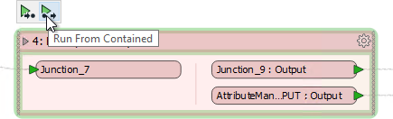

## Collapsed Bookmarks and Caches ##
Collapsible bookmarks have been designed very carefully so that they interact with caches and partial runs.

### Running a Bookmark ###

The pop-up options for a partial run, as well as appearing on transformers, are also present on bookmarks:

The options are called *Run To Contained* and *Run From Contained*, and appear whether the bookmark is collapsed or expanded.

This obviously makes it easier to run a section of workspace, particularly where the bookmark is collapsed.

---

### Improving Performance ###

When an author creates a very large workspace, as is usually the case when there are many bookmarks, running with feature caching turned on could create a large amount of unwanted caches:

 
Notice in the above screenshot that every transformer in the Prepare Data for Matching bookmark is being cached.

To avoid this, feature caching has been designed to avoid caching data for every transformer inside a collapsed bookmark. When a workspace is run all transformers in the collapsed bookmark operate as usual, but the only data cached is for transformers represented by an output port on the bookmark:

We can see that by expanding the bookmark after the workspace has finished running:

This saves considerable time and resources when working with a large workspace. 

---

<!--Person X Says Section-->

<table style="border-spacing: 0px">
<tr>
<td style="vertical-align:middle;background-color:darkorange;border: 2px solid darkorange">
<i class="fa fa-quote-left fa-lg fa-pull-left fa-fw" style="color:white;padding-right: 12px;vertical-align:text-top"></i>
Dr. Workbench says...
</td>
</tr>

<tr>
<td style="border: 1px solid darkorange">

Obviously you don't want to put a workspace into production when caching is turned on, regardless of whether your bookmarks are collapsed. This technique is only recommended for use in the design, authoring, and testing phases of workspace creation.

</td>
</tr>
</table>