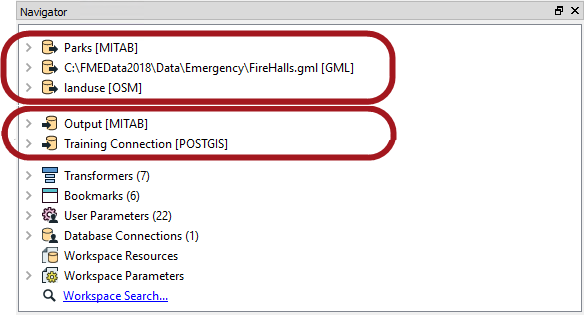
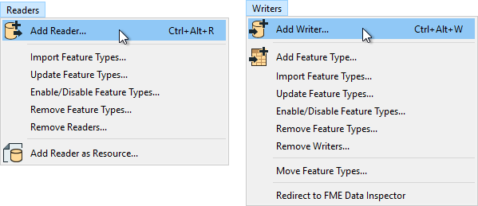
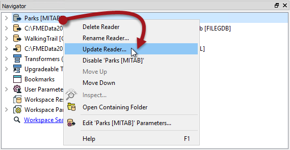

## Multiple Readers and Writers ##

An FME workspace is not limited to any particular number of readers or writers; readers and writers can be added to a workspace at any time, any number of formats can be used, and there does not need to be an equal number of readers and writers.

For example, the Navigator window shows this workspace contains three readers and two writers, of different data types and formats!

<!--Person X Says Section-->

<table style="border-spacing: 0px">
<tr>
<td style="vertical-align:middle;background-color:darkorange;border: 2px solid darkorange">
<i class="fa fa-quote-left fa-lg fa-pull-left fa-fw" style="color:white;padding-right: 12px;vertical-align:text-top"></i>
Ms. Analyst says...
</td>
</tr>

<tr>
<td style="border: 1px solid darkorange">

It's important to note that readers and writers don’t appear as objects on the Workbench canvas. Their feature types (layers) do, but readers and writers don't.
  Instead they are represented by entries in the Navigator window, as in the above screenshot.

</td>
</tr>
</table>

---

### Adding Readers and Writers ###

Additional readers or writers are added to a translation using the Quick Add menu:

...Or by selecting Readers &gt; Add Reader (Writers &gt; Add Writer) from the menubar:

This action opens a dialog, similar to the Generate Workspace dialog, in which the parameters for the new reader or writer can be defined:

As many readers and writers as required can be added in this way.

---

<!--Tip Section--> 

<table style="border-spacing: 0px">
<tr>
<td style="vertical-align:middle;background-color:darkorange;border: 2px solid darkorange">
<i class="fa fa-info-circle fa-lg fa-pull-left fa-fw" style="color:white;padding-right: 12px;vertical-align:text-top"></i>
TIP
</td>
</tr>

<tr>
<td style="border: 1px solid darkorange">

A reader can also be added by dragging a dataset from a filesystem explorer and dropping it onto the Workbench canvas.

</td>
</tr>
</table>

---

### Removing a Reader or Writer ###

If a reader or writer is no longer required, then it can be removed very simply using options on the menubar:

Alternatively it's possible to right click a reader/writer in the Navigator window and choose the Delete option.

---

### Updating a Reader or Writer ###

Readers and writers can be updated so that older workspaces have the speed and functionality available in a newer version of FME. This is done by right-clicking the reader/writer in the Navigator window and choosing the Update option:

For readers this tool provides the option to either just update the reader, or to also update the list of feature types being read. This way the workspace can be updated if the source data changes. Another way to update feature types is Reader &gt; Update Feature Types on the menubar.