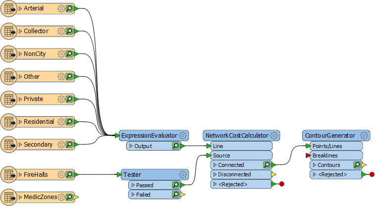
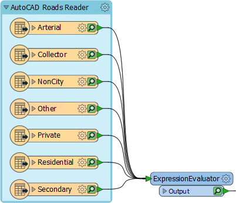
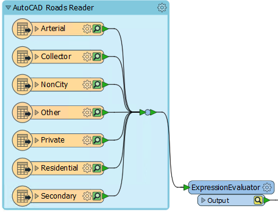
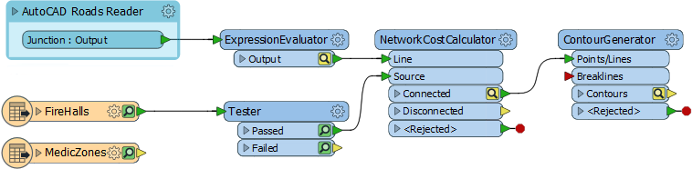
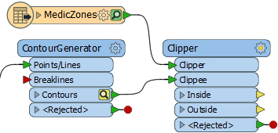
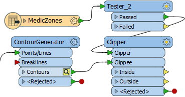
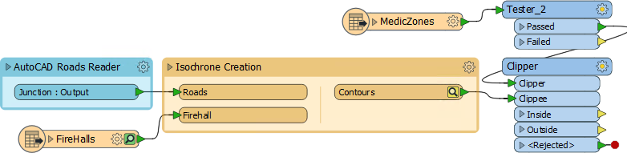
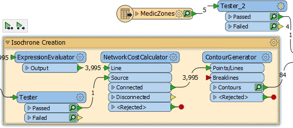

<!--Exercise Section-->

<table style="border-spacing: 0px;border-collapse: collapse;font-family:serif">
<tr>
<td width=25% style="vertical-align:middle;background-color:darkorange;border: 2px solid darkorange">
<i class="fa fa-cogs fa-lg fa-pull-left fa-fw" style="color:white;padding-right: 12px;vertical-align:text-top"></i>
Exercise
</td>
<td style="border: 2px solid darkorange;background-color:darkorange;color:white">
Caching and Partial Runs
</td>
</tr>

<tr>
<td style="border: 1px solid darkorange; font-weight: bold">Data</td>
<td style="border: 1px solid darkorange">Roads (AutoCAD DWG) Firehalls and Zones (GML)</td>
</tr>

<tr>
<td style="border: 1px solid darkorange; font-weight: bold">Overall Goal</td>
<td style="border: 1px solid darkorange">Create time and distance isolines with the NetworkCostCalculator</td>
</tr>

<tr>
<td style="border: 1px solid darkorange; font-weight: bold">Demonstrates</td>
<td style="border: 1px solid darkorange">Collapsible Bookmarks</td>
</tr>

<tr>
<td style="border: 1px solid darkorange; font-weight: bold">Start Workspace</td>
<td style="border: 1px solid darkorange">C:\FMEData2018\Workspaces\UpgradingTo2018\Bookmarks-Ex1-Begin.fmwt</td>
</tr>

<tr>
<td style="border: 1px solid darkorange; font-weight: bold">End Workspace</td>
<td style="border: 1px solid darkorange">C:\FMEData2018\Workspaces\UpgradingTo2018\Bookmarks-Ex1-Complete.fmwt</td>
</tr>

</table>

Here we'll continue the exercise from the Caching chapter. Our goal is to assist in planning emergency services by creating a dataset of isochrones - contour lines depicting travel time from each firehall - for medical emergencies.

 **1) Start Workbench**
 Start FME Workbench and, if necessary, open the template file for the previous exercise. You can find a copy of it at: C:\FMEData2018\Workspaces\UpgradingTo2018\Bookmarks-Ex1-Begin.fmwt

The workspace works fine, but it needs a couple of adjustments, plus it is in dire need of best practice style.

 **2) Add Bookmark**
 The first thing we can do is make the workspace canvas tidier by bookmarking all the road feature types and collapsing it into a smaller space.

So, select all of the feature types for the AutoCAD roads reader. Press Ctrl+B (or select Insert Bookmark from the toolbar). Name the bookmark AutoCAD Roads Reader:

If we collapse the bookmark now (try it and see) we'll still get multiple outputs and connections. We don't really need this. So add a single Junction transformer between all the connections and the ExpressionEvaluator and resize the bookmark to fit the Junction:

Collapse the bookmark and now there will be just a single output port. Double-click the port to rename it. Name it Roads:

This has obviously saved quite a lot of space in the canvas.

 **3) Add Clipper**
 To return to the task at hand, the current workspace output covers all of the city of Vancouver, whereas we only need it to show contours for the area of responsibility for fire hall number 4.

To clip the data add a Clipper transformer to the workspace. Connect the contours to the Clippee input port and the MedicZone feature type to the Clipper port:

Rearrange the objects/ports to ensure there are no overlapping connections.

 **4) Duplicate Tester**
 The MedicZones data covers all of the city too, and we only need fire hall number 4. We can filter this with a Tester; in fact with the same test as the existing Tester.

So, select the existing Tester and press Ctrl+D (Right Click &gt; Duplicate) to duplicate it. Drop the duplicate Tester into the MedicZones-Clipper connection:

But don't run the workspace yet...

 **5) Add Bookmark**
 If we run the workspace now there are a number of yellow caches that will be updated and saved. However, we don't really need these. Caches are useful for testing a section of workspace, but we already know the main part of this workspace is correct.

So, add a bookmark around the four main processing transformers (ExpressionEvaluator, Tester, NetworkCostCalculator, ContourGenerator):

Now collapse the bookmark, rename its ports, and rearrange content around it:

Notice that there is now only a single cache for the whole bookmark.

 **6) Run Workspace**
 Re-run the workspace by selecting the Clipper transformer and choosing Run To This.

We are now saving cache space because only one cache is created for the bookmarked parts. Expand (and re-collapse) the Isochrone bookmark to prove this. The ContourGenerator has caches because it is the last transformer. The Tester has caches, but only because it already had them:

Notice that as you expand/collapse the bookmark, other objects move in response to keep from overlapping. 

Now inspect the Clipper:Inside cache. You should see that the isochrones are clipped to the area of responsibility for fire hall 4.

 **7) Save Workspace**
 Re-save the workspace as a template - including caches - so it is ready for further editing if required.

---

<!--Tip Section--> 

<table style="border-spacing: 0px">
<tr>
<td style="vertical-align:middle;background-color:darkorange;border: 2px solid darkorange">
<i class="fa fa-info-circle fa-lg fa-pull-left fa-fw" style="color:white;padding-right: 12px;vertical-align:text-top"></i>
TIP
</td>
</tr>

<tr>
<td style="border: 1px solid darkorange">

To see some advanced tasks for this project, check out the <a href="https://knowledge.safe.com/articles/30048/creating-time-and-distance-isolines-using-the-netw.html">GIS Tutorial</a> on the FME Knowledge Centre.

</td>
</tr>
</table>

---

<!--Exercise Congratulations Section--> 

<table style="border-spacing: 0px">
<tr>
<td style="vertical-align:middle;background-color:darkorange;border: 2px solid darkorange">
<i class="fa fa-thumbs-o-up fa-lg fa-pull-left fa-fw" style="color:white;padding-right: 12px;vertical-align:text-top"></i>
CONGRATULATIONS
</td>
</tr>

<tr>
<td style="border: 1px solid darkorange">

By completing this exercise you have learned how to:
 
<ul><li>Add and collapse bookmarks</li>
<li>Add a Junction to reduce the number of bookmark output ports</li>
<li>Rename bookmark output ports</li>
<li>Rearrange objects around a bookmark so that they move when the bookmark is collapsed/expanded</li>
<li>Collapse a bookmark to save caching excess data</li></ul>

</td>
</tr>
</table>