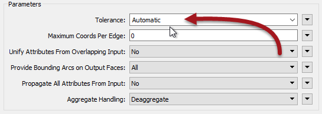
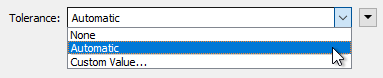

# Tolerance Parameters #

FME2018 introduces a tolerance parameter to many existing transformers, and one new transformer:

- AreaGapAndOverlapCleaner
- AreaOnAreaOverlayer
- Clipper
- Dissolver
- FeatureMerger
- Generalizer
- Intersector
- LineOnAreaOverlayer
- LineOnLineOverlayer
- Snapper
- Tiler
- TopologyBuilder

The AreaGapAndOverlapCleaner is, of course, the new transformer. It's a direct replacement for the SliverRemover. The Snapper already had a tolerance parameter, but that has been updated to use this new functionality.

So why these transformers? Because it's a set of transformers that use a common piece of code. That code was updated to allow a tolerance to be applied and was exposed as a new parameter:

The tolerance parameters have three different options:

- None
- Automatic
- Custom Value

**None** means the transformer operates as it always did in FME; without any tolerance applied. The operation will be carried out using strict matches of coordinates. This is the default value (for 2018.0 at least).

**Automatic** means FME will decide upon a tolerance. Here FME is trying to resolve minor issues with coordinates, such as coordinate precision and rounding.

**Custom Value** means the user will enter a tolerance. The user is trying to resolve any issues they believe can be fixed through tolerance, such as bad geometry.

## Collapsed Ports ##

Some transformers with the new tolerance setting have a Collapsed output port. This is for features whose size is smaller than the tolerance value, and which therefore collapse to a single point.

---

<!--Tip Section--> 

<table style="border-spacing: 0px">
<tr>
<td style="vertical-align:middle;background-color:darkorange;border: 2px solid darkorange">
<i class="fa fa-info-circle fa-lg fa-pull-left fa-fw" style="color:white;padding-right: 12px;vertical-align:text-top"></i>
TIP
</td>
</tr>

<tr>
<td style="border: 1px solid darkorange">

Because the Automatic mode is newer technology, its performance in many cases is actually faster than having no tolerance at all!

</td>
</tr>
</table>