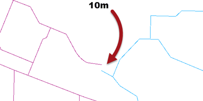
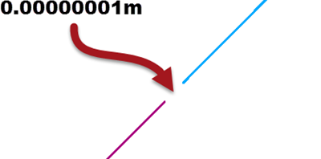
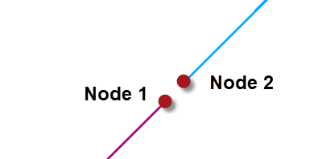
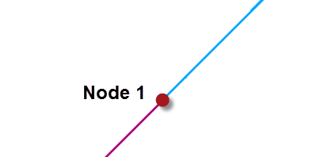
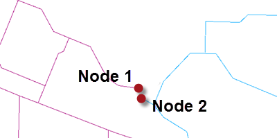
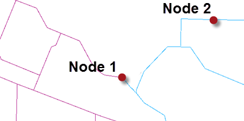

## Example Geometry Problems ##

In general, data can not join, meet, or intersect because of one of two issues.

Firstly the geometry of the data can have simply been created badly:

In that example the two lines are meant to connect, but instead have a gap of around 10 metres.

The second source of problems is geometry that has very tiny imperfections due to issues such as coordinate rounding:

In this case the two lines are meant to connect, but instead there is a very small gap of 0.00000001 metres. This sort of error is very difficult to locate visually, because of its small size.

Such an issue might arise because of coordinate rounding (coordinates are rounded to a precision that leads to gaps), because of different data formats (where each format stores coordinates in slightly different ways), or perhaps because of some other automated process that has been carried out. 

---

### No Tolerance ###

When tolerance is set to none, then the above features are not considered a match. 

For example, in a TopologyBuilder, the gaps in each case would lead FME to assume that each geometry is a road that ends without a connection. There would be two nodes with a gap between them:

Depending on the data this may or may not be the correct result. With a gap of only 0.00000001 metres we can safely assume it is not correct in this example.

---

### Automatic Tolerance ###

When tolerance is set to automatic, then FME will assess the data and come up with a reasonable tolerance to solve minor problems. For example, in a TopologyBuilder FME would correctly determine that the smaller gap is an error that should be corrected:

However, it will not fix the grosser error that caused the larger tolerance gap:

That's because there is no way FME could reasonably define that as a problem, or fix it without possibly altering other similar gaps.

---

### Custom Tolerance ###

When the tolerance is set to a custom value then the author is trying to resolve issues at a scale of their own choosing. For example, in the TopologyBuilder they could set a tolerance of 10. That would solve both the small issues and the larger one:

But it might also mistakenly fix issues where two points are legitimately within 10 metres of each other, like at Node 2.

So in general cases it's best to use automatic tolerance, unless you can be sure that a custom tolerance will work as you want it to.