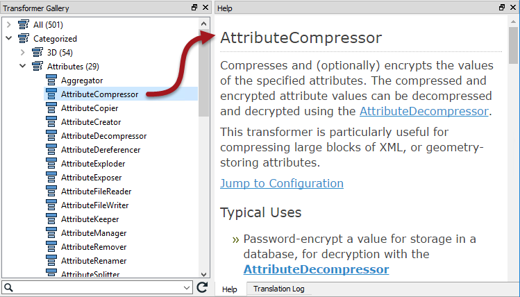

## Transformer Gallery ##
The transformer gallery window is the obvious place to start looking for transformers. There are a number of ways in which transformers here can be located.

## Transformer Categories ##
Transformer categories are a good starting point from which to explore the transformer list. Transformers are grouped in categories to help find a transformer relevant to the problem at hand.

Although all of them are important, the most commonly used transformers are found in these categories:

- **Attributes**: Operations for attribute/list management
- **Calculated Values**: Operations that return a calculated value
- **Filters and Joins**: Operations for dividing and merging data flows
- **Geometries**: Operations that create geometry or transform it to a different geometry type
- **Spatial Analysis**: Operations that return the result of a spatial analysis
- **Strings**: Operations that manipulate string contents, including dates 

Simply click on the expand button to show all transformers within a particular category.

---

## Transformer Help ##
The FME Workbench Help tool displays information about transformers. Simply click on a transformer and press the F1 key to open the help dialog.

This tool is linked to FME Workbench so that a transformer selected (in the gallery or on the canvas) triggers content to display in the Help tool.

---

<!--Tip Section--> 

<table style="border-spacing: 0px">
<tr>
<td style="vertical-align:middle;background-color:darkorange;border: 2px solid darkorange">
<i class="fa fa-info-circle fa-lg fa-pull-left fa-fw" style="color:white;padding-right: 12px;vertical-align:text-top"></i>
TIP
</td>
</tr>

<tr>
<td style="border: 1px solid darkorange">

Another useful - and printable - piece of documentation is the <strong><a href="http://cdn.safe.com/resources/fme/FME-Transformer-Reference-Guide.pdf">FME Transformer Reference Guide</a></strong>.

</td>
</tr>
</table>