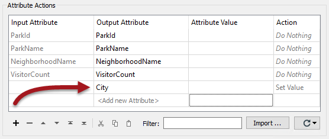

## Creating and Setting Attributes ##

Creating attributes and setting a value are probably the primary attribute function used within FME. When an attribute is created, its value can be set in a number of ways.

The transformers capable of creating an attribute - and setting its value - are:

- AttributeCreator
- AttributeManager

***NB:*** *The AttributeCopier and AttributeRenamer transformers can set an attribute value, but only where the attribute doesn't already exist.*

---

### The AttributeManager ###
For most operations we'll concentrate on the AttributeManager, so here is a quick overview of that transformer.

The AttributeManager parameters dialog has a number of fields: Input Attribute, Output Attribute, Attribute Value, and Action. Uniquely among attribute-handling transformers, it is automatically filled in with the details of the attributes connected to it:

The action field can be set by the user, but is also set automatically when a change is made to the other fields.

<!--New Section--> 

<table style="border-spacing: 0px">
<tr>
<td style="vertical-align:middle;background-color:darkorange;border: 2px solid darkorange">
<i class="fa fa-bolt fa-lg fa-pull-left fa-fw" style="color:white;padding-right: 12px;vertical-align:text-top"></i>
NEW
</td>
</tr>

<tr>
<td style="border: 1px solid darkorange">

The AttributeManager has new options in FME2018 to cut/copy/paste/duplicate individual rows in the dialog.

</td>
</tr>
</table>

---

### Manually Create an Attribute ###
By entering a new attribute name into the Output Attribute field, it will be created in the output.

The text &lt;Add new Attribute&gt; highlights where a new attribute can be created. By default, when the Attribute Value field is empty, a new attribute has no value. 

---

### Set a Fixed Attribute Value ###
A fixed (or *constant*) value for an attribute can be created by simply entering a value into the Attribute Value field:

Here, for example, a new attribute called City is being given a fixed value of Vancouver.

However, also note that the existing attribute NeighborhoodName is also being assigned a fixed value. It is being given the value "Kitsilano". Notice how by entering a value into that field, the Action field has automatically changed from "*Do Nothing*" to "Set Value".

Besides entering set values like this, it's possible to construct an attribute value in a number of different ways...