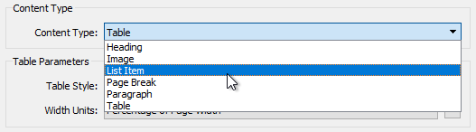
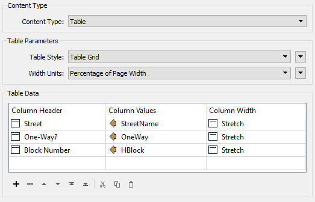
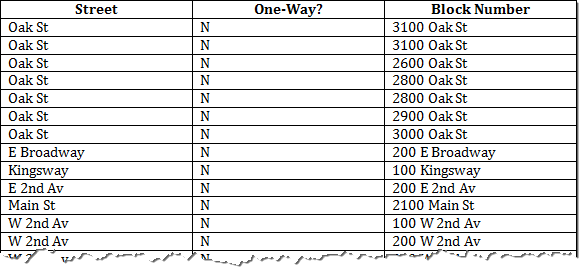

## Microsoft Word ##
The Microsoft Word writer in FME allows writing features to Word documents. The writer only has a single parameter, that to define a Word template to use.

The data sent to the writer must also first be styled using the MSWordStyler transformer.

### MSWordStyler ###
The MSWordStyler transformer allows the creation of various content types:

This way a document can be built up from several components, with headings, images, lists, tables, and plain text (paragraphs). As a different content type is selected, the available parameters change in the dialog. For example, for Table content the parameters look like this:

...with the output of that looking like this:

Map features cannot be written directly to the Microsoft Word writer, but can be written as an image by first rasterizing the data with an ImageRasterizer or MapnikRasterizer transformer.

### Write Order ###
As you might expect, features are written to the Word document in the order they arrive, so a workspace author can control the document by controlling the order of features using a Sorter transformer. 