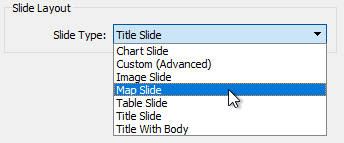
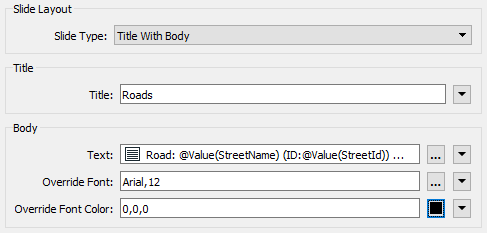
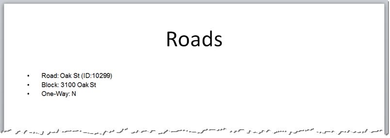
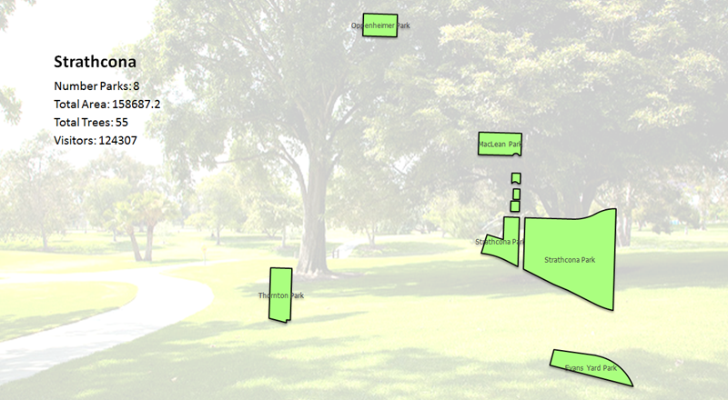

## Microsoft PowerPoint ##
The Microsoft PowerPoint writer in FME allows writing features to PowerPoint presentations. Like the Word format, the PowerPoint writer only has a single parameter, that to define a template to use.

A separate slide in the presentation is created for each feature.

The data sent to the writer must also first be styled using the PowerPointStyler transformer. 

### PowerPointStyler ###
The PowerPointStyler transformer allows the creation of various slide types:

This way a presentation can be built up from several components, with charts, maps, images, tables, and other plain text content. As a different content type is selected, the available parameters change in the dialog. For example, for Table content the parameters look like this:

...with the output of that looking like this:

Unlike the Word writer, Map features *can* be written directly to the Microsoft PowerPoint writer. Features can be grouped together in one slide and each feature becomes a vector object in that slide.

The PowerPointStyler transformer also has a parameter to control the order of features being written. If this is left as Automatic, then all the features going to the Microsoft PowerPoint Writer will be written to a presentation in the same order they arrive, meaning the slides will be in that order. 

Setting this parameter only makes sense where there is more than one PowerPointStyler parameter. If a number is entered into this field, then the features are sorted by that number on writing. For example, a title slide could be given the number 1 to allow it to be first in the presentation.

If more than one feature has the same slide order, then they are written in the same order they arrive.

---

<!--Tip Section--> 

<table style="border-spacing: 0px">
<tr>
<td style="vertical-align:middle;background-color:darkorange;border: 2px solid darkorange">
<i class="fa fa-info-circle fa-lg fa-pull-left fa-fw" style="color:white;padding-right: 12px;vertical-align:text-top"></i>
TIP
</td>
</tr>

<tr>
<td style="border: 1px solid darkorange">

The template file for a PowerPoint can be designed in the Master slide view in PowerPoint. For example, setting a background image in the template could lead FME to produce a map slide like this:
  
 Park Image by <a href="https://www.flickr.com/photos/ocparks/">OCParks</a>, CC BY-ND 2.0 
  Notice how a map slide allows the creation of labels on each feature (also to set the feature color) and the creation of a "caption" text box in the upper-left.

</td>
</tr>
</table>

 
