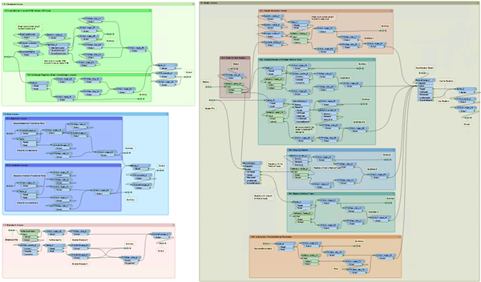
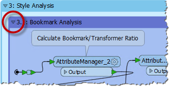

### Bookmarks for Design ###
A bookmark is a great way of indicating that a particular section of a workspace is for a particular purpose. By subdividing a workspace in this way, the layout is often a lot easier to follow. 

As one user has put it, bookmarks are like paragraphs for your workspace!

The above workspace illustrates nicely how to mark up different sections of a workspace using bookmarks. As you can see, it's permitted to subdivide bookmarks further by *nesting* one bookmark inside another.

#### Collapsible Bookmarks ####

Each bookmark has a small icon in the top-left corner that allows it to be collapsed:

Collapsing a bookmark means it is compressed down to the size of a single transformer, displaying none of the contents except for where data enters or exits the bookmark:

Clicking the icon a second time re-opens the bookmark to its previous size.

---

<!--New Section--> 

<table style="border-spacing: 0px">
<tr>
<td style="vertical-align:middle;background-color:darkorange;border: 2px solid darkorange">
<i class="fa fa-bolt fa-lg fa-pull-left fa-fw" style="color:white;padding-right: 12px;vertical-align:text-top"></i>
NEW
</td>
</tr>

<tr>
<td style="border: 1px solid darkorange">

Collapsible bookmarks are an entirely new feature for FME2018.

</td>
</tr>
</table>

---

This functionality allows large sections of workspace to be rendered in a much smaller area, and only opened up when editing is required.

For example the section of workspace displayed above might be reduced to this:

Re-opening a collapsed bookmark adjusts the layout of the workspace, moving other transformers or bookmarks out of the way so that its contents are shown without overlap. Re-closing the bookmark causes the opposite to occur.

For example, in the above screenshot if bookmark 3 (Style) is expanded, then bookmarks 4 and 5 are moved to one side to accommodate it. When bookmark 3 is collapsed again, the reverse takes place, to give the same compact layout as before.

---

<!--Person X Says Section-->

<table style="border-spacing: 0px">
<tr>
<td style="vertical-align:middle;background-color:darkorange;border: 2px solid darkorange">
<i class="fa fa-quote-left fa-lg fa-pull-left fa-fw" style="color:white;padding-right: 12px;vertical-align:text-top"></i>
Mr E. Dict (Attorney of FME Law) says...
</td>
</tr>

<tr>
<td style="border: 1px solid darkorange">

The input and output ports on collapsed bookmarks can be renamed to help clarify the data entering and exiting:
  
 This can be achieved by either double-clicking the object, pressing F2, or using the Rename option on the context menu.

</td>
</tr>
</table>

