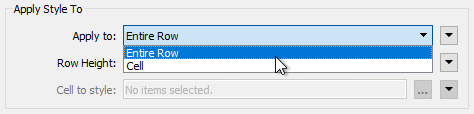
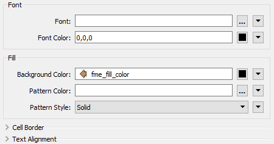
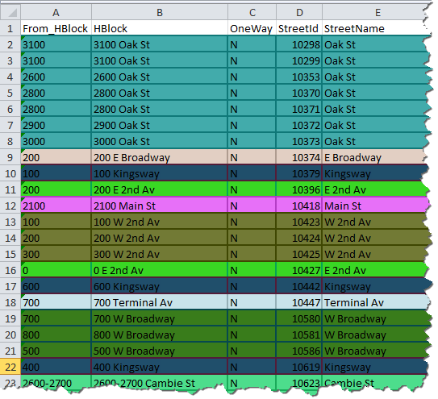

## Microsoft Excel ##
FME has had a Microsoft Excel reader and writer for a number of years. However, new in 2018 the writer has gained a number of new formatting options, and these options can be controlled with the new ExcelStyler transformer.

### ExcelStyler ###
The ExcelStyler transformer allows styling to be applied to either individual cells or to entire rows:

It allows setting of font, fill, border, and text alignment styles:

As shown above, parameters can be set by attributes; so features can be colored on the basis of an attribute and that attribute used to set the color in the ExcelStyler, giving something like this:

...where color is applied on the basis of a street name attribute.

The ExcelStyler also allows for setting cell format (for numbers) and cell protection (whether it is hidden or locked).
 