<!--Exercise Section-->

<table style="border-spacing: 0px;border-collapse: collapse;font-family:serif">
<tr>
<td width=25% style="vertical-align:middle;background-color:darkorange;border: 2px solid darkorange">
<i class="fa fa-cogs fa-lg fa-pull-left fa-fw" style="color:white;padding-right: 12px;vertical-align:text-top"></i>
Exercise
</td>
<td style="border: 2px solid darkorange;background-color:darkorange;color:white">
The PowerPoint Writer
</td>
</tr>

<tr>
<td style="border: 1px solid darkorange; font-weight: bold">Data</td>
<td style="border: 1px solid darkorange">Libraries (Esri Geodatabase) Land Boundary (Esri Shapefile)</td>
</tr>

<tr>
<td style="border: 1px solid darkorange; font-weight: bold">Overall Goal</td>
<td style="border: 1px solid darkorange">Create a PowerPoint presentation showing various items of interest in the city of Vancouver</td>
</tr>

<tr>
<td style="border: 1px solid darkorange; font-weight: bold">Demonstrates</td>
<td style="border: 1px solid darkorange">Microsoft-related transformers and formats</td>
</tr>

<tr>
<td style="border: 1px solid darkorange; font-weight: bold">Start Workspace</td>
<td style="border: 1px solid darkorange">None</td>
</tr>

<tr>
<td style="border: 1px solid darkorange; font-weight: bold">End Workspace</td>
<td style="border: 1px solid darkorange">C:\FMEData2018\Workspaces\UpgradingTo2018\Microsoft-Ex1-Complete.fmw</td>
</tr>

</table>

As part of a conference on community mapping, you have been asked to provide a presentation on different aspects of community in the city of Vancouver. You realize this is a great chance to both carry out the task and demonstrate FME's potential for such projects. 

We'll begin the task by creating a slide about libraries. Since we've not used this format or transformer before, this will be a joint voyage of exploration!

***NB:*** *If you don't have a PowerPoint viewer on your computer, then you can view files online on such sites as [onlinedocumentviewer.com](http://onlinedocumentviewer.com)*

 **1) Start Workbench**
 Start FME Workbench. Generate a workspace as follows:

<table style="border: 0px">

<tr>
<td style="font-weight: bold">Reader Format</td>
<td style="">Esri Geodatabase (File Geodb Open API)</td>
</tr>

<tr>
<td style="font-weight: bold">Reader Dataset</td>
<td style="">C:\FMEData2018\Data\CommunityMapping\CommunityMap.gdb</td>
</tr>

<tr>
<td style="font-weight: bold">Reader Parameters</td>
<td style=""><strong>Table List:</strong> Libraries</td>
</tr>

<tr>
<td style="font-weight: bold">Writer Format</td>
<td style="">Microsoft PowerPoint</td>
</tr>

<tr>
<td style="font-weight: bold">Writer Dataset</td>
<td style="">C:\FMEData2018\Output\Training\VancouverCommunity.pptx</td>
</tr>

<tr>
<td style="font-weight: bold">Writer Parameters</td>
<td style=""><strong>Template:</strong> C:\FMEData2018\Resources\DesktopBasic\VancouverTemplate.pptx</td>
</tr>

</table>

 **2) Add PowerPointStyler Transformer**
 If we ran the translation now, we wouldn't get any slides in the output. That's because all the features need to be stylized for the PowerPoint writer first. So, add a PowerPointStyler transformer between the reader and writer feature type.

Inspect the transformer parameters. Set:

- **Slide Type:** Map Slide
- **Slide Subtype:** Map With Caption
- **Title:** Vancouver Libraries
- **Caption:** A Map of Libraries in Vancouver 

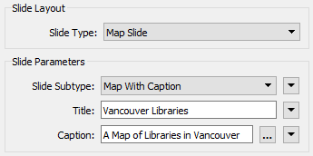

Next set the label parameters to label each object with the library name. Use a font and color of your choosing and make sure Wrap Label Text is set to No:

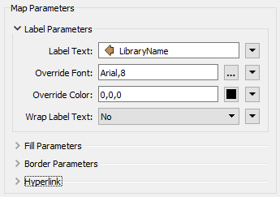

Click OK to close the dialog and accept the changes.

---

<!--Tip Section--> 

<table style="border-spacing: 0px">
<tr>
<td style="vertical-align:middle;background-color:darkorange;border: 2px solid darkorange">
<i class="fa fa-info-circle fa-lg fa-pull-left fa-fw" style="color:white;padding-right: 12px;vertical-align:text-top"></i>
TIP
</td>
</tr>

<tr>
<td style="border: 1px solid darkorange">

The PowerPointStyler also has a parameter for Hyperlink. If you like, set the Hyperlink parameter to point to the attribute LibraryURL. That way all the output features will have hyperlinks in the PowerPoint file.

</td>
</tr>
</table>

---

 **3) Add 2DEllipseReplacer Transformer**
 A point feature won't show up very well in a PowerPoint slide, so let's turn the libraries into something larger.

Add a 2DEllipseReplacer transformer before the PowerPointStyler. Set it up to create an ellipse of size 200x200:

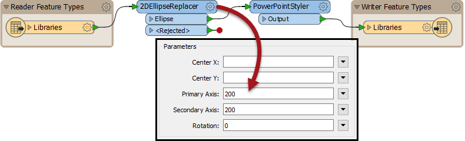

Accept the changes, turn on feature caching (if not already) and run the workspace. The result will be a series of slides, each with one library:

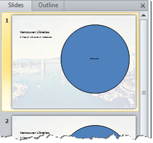

We'd prefer a single slide with all libraries, so we'll have to change that.

 **4) Add AttributeCreator Transformer**
 The PowerPointStyler transformer has an option to group objects, but we need an attribute to group them by. So place an AttributeCreator transformer between the 2DEllipseCreator and the PowerPointStyler (it's important for it to go here for a later step).

Use the transformer to create an attribute (call it Group) with a fixed value (say, 1).

Now inspect the PowerPointStyler parameters again. Near the bottom of the dialog, under Feature Handling, set Create Slide From to Multiple Features, and set Slide Group ID to the *Group* attribute:

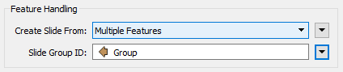

Now re-run the workspace. The output should be a single slide with all the libraries on it:

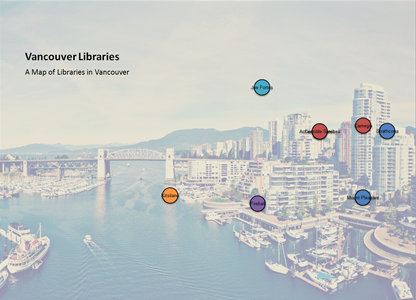

 **5) Add Shapefile Reader**
 The map is correct, but it really needs a background to the library features. We'll create that with a dataset of the Vancouver land boundary. So select Reader &gt; Add Reader from the menubar and add the following:

<table style="border: 0px">

<tr>
<td style="font-weight: bold">Reader Format</td>
<td style="">Esri Shapefile</td>
</tr>

<tr>
<td style="font-weight: bold">Reader Dataset</td>
<td style="">C:\FMEData2018\Data\Boundaries\LandBoundary\VancouverLandBoundary.shp</td>
</tr>

</table>

Connect the newly added feature type to the AttributeCreator input port:

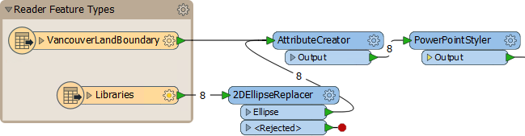

We connect it to the AttributeCreator port so that it gets the same attribute value and appears on the same slide as the library features.

---

<!--Tip Section--> 

<table style="border-spacing: 0px">
<tr>
<td style="vertical-align:middle;background-color:darkorange;border: 2px solid darkorange">
<i class="fa fa-info-circle fa-lg fa-pull-left fa-fw" style="color:white;padding-right: 12px;vertical-align:text-top"></i>
TIP
</td>
</tr>

<tr>
<td style="border: 1px solid darkorange">

If (in step 4) you were tempted to use an existing attribute rather than create a new one, this is why we didn't. We want something that will work for multiple datasets.
 It's also why it was important to put the AttributeCreator after the 2DEllipseReplacer, because we don't want to turn other data into ellipses too, just the libraries.

</td>
</tr>
</table>

---

 **6) Add Sorter**
 If we run the workspace now you will see, however, that all is not well. The land boundary feature overlays the libraries. To handle this we must sort the data in such as order that the libraries arrive first. This we can do with a Sorter transformer.

We could also create attributes for each data type, but we'll avoid that by reusing the format attribute *fme_feature_type*.

So open the parameters dialog for a feature type (it doesn't matter which), click the Format Attributes tab, and put a check-mark against *fme_feature_type*:

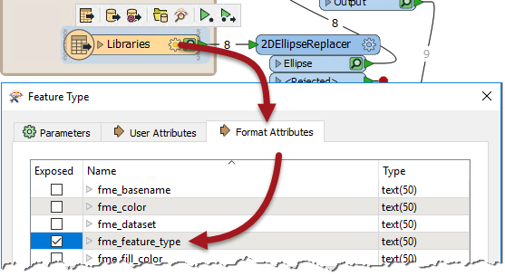

Click OK to close this and put a Sorter into the workspace just before the PowerPointStyler. Set it up to sort by fme_feature_type, alphabetic, descending:

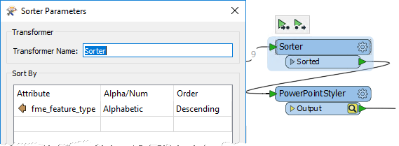

Now when the workspace is run, we should get library features above the city boundary.

 **7) Add FeatureColorSetter**
 The map is now visible, but it would be better if we could get a standard color for each library object. We can set color inside the PowerPointStyler, but that would cause all features to be the same color, including the city boundary. 

So, place a FeatureColorSetter transformer before the Sorter transformer. Open its parameters and set it up to create random coloring, but based on the attribute *fme_feature_type*:

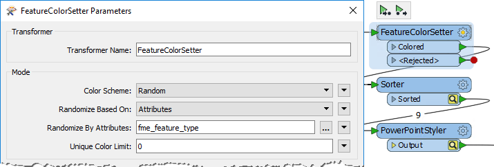

This means that each different feature type will get its own color. In the PowerPointStyler transformer locate the Foreground Fill Color parameter and set it to *fme_fill_color*:

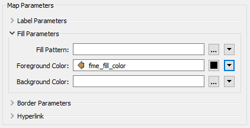

---

<!--Tip Section--> 

<table style="border-spacing: 0px">
<tr>
<td style="vertical-align:middle;background-color:darkorange;border: 2px solid darkorange">
<i class="fa fa-info-circle fa-lg fa-pull-left fa-fw" style="color:white;padding-right: 12px;vertical-align:text-top"></i>
TIP
</td>
</tr>

<tr>
<td style="border: 1px solid darkorange">

This technique is like creating a group-by with color. It's also a great technique to use for the ExcelStyler transformer, where you want to create different colors per row, but based on an attribute value.

</td>
</tr>
</table>

---

 **8) Add Title Slide**
 One last thing: we really need a title slide for the presentation. This is easily achieved. Place a Creator onto the canvas, connect it to a second PowerPointStyler, and connect that to the output:

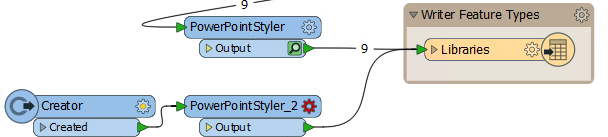

Open the parameters dialog for the second PowerPointStyler. Set it as follows:

- **Slide Type:** Title Slide
- **Title:** The Vancouver Community
- **Subtitle:** A series of FME-generated maps and charts
- **Slide Order:** 1

The Slide Order parameter is important because we want this to be the first slide in the presentation. Yes, we could rely on this feature being written first, but that's harder to control. Also visit the first PowerPointStyler transformer and set its Slide Order to 2, to ensure it comes second in the presentation.

Re-run the workspace and check the output. You should now have two slides (one title slide, one for libraries), with all slides and features in the correct order and with unique colors per "layer": 

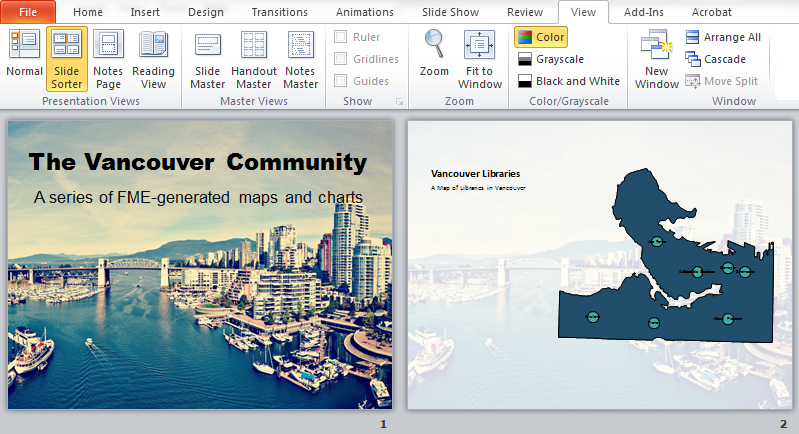

This forms a great basis for your presentation on the communities of Vancouver! You could even start experimenting with using the BookCount and Circulation attributes as the size of feature in the 2DEllipseReplacer, to create a thematic map.

---

<!--Exercise Congratulations Section--> 

<table style="border-spacing: 0px">
<tr>
<td style="vertical-align:middle;background-color:darkorange;border: 2px solid darkorange">
<i class="fa fa-thumbs-o-up fa-lg fa-pull-left fa-fw" style="color:white;padding-right: 12px;vertical-align:text-top"></i>
CONGRATULATIONS
</td>
</tr>

<tr>
<td style="border: 1px solid darkorange">

By completing this exercise you have learned how to:
 
<ul><li>Create maps with the PowerPointStyler</li>
<li>Replace point features with ellipses using the 2DEllipseReplacer</li>
<li>Create slide groups for multiple features per PowerPoint slide</li>
<li>Sort features into the correct order for visualizing on a slide</li>
<li>Set feature colors on a random group-by basis</li>
<li>Sort slides into the correct order in a presentation</li></ul>

</td>
</tr>
</table>