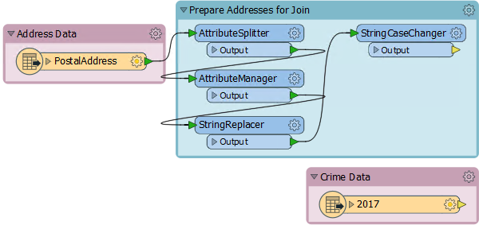
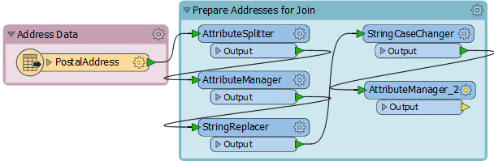
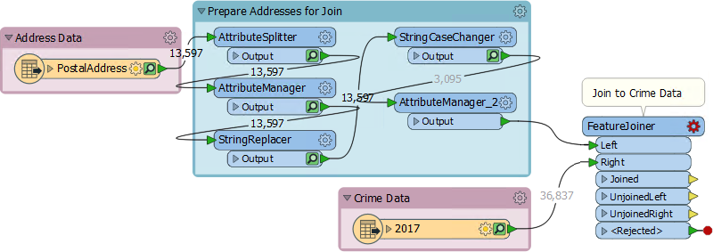
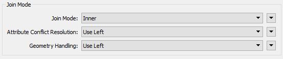
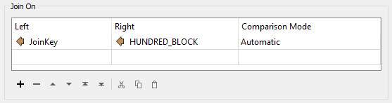
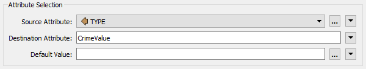
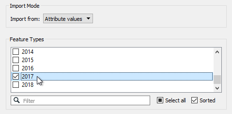
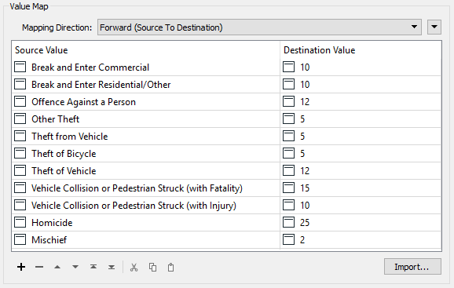
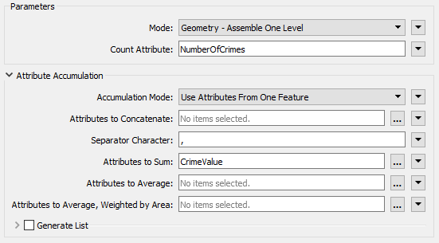
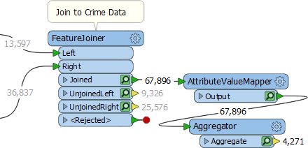

<!--Exercise Section-->

<table style="border-spacing: 0px;border-collapse: collapse;font-family:serif">
<tr>
<td width=25% style="vertical-align:middle;background-color:darkorange;border: 2px solid darkorange">
<i class="fa fa-cogs fa-lg fa-pull-left fa-fw" style="color:white;padding-right: 12px;vertical-align:text-top"></i>
Exercise
</td>
<td style="border: 2px solid darkorange;background-color:darkorange;color:white">
The FeatureJoiner
</td>
</tr>

<tr>
<td style="border: 1px solid darkorange; font-weight: bold">Data</td>
<td style="border: 1px solid darkorange">Addresses (Esri Geodatabase) Crime Statistics (Microsoft Excel)</td>
</tr>

<tr>
<td style="border: 1px solid darkorange; font-weight: bold">Overall Goal</td>
<td style="border: 1px solid darkorange">Join crime statistics to each address using street name and block number</td>
</tr>

<tr>
<td style="border: 1px solid darkorange; font-weight: bold">Demonstrates</td>
<td style="border: 1px solid darkorange">The FeatureJoiner transformer</td>
</tr>

<tr>
<td style="border: 1px solid darkorange; font-weight: bold">Start Workspace</td>
<td style="border: 1px solid darkorange">C:\FMEData2018\Workspaces\UpgradingTo2018\FeatureJoiner-Ex1-Begin.fmw</td>
</tr>

<tr>
<td style="border: 1px solid darkorange; font-weight: bold">End Workspace</td>
<td style="border: 1px solid darkorange">C:\FMEData2018\Workspaces\UpgradingTo2018\FeatureJoiner-Ex1-Complete.fmw</td>
</tr>

</table>

Your task for today is to make a join between address points and a dataset of crime statistics. An existing workspace has already been set up to prepare the data by standardizing the attributes required to make a join key.

 **1) Open Workspace**
 Open the beginning workspace for the exercise, FeatureJoiner-Ex1-Begin.fmw

Inspect the workspace contents:

Notice that the StringReplacer and the StringCaseChanger in particular are set up to adjust the PostalAddress attributes (200 High Street) in such a way as to match those in the crime data (2XX HIGH STREET).

Also notice that the crime data is being read directly from the City of Vancouver website. We probably won't want to read that more times than is necessary, so will make use of caches.

---

<!--Tip Section--> 

<table style="border-spacing: 0px">
<tr>
<td style="vertical-align:middle;background-color:darkorange;border: 2px solid darkorange">
<i class="fa fa-info-circle fa-lg fa-pull-left fa-fw" style="color:white;padding-right: 12px;vertical-align:text-top"></i>
TIP
</td>
</tr>

<tr>
<td style="border: 1px solid darkorange">

If, for whatever reason, you can't access the data on the City of Vancouver website, change the reader parameter on the Excel reader to point to: C:\FMEData2018\Data\Emergency\crime_xlsx_all_years.zip

</td>
</tr>
</table>

---

 **2) Run Workspace**
 Before putting down any transformers, turn on feature caching and run the workspace. We can't be sure how long it will take to fill the caches, and we can carry on building the workspace while it runs.

 **3) Place AttributeManager**
 A FeatureJoiner transformer does not allow use of a text editor to construct a join key, therefore any join key we wish to make must be done in an AttributeManager.

So, place an AttributeManager transformer, inside the Prepare Addresses bookmark, connected to the StringCaseChanger:

Open the AttributeManager parameters dialog. Create a new attribute called JoinKey. For the attribute value click the drop-down list and choose to open the Text Editor. In the editor enter:

<pre>
@Trim(@Value(Number) @Value(Street))
</pre>

...with a space character between the Number and Street attributes:

 **4) Place FeatureJoiner**
 Add a FeatureJoiner transformer, with the new AttributeManager connected to the Left input port and the Crime Data feature type connected to the Right:

Open the parameters dialog. Set the Join Mode to Inner, because we want to only keep addresses where there is a match to crime on the same block. Leave the other two Join Mode parameters to their default (Use Left):

Now select the newly created JoinKey attribute as the Left Join On key. Choose the existing crime data attribute HUNDRED_BLOCK as the Right Join On key: 

Close the dialog.

 **5) Run Workspace**
 Run the workspace by selecting the FeatureJoiner and choosing Run To This. Besides noticing how fast the translation runs, notice that there will be 67,896 matched features. That's because there are multiple crimes per block and so multiple matches per address.

Inspect the cached data and you will notice that there is one join per feature, rather than a list such as the FeatureMerger might create.

 **6) Add AttributeValueMapper**
 The reason we want to carry out this join is to assess crime for each address. We'll do this by giving a value to each crime that is committed and creating a sum for each address.

So, place an AttributeValueMapper transformer connected to the FeatureJoiner:Joined output port. Open the parameters and set the Source Attribute to TYPE and the Destination Attribute to *CrimeValue*:

Now click the Import button. We'll use this to import a list of different types of crime from the crime dataset. Enter:

<table style="border: 0px">

<tr>
<td style="font-weight: bold">Reader Format</td>
<td style="">Microsoft Excel</td>
</tr>

<tr>
<td style="font-weight: bold">Reader Dataset</td>
<td style="">C:\FMEData2018\Data\Emergency\crime_xlsx_all_years.zip</td>
</tr>

</table>

Click Next. When prompted (it will take a while to scan the dataset) pick 2017 as the Feature Type and change Import From to be Attribute Values:

Next select TYPE as the Source Value (no Destination Value need be selected) and click Import. FME will import a list of different crimes. Give each crime a value (say from 1-25) based on what you consider the severity of the crime to be:

Don't worry, it's just a hypothetical exercise. You won't be marked on what values you've awarded!

 **7) Add Aggregator**
 Now we need to group all joined features by their address, and add together the crime values. A ListBuilder and ListSummer might be one solution, but here we'll use an Aggregator transformer because it can do both actions in one.

So place an Aggregator connected to the AttributeValueMapper. Open the parameters dialog. Set:

- Group By: PSTLADDRESS
- Count Attribute: NumberOfCrimes
- Attributes to Sum: CrimeValue

If we wanted to create a list of crimes we could do that with the Generate List option, but we won't do that for now:

Now run the workspace using Run To This on the Aggregator:

The output of the Aggregator (4,271 features) plus the UnJoinedLeft output on the FeatureJoiner (9,326) should equal the number of addresses entering the FeatureJoiner (13,597). It does, so we can tell we have the correct number of features.

 **8) Add CenterPointReplacer**
 Inspect the Aggregator cache. Notice that each feature is actually made up of a multipoint feature. This we don't need, so add a CenterPointReplacer transformer to the end of the workspace to reduce this to a single point.

Now we have our desired output: a feature per address with a count of the number of crimes in that block and a sum of their severity. With this information we could (if we wanted) calculate the average crime severity per address/block, and maybe even map this data with perhaps the MapnikRasterizer transformer.

Save the workspace as a template, including the feature caches, and it will be ready for you to continue the project the next time you join start FME.

---

<!--Exercise Congratulations Section--> 

<table style="border-spacing: 0px">
<tr>
<td style="vertical-align:middle;background-color:darkorange;border: 2px solid darkorange">
<i class="fa fa-thumbs-o-up fa-lg fa-pull-left fa-fw" style="color:white;padding-right: 12px;vertical-align:text-top"></i>
CONGRATULATIONS
</td>
</tr>

<tr>
<td style="border: 1px solid darkorange">

By completing this exercise you have learned how to:
 
<ul><li>Create a join key for the FeatureJoiner</li>
<li>Use the FeatureJoiner transformer to join two sets of features</li>
<li>Group multiple join features together with an Aggregator</li>
<li>Create a single point geometry for grouped joins</li></ul>

</td>
</tr>
</table>
