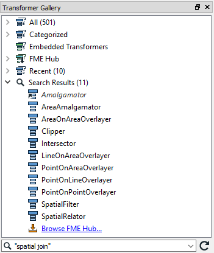

# Locating Transformers

Even experienced FME users find the full list of transformers a daunting sight. In this section, you’ll learn to stop worrying and love the transformer gallery.

With over five hundred (500) transformers, FME possesses a lot of functionality; probably a lot more than a new user realizes and much of which would be very useful to them. This section helps you find the transformer you need, even if you didn’t know you needed it.

Although the transformer list can look a bit overwhelming, don't panic! The reality is that most users focus on 20-30 transformers that are relevant to their day-to-day workflow. You don't need to know every single transformer to use FME effectively.

## Transformer Gallery ##
The transformer gallery window is the obvious place to start looking for transformers. There are a number of ways in which transformers here can be located.

## Transformer Categories ##
Transformer categories are a good starting point from which to explore the transformer list. Transformers are grouped in categories to help find a transformer relevant to the problem at hand.

Although all of them are important, the most commonly used transformers are found in these categories:

- **Attributes**: Operations for attribute/list management
- **Calculated Values**: Operations that return a calculated value
- **Filters and Joins**: Operations for dividing and merging data flows
- **Geometries**: Operations that create geometry or transform it to a different geometry type
- **Spatial Analysis**: Operations that return the result of a spatial analysis
- **Strings**: Operations that manipulate string contents, including dates

Simply click on the expand button to show all transformers within a particular category.

---

## Transformer Help ##

---





## Transformer Searching ##
There are search functions in both the transformer gallery and Quick Add dialog.

### Transformer Gallery Search

To perform a search in the transformer gallery, enter the search terms and either press the <enter> key or click the search icon (the binoculars icon).

The transformer gallery search searches in both name and description. Therefore a search term may be the exact name of a transformer, or it may be a general keyword referring to functionality in general:

Search terms can either be full or partial words and may consist of a number of keywords, including quote marks to enclose a single search reference:

---

### Quick Add Search ###

Quick Add search terms can also be full or partial words:

By default, Quick Add does not look in transformer descriptions, so the search term must be the actual name of a transformer:

However, Quick Add will search in the transformer descriptions if you press the &lt;TAB&gt; key:

Quick Add results include aliases - for example, transformers that have an alternative name or which have been renamed - and also include transformers found in the FME Hub:

---

#### The FME Hub

The [FME Hub](https://hub.safe.com/) is a facility for sharing FME functionality such as custom transformers, web connections, and formats:

Transformers from the hub are shown in Quick Add with a small, downwards-pointing arrow, to denote that they will be downloaded if selected.

---

#### CamelCase
Quick Add also allows the use of CamelCase initials as a shortcut. CamelCase is where a single keyword is made up of several conjoined words, each of which retains an upper case initial; for example AttributeFileWriter (AFW) or ShortestPathFinder (SPF).

# Exercise

<!-- Finding transformers -->
