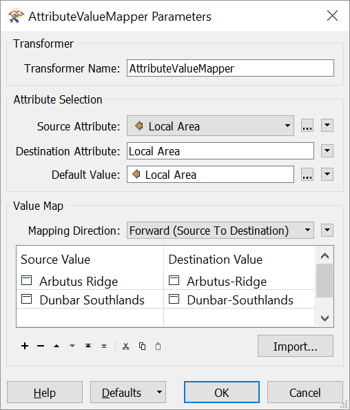



{{ template.exercise("3.2b",
               "Locating Transformers",
               "3-1-1 case location details (XLS hosted on FTP)",
               "Find a transformer to fix inconsistent data",
               "Using Transformer Gallery and Quick Add",
               "C:\\FMEData2018\\Workspaces\\IntroToDesktop\\Ex3.2-Begin.fmw",
               "C:\\FMEData2018\\Workspaces\\IntroToDesktop\\Ex3.2-Complete.fmw")
}}

Did you find a transformer that worked?

# Answer

We can fix this problem with a single transformer: the [AttributeValueMapper](https://docs.safe.com/fme/html/FME_Desktop_Documentation/FME_Transformers/Transformers/attributevaluemapper.htm). Here is the description from the [FME Documentation](http://docs.safe.com/fme/html/FME_Desktop_Documentation/FME_Transformers/Transformers/attributevaluemapper.htm):

>Compares attribute values to a lookup table and assigns new values where matches are found. Mapped values may be stored in a new attribute, or overwrite an existing attribute, including the original source.

# Other Solutions

Don't worry if you didn't find this specific transformer. Hopefully the exercise of looking for it still exposed you to some of the paths you can use to find the right transformer.

You might have found another way to solve this problem. Here are a few possibilities:

- An [AttributeManager](https://docs.safe.com/fme/html/FME_Desktop_Documentation/FME_Transformers/Transformers/attributemanager.htm) with [Conditional Values](https://docs.safe.com/fme/html/FME_Desktop_Documentation/FME_Workbench/!Transformer_Parameters/Parameter_Condition_Definition_Dialog.htm)
- An [AttributeCreator](https://docs.safe.com/fme/html/FME_Desktop_Documentation/FME_Transformers/Transformers/attributecreator.htm) with [Conditional Values](https://docs.safe.com/fme/html/FME_Desktop_Documentation/FME_Workbench/!Transformer_Parameters/Parameter_Condition_Definition_Dialog.htm)
- A [TestFilter](https://docs.safe.com/fme/html/FME_Desktop_Documentation/FME_Transformers/Transformers/testfilter.htm) and [AttributeCreators](https://docs.safe.com/fme/html/FME_Desktop_Documentation/FME_Transformers/Transformers/attributecreator.htm)
- [Testers](https://docs.safe.com/fme/html/FME_Desktop_Documentation/FME_Transformers/Transformers/tester.htm) and [AttributeCreators](https://docs.safe.com/fme/html/FME_Desktop_Documentation/FME_Transformers/Transformers/attributecreator.htm)
- [AttributeValidators](http://docs.safe.com/fme/html/FME_Desktop_Documentation/FME_Transformers/Transformers/attributevalidator.htm) and [AttributeCreators](https://docs.safe.com/fme/html/FME_Desktop_Documentation/FME_Transformers/Transformers/attributecreator.htm)
- Two consecutive [StringReplacers](https://docs.safe.com/fme/html/FME_Desktop_Documentation/FME_Transformers/Transformers/stringreplacer.htm)

Did you find another way? Congratulations! Please let us know at [train@safe.com](mailto:train@safe.com).

# 1) Start Workbench

Start Workbench (if necessary) and open the workspace from Exercise 3.1. Alternatively you can open C:\\FMEData2018\\Workspaces\\IntroToDesktop\\Ex3.2-Begin.fmw.

# 2) Add an AttributeValueMapper

Add an AttributeValueMapper to the canvas between the AttributeManager and the writer feature type.

Once it is added, double-click it to open its parameters. This transformer allows you to supply a series of Source Values and Destination Values. The source values in the incoming data are replaced by any matching destination values, or otherwise receive a default value. Fill in the parameters like this:

|Parameter|Value|
|-|-|
|Source Attribute|`Local Area`|
|Destination Attribute|`Local Area`|
|Default Value|`Local Area`|
|Mapping Direction|Forward (Source to Destination)|

|Source Value|Destination Value|
|-|-|
|Arbutus Ridge|Arbutus-Ridge|
|Dunbar Southlands|Dunbar-Southlands|

We will replace any values with a space to those with a dash - this fits the [City of Vancouver specification](https://data.vancouver.ca/datacatalogue/localAreaBoundary.htm).

Note that by providing an attribute to Default Value, if `Local Area` for a feature doesn't equal one of the Source Values, it will simply keep the value it already had.

Your dialog should look like this:



<ul>
  <li>Search for a transformer using the Transformer Gallery (in Workbench and online), the FME Transformer Reference Guide, and/or Quick Add.</li>
  <li>Use a AttributeValueMapper to fix inconsistent data values</li>
</ul>


