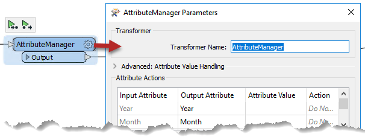
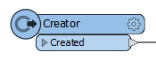
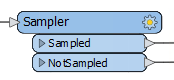
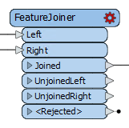
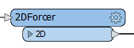
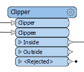
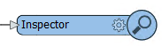
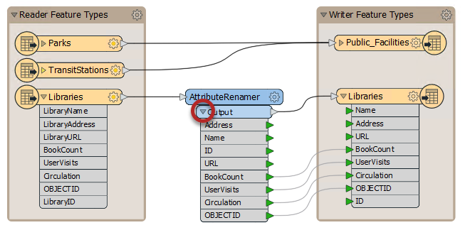

# Transformers

Besides Schema Editing and Schema Mapping, transformation can be carried out using objects called ***transformers***.

## What is a Transformer?

As the name suggests, a transformer is an FME Workbench object that carries out the transformation of features. There are lots of FME transformers, each of which carries out a different operation.

Transformers are connected somewhere between the reader and writer feature types, so that data flows from the reader, through a transformation process, and on to the writer.

Transformers appear in the canvas window as rectangular, light-blue objects.

## Transformer Parameters

Each transformer may have many parameters (settings). Parameters can be accessed (like feature types) by clicking the cogwheel icon:

Alternatively, if the Parameter Editor window is open, parameters can be found there by clicking on the transformer (or any other canvas object):

---

## Color-Coded Parameter Buttons

The parameter button on a transformer is color-coded to reflect the status of the settings.

A blue parameter button indicates that the transformer parameters were checked and amended as required and that the transformer is ready to use.

A yellow parameter button indicates that the default parameters have not yet been checked.

A red parameter button indicates that there is at least one parameter for which FME cannot supply a default value. The parameter must be provided with a value before using the transformer.

## Transformer Ports

Far from having just a single input and output, a transformer can have multiple input ports, multiple output ports, or both.

This 2DForcer transformer has a single input and output port.

This Clipper has multiple input and output ports. Notice that not all of them are – or need to be – connected.

This Inspector has just a single input port...

…whereas this Creator has only a single output port!

### Transformer Attributes

Click on the drop-down arrow of a transformer output port to see all of the attributes that exit the transformer. This list includes all changes applied within the transformer.

This feature lets one visualize which attributes have been created, lost, or otherwise transformed within the transformer.
