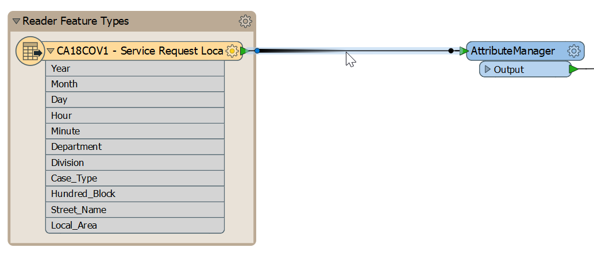
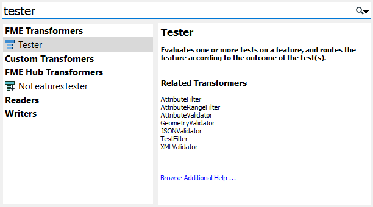
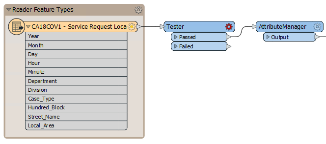
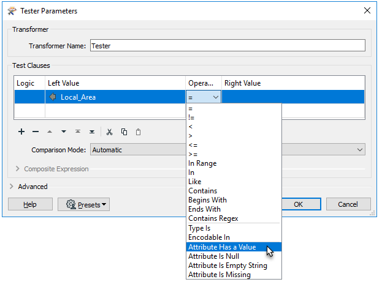
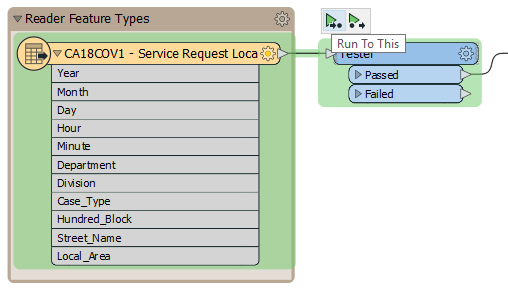
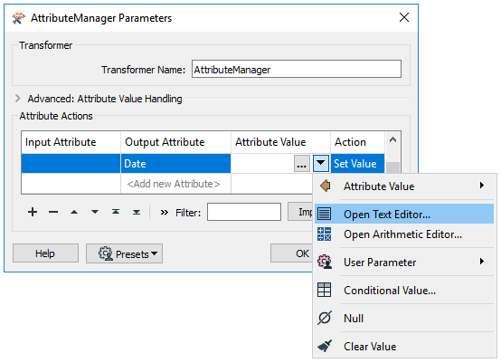
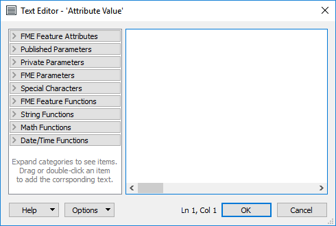
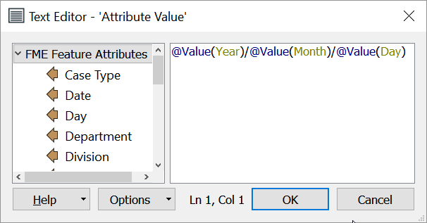
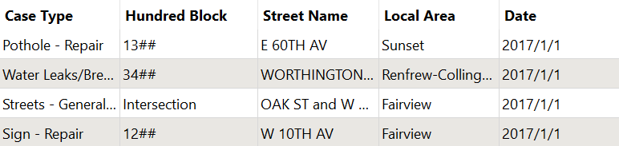



{{ template.exercise(3.1,
               "Adding a Transformer",
               "3-1-1 case location details (XLS hosted on FTP)",
               "Add a transformer to filter out missing values<br>Calculate a new attribute",
               "Adding a transformer<br>Setting transformer parameters<br>Filtering",
               "C:\\FMEData2019\\Workspaces\\IntroToDesktop\\Ex3.1-Begin.fmw",
               "C:\\FMEData2019\\Workspaces\\IntroToDesktop\\Ex3.1-Complete.fmw")
}}

We know from the [last unit](..\2.translations\2.05.ex2.2.md) that we have missing values in our data. We can use a filtering transformer to remove features with missing values.

# 1) Start Workbench

Start Workbench (if necessary) and open the workspace from Exercise 2.4. Alternatively you can open C:\\FMEData2019\\Workspaces\\IntroToDesktop\\Ex3.1-Begin.fmw.

# 2) Add Tester Transformer

Click on the feature connection between the reader feature type and the AttributeManager:



Start to type the phrase "Tester." When the list is short enough for you to see the Tester, select it from the dialog (double-click on it):



Doing so will place a Tester transformer:



Notice that the Passed output port is the one connected by default.

# 3) Set Parameters

Inspect the parameters for the Tester transformer (either its dialog or in the Parameter Editor window). Click in the Left Value field and from there click the down arrow and choose Attribute Value &gt; `Local_Area`:


For the Operator field click the cell and select "Attribute Has a Value." We do not need to fill in the Right Value field for this operator. Your Test Clauses table should look like this:



There might be missing values in other attributes, but we are only concerned with cases where `Local_Area` is missing, so we will only fill in one test clause.

Click OK to accept the values and close the dialog.



<p>
  You could also accomplish this procedure with the <a href="http://docs.safe.com/fme/html/FME_Desktop_Documentation/FME_Transformers/Transformers/nullattributemapper.htm">NullAttributeValueMapper</a>. In FME there is usually more than one way to solve your problem.
</p>



# 4) Run the Workspace using Feature Caching

Now that you know how to use feature caching, we can use it to test our new transformer. Select the Tester transformer. Then click the "Run To This" icon (note that the objects that will run are highlighted in green):



Your workspace will run. If you set up the Tester properly, it should do so without errors. If you pay attention while the translation is running, you can see the feature counts increasing as features flow through the workspace. By the time the translation is complete, 4,122 features will be filtered out to the Tester's Failed port. These features did not have values for `Local_Area` and are removed from the rest of the translation.

# 5) Explore the Text Editor

In [Exercise 2.4](../2.translations/2.09.ex2.4.md) we added a `Date` attribute, but it does not have any values yet.

You can enter in the value for our `Date` attribute in the Attribute Value column. If you were to type in "January 1st, 2000," all of the features would receive that value as a constant. However, what we want to do is create a date attribute that combines (or "concatenates") our existing date-time fields: `Year`, `Month`, `Day`, `Hour`, and `Minute`.

We can do that using FME's **Text Editor**, which allows us to construct an expression to generate the value for our attribute. To open it, click the Attribute Value cell, and then click the drop-down arrow that appears. You will see "Open Text Editor" and "Open Arithmetic Editor" as options. Click "Open Text Editor":



The text editor - as you would expect - allows you to construct a text value. It includes all the usual string-handling functionality you would need, such as concatenation, trimming, padding, and case changing.

The text editor looks like this:



Notice the menu on the left-hand side. Existing attributes are listed here and were added into the string by double-clicking them. Also, notice the other menu options. The essential functions for text are the String Functions:


The **Arithmetic Editor** contains similar functions, as well as mathematical operators to calculate values for attributes.

# 6) Create Values for `Date` Attribute

Let's combine existing attributes to give `Date` some values. In the left-hand panel under "FME Feature Attributes," you will see all the incoming attributes listed. Double-click the attribute `Year`. Doing so adds `@Value(Year)` to the Text Editor window. When the translation runs, this code will take the value of `Year` for each feature. We can combine multiple attribute values to construct the date. In this case, we will create a basic year/month/day attribute, but you could use the Text Editor to format your date however you like.

Type in a forward-slash `/` and then double-click the attribute `Month`, type in another `/`, and then double-click the attribute `Day`. You should see this in the Text Editor:



Alternatively, you can copy and paste the following into the Text Editor:

```
@Value(Year)/@Value(Month)/@Value(Day)
```

Click OK and OK again. Save your workspace. Then, use Run To This on the AttributeManager.



Many FME Text and Arithmetic Editor functions come from the <a href="https://en.wikipedia.org/wiki/Tcl">Tcl programming language</a>. If you do not want to type out code, most results can also be accomplished using transformers. For more information, refer to the <a href="http://docs.safe.com/fme/html/FME_Desktop_Documentation/FME_Workbench/!Transformer_Parameters/text_editor.htm">Documentation</a>.



# 7) Inspect the Data

Inspect the AttributeManager feature cache and examine the Table View window. You can see that the underscores have been removed from attribute names and the `Date` attribute now correctly displays the full date/time in FME standard format:





<p>
  If you want to use a more realistic - but also more complicated - example, you can generate a <a href="https://docs.safe.com/fme/html/FME_Desktop_Documentation/FME_Workbench/!Transformer_Parameters/standard_fme_date_time_format.htm">standard FME date/time stamp</a>. To do so, copy and paste the following code into the Text Editor:
  <br>
  <code>
    @TimeZoneSet(@Format(%04d,@Value(Year))@Format(%02d,@Value(Month))@Format(%02d,@Value(Day))@Format(<%02d></%02d>,@Value(Hour))@Format(%02d,@Value(Minute))00, local)
  </code>
</p>

<p>
  The details aren't important here, but if you want them, read on. In short, we are using the <code>@TimeZoneSet</code> function to add a <a href="https://en.wikipedia.org/wiki/UTC_offset">UTC offset</a> to each date/time stamp. We are forming the date/time stamp by combining the attributes from our source data into a string matching <a href="https://docs.safe.com/fme/html/FME_Desktop_Documentation/FME_Workbench/!Transformer_Parameters/standard_fme_date_time_format.htm">FME date/time format</a>: <code>yyyymmddhhss-UTC</code>. Our original data had single digit months, days, hours, and minutes missing the leading zero, so we use the <code>@Format</code> function to fix that problem. This new attribute will be easier to use in FME workflows.
</p>





<ul>
  <li>Filter data using the Tester transformer</li>
  <li>Use transformer parameters to create attributes that match the writer schema</li>
  <li>Construct an attribute value using the Text Editor</li>
</ul>


