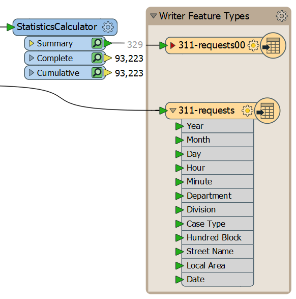
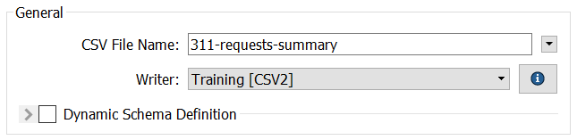
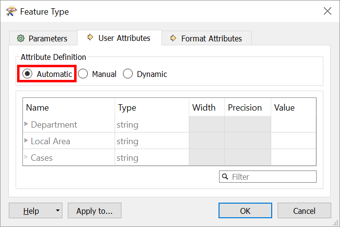



{{ template.exercise(3.3,
               "Using Common Transformers",
               "3-1-1 case location details (<code>.xls</code> hosted on FTP)",
               "Add a transformer to clean up schema Create a summary table",
               "Common transformer procedures",
               "C:\\FMEData2018\\Workspaces\\IntroToDesktop\\Ex3.3-Begin.fmw",
               "C:\\FMEData2018\\Workspaces\\IntroToDesktop\\Ex3.3-Complete.fmw")
}}

Did you find a transformer that works? The easiest one to use is the **StatisticsCalculator**. Let's add it to our workspace.



Again, there are often multiple solutions to a given problem in FME. We could accomplish roughly the same result by using:

<ul>
  <li>An <a href="https://docs.safe.com/fme/html/FME_Desktop_Documentation/FME_Transformers/Transformers/attributepivoter.htm" target="_blank">AttributePivoter</a></li>
  <li>An <a href="https://docs.safe.com/fme/html/FME_Desktop_Documentation/FME_Transformers/Transformers/aggregator.htm" target="_blank">Aggregator</a> and a <a href="https://docs.safe.com/fme/html/FME_Desktop_Documentation/FME_Transformers/Transformers/listhistogrammer.htm" target="_blank">ListHistogrammer</a></li>
  <li>Some overly-complicated combination of AttributeCreators, AttributeFilters, Counters, and Sorters</li>
</ul>



# 1) Start Workbench

Start Workbench (if necessary) and open the workspace from Exercise 3.2. Alternatively you can open C:\\FMEData2018\\Workspaces\\IntroToDesktop\\Ex3.3-Begin.fmw.

# 2) Add a StatisticsCalculator

Click the feature connection line between the second StringReplacer and your writer feature type. Then, type "StatisticsCalculator" and hit <kbd>Enter</kbd> when it appears on the Quick Add menu:

IMAGE, maybe show connection if needed

Your workspace should look like this:

IMAGE

Double-click the StatisticsCalculator to open its parameters. Fill them in like this:

|Parameter|Value|
|-|-|
|Group By|`Department` and `Local Area`|
|Attributes to Analyze|`Case Type`|
|Total Count Attribute|`Cases`|

Additionally, make sure you remove the values from all the other Calculated Attributes (Minimum Attribute, Maximum Attribute, etc.). You can do this by selecting the parameter and deleting it with the <kbd>Delete</kbd> or <kbd>Backspace</kbd> key, or by clicking the drop-down arrow and selecting Clear Value:

When finished, your parameters should look like this:

Click OK and use Run To Here on the StatisticsCalculator type to summarize your data.

With these parameters, the transformer will add an attribute, `Cases`, to your data, which sums count of `Case Type`. By setting Group By to `Department` and `Local Area`, we get the total count for each unique combination of department and local area.

# 3) Inspect the Cache

Let's inspect the cache to ensure our data looks correct. Click on the green inspect cache icon on the **Summary** output port of the StatisticsCalculator. The StatisticsCalculator illustrates that transformers vary in the number of input and output ports they have. The Summary port outputs a summary table of the results, resulting in a new stream of features (here, 329), while the Complete and Cumulative ports add the results of the summary to every incoming feature (here, 93,223).

In the Data Inspector, you should see this in the Table View:

This result is a good start, but now that our data's schema has changed, we have different attributes than those on our existing writer feature type. We can add another CSV feature type with a different schema to address that.

**DO THIS? Or just keep one CSV feature type? Then we don't have multiple feature types, but we would have multiple reader/writer and fanout...**

# 4) Duplicate the CSV Writer Feature Type

Because your manager wants both the original data with a new schema _and_ the summary table, we need two CSV writer feature types. Right-click the 311-requests feature type and click Duplicate. Move this new feature type (called 311-requests00 by default) above the original feature type and connect it to the Summary output port of the StatisticsCalculator:

We need to edit the new summary feature type's schema. Double-click your 311-requests00 feature type to open its parameters. Change CSV File Name to 311-requests-summary:

Then, click on the User Attributes tab. We _could_ manually remove the attributes we don't need. However, there is a faster way. Because we want our feature type to accept the parameters coming out of the StatisticsCalculator Summary port, we can change the Attribute Definition method from Manual to Automatic. Feature types using this mode will automatically adjust their schema to match connected features. Clicking it will edit the schema to contain only `Department`, `Local Area`, and `Cases`:

<!--- remove other time attributes? -->

Now we have two CSV feature types being written, containing different structure (schema) and content (attribute values).



<ul>
  <li>Use the StatisticsCalculator to generate a summary table.</li>
  <li>Use group-by to group features in a transformer.</li>
  <li>Observe that some transformers have multiple output ports creating different streams of data.</li>
</ul>


