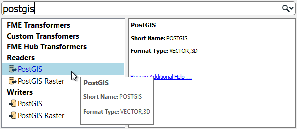
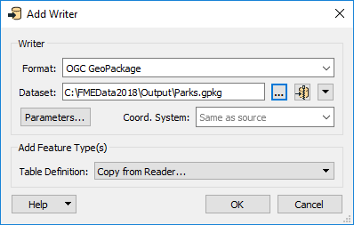

# Multiple Readers, Writers, and Feature Types

## Multiple Readers and Writers

An FME workspace is not limited to any particular number of readers or writers; readers and writers can be added to a workspace at any time, any number of formats can be used, and there does not need to be an equal number of readers and writers.

For example, the Navigator window shows this workspace contains two readers and three writers, of different data types and formats!





It's important to note that readers and writers don’t appear as objects on the Workbench canvas. Their feature types (layers) do, but readers and writers do not.
  Instead they are represented by entries in the Navigator window, as in the above screenshot.



### Adding Readers and Writers

Additional readers or writers are added to a translation using the Quick Add menu:

...Or by selecting Readers &gt; Add Reader (Writers &gt; Add Writer) from the menubar:

This action opens a dialog, similar to the Generate Workspace dialog, in which the parameters for the new reader or writer can be defined:

You can add as many readers and writers as you require in this way.



A reader can also be added by dragging a dataset from a file system explorer and dropping it onto the Workbench canvas.



### Removing a Reader or Writer

If a reader or writer is no longer required, then it can be removed using options on the menubar:

Alternatively, it's possible to right-click a reader/writer in the Navigator window and choose the Delete option.

---

### Updating a Reader or Writer

Readers and writers can be updated so that older workspaces have the speed and functionality available in a newer version of FME. You can update a transformer by right-clicking the reader/writer in the Navigator window and choosing the Update option:

For readers, this tool provides the option to either update the reader or to also update the list of feature types being read. This way the workspace can be updated if the source data changes. Another way to update feature types is Reader &gt; Update Feature Types on the menubar.

## Multiple Feature Types

In manual?

- You might be prompted to add feature types
- Pick the ones you want
- Add FT to r/w
