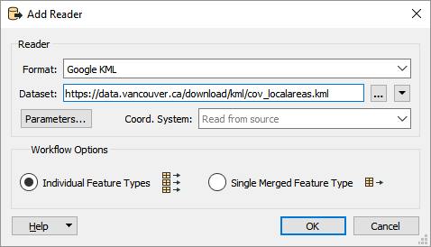
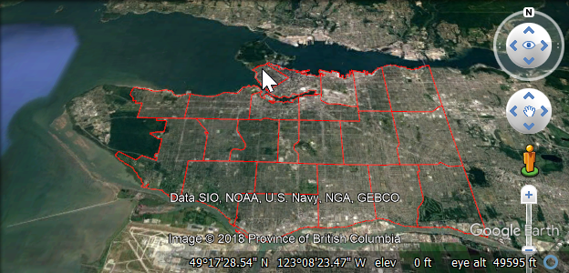
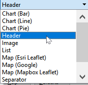
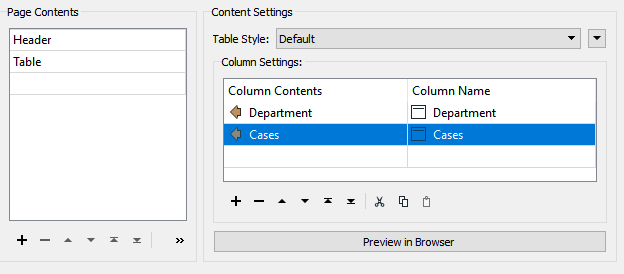
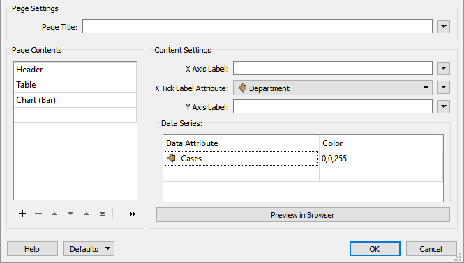
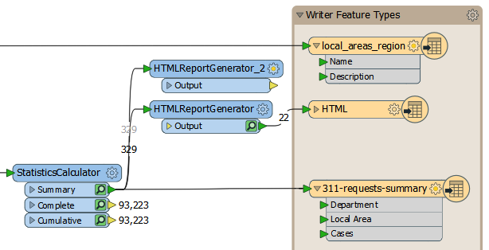



{{ template.exercise(4.1,
               "Multiple Readers, Writers, and Feature Types",
               "3-1-1 case location details (XLS hosted on FTP) Local planning area polygons (KML hosted on FTP)",
               "Add additional readers and writers Add a dataset fanout Create a report using the HTMLReportGenerator",
               "Creating more complex FME workflows",
               "C:\\FMEData2018\\Workspaces\\IntroToDesktop\\Ex4.1-Begin.fmw",
               "C:\\FMEData2018\\Workspaces\\IntroToDesktop\\Ex4.1-Complete.fmw")
}}

City planners are undertaking strategic planning and want to know which local planning areas will need additional resources. They have requested the following:

- They like the summary table made earlier, but instead of a single CSV, they want a CSV for each planning area to send to local planners
- Reports of the 3-1-1 requests by local planning areas with tables and charts
- A map they can use to view the local planning areas with summary tables of the requests

You have decided to create an HTML report with tables and charts and a KML ([Keyhole Markup Language](https://developers.google.com/kml/), a spatial data format used by Google Earth) map to share with them. This task requires adding additional readers and writers to our workspace. In this exercise we will add a KML reader feature type, a KML writer feature type, and an HTML writer feature type. We will also use a transformer to generate the HTML report.

# 1) Start Workbench

Start Workbench (if necessary) and open the workspace from Exercise 3.2b. Alternatively you can open C:\\FMEData2018\\Workspaces\\IntroToDesktop\\Ex4.1-Begin.fmw.

# 2) Add a KML Reader

First, let's add a KML reader for the local planning areas. Click Readers > Add Reader, or press <kbd>Ctrl</kbd> + <kbd>Alt</kbd> + <kbd>R</kbd>. Enter the following:

<table style="border: 0px">

  <tr>
    <td style="font-weight: bold">Reader Format</td>
    <td style="">Google KML</td>
  </tr>

  <tr>
    <td style="font-weight: bold">Reader Dataset</td>
    <td style=""><a href="https://data.vancouver.ca/download/kml/cov_localareas.kml">https://data.vancouver.ca/download/kml/cov_localareas.kml</a> <i>Note:</i> You can also access the data locally at C:\FMEData2018\Data\Boundaries\LocalAreas.kml</td>
  </tr>

</table>

Your dialog should look like this:

Click Ok. When prompted, select only the "local_areas_region" feature type; this is the layer containing polygons of the local areas:

Click Ok again to add the reader.

# 3) Add a KML Writer

Next, let's add a KML writer for the local areas. Click Writers > Add Writer, or press <kbd>Ctrl</kbd> + <kbd>Alt</kbd> + <kbd>W</kbd>. Enter the following:

<table style="border: 0px">

  <tr>
    <td style="font-weight: bold">Writer Format</td>
    <td style="">Google KML</td>
  </tr>

  <tr>
    <td style="font-weight: bold">Writer Dataset</td>
    <td style="">C:\FMEData2018\Output\Training\localareas.kml</td>
  </tr>

  <tr>
    <td style="font-weight: bold">Feature Type Definition</td>
    <td style="">Automatic/td>
  </tr>

</table>

In the next exercise we'll be connecting data from our summary table to this writer feature type, so we chose Automatic for our feature type definition. Your dialog should look like this:

Click Ok. The feature type parameters dialog will open. Type in local_areas_region as the name for our writer feature type.

The KML writer feature type will be added to your canvas. Go ahead and click and drag to connect your KML reader feature type local_areas_region to it. This part of your workspace should look like this now:

# 4) Inspect KML

Once your KML reader and writer feature types are connected, click the KML writer feature type. Then click Run to This. Once the translation is complete, click the Inspect button. You should see the local area polygons:

You can also use the Open Containing Folder button and open localareas.kml in [Google Earth](https://www.google.com/earth/), if you have it installed:

# 5) Add an HTMLReportGenerator

In order to create an HTML report, we will use an HTMLReportGenerator. We want to add it after the StatisticsCalculator so it uses our summarized data, but we don't want to write out to CSV. So, we'll branch our data stream. Add an HTMLReportGenerator and connect it to the Summary port of the StatisticsCalculator:

Double-click the HTMLReportGenerator to open its parameters. First, set the Group By to `Local Area`. Doing so will tell the transformer to create a report for each local area separately.

Next, click where it says Chart (Bar) under Page Contents. This table is used to add elements to the report. From the dropdown, select Header:

Click somewhere under Content Settings to update the parameters for a Header block. For Text, choose the `Local Area` attribute. For Header Level, choose H1. These settings give us a header with the local area name in each section of the report. Your dialog should look like this:

Click the cell under Header in Page Contents and select Table from the dropdown:

Click somewhere under Content Settings to update the parameters for a Table block. Under Column settings, we'll create two columns, one for Department and one for Cases. Notice that if you type "Department" or "Cases" into the Table Name, FME will automatically choose the attribute value instead of a constant. To fix this, right click the cell and choose Open Text Editor, then type in the name of the column. This will store a constant value instead of supplying an attribute. Your dialog should look like this:

This will make an HTML table listing the number of cases by department.

Finally, let's add a Chart (Bar) to the Page Contents. Fill out the parameters like this:

Click Ok. You can Run to This on the HTMLReportGenerator and inspect the cache, but all you will be able to see is the raw HTML in Data Inspector. We need to write this data out to an HTML file to view it in a browser.

# 6) Add an HTML Writer

Here is another way to add a reader or writer: click on a blank space on the canvas and type HTML. You can use the mouse or <kbd>&#x2191;</kbd> and <kbd>&#x2193;</kbd> to browse the Quick Add menu. You should see HTML listed as an option under Writers:

Double-click it or press <kbd>Enter</kbd> to add an HTML writer. Use the following parameters:

<table style="border: 0px">

  <tr>
    <td style="font-weight: bold">Writer Format</td>
    <td style="">HTML</td>
  </tr>

  <tr>
    <td style="font-weight: bold">Writer Dataset</td>
    <td style="">C:\FMEData2018\Output\Training\report.html</td>
  </tr>

</table>

Your dialog should look like this:

Once the HTML writer appears, connect it to your HTMLReportGenerator's Output port:

# 7) View Your HTML Report

Click on the HTML feature type and select Run to This. Once it has run, click on the Open Containing Folder button to open C:\FMEData2018\Output\Training\. You should see `reports.html`. Open it with your preferred web browser to inspect the heading, tables, and charts:

# 8) Duplicate and Simplify HTMLReportGenerator

In the next exercise we will be adding our summary data to the local area polygons. KML files can display HTML content in a "bubble" that users see when they click an object, so we need to get an HTML table of the summary data. In preparation for this step, we will duplicate the HTMLReportGenerator. Right-click it and select Duplicate, or select it and press <kbd>Ctrl</kbd> + <kbd>D</kbd>.

Then connect the Summary output port of the StatisticsCalculator to the input port of HTMLReportGenerator_2. Your workspace should look like this:

We only need the table for our map, so open the parameters of the HTMLReportGenerator_2 by double-clicking it. Click on Header and then click the Remove Row `-` button to remove it:

Then do the same for the Chart (Bar) section. You should only have the Table section left:

Click Ok. We will come back to this transformer in the next exercise.

# 9) Conduct a Dataset Fanout on the CSV Writer Feature Type

As a last step, we will fulfill the planners' request to have a separate CSV file for each local area. We could add an AttributeFilter and 23 separate CSV feature types, but that would be very inefficient. Instead, we can make use of an FME feature known as fanouts. There are several ways to set up a fanout (for more information, see the [FME Help](http://docs.safe.com/fme/2018.1/html/FME_Desktop_Documentation/FME_Workbench/Workbench/fanout_about.htm)).

To get our desired result, double-click on the 311-requests-summary writer feature type to open its parameters. Telling FME to write separate files is as simple as setting an attribute to the file name. Click the dropdown arrow next to CSV File Name and select Attribute Value > `Local Area`:

Click Ok to make the change and then select the CSV writer feature type and use Run to This to write out the separate files. Click the Open Containing Folder button. Now in C:\\FMEData2018\\Output\\Training you should see 23 separate `.csv` files:

Now we can supply these files to the local planners that need them.



<ul>
  <li>Work with multiple readers and writers</li>
  <li>Generate a report using HTMLReportGenerator</li>
  <li>Conduct a dataset fanout</li>
</ul>


