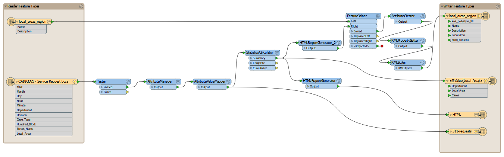



{{ template.exercise("4.3a",
               "Best Practice: Bookmarks and Annotations",
               "3-1-1 case location details (XLS hosted on FTP)",
               "Use bookmarks and annotations to organize your workspace",
               "Following best practice in developing FME workspaces",
               "C:\\FMEData2018\\Workspaces\\IntroToDesktop\\Ex4.3-Begin.fmw",
               "C:\\FMEData2018\\Workspaces\\IntroToDesktop\\Ex4.3-Complete.fmw")
}}

Our final workspace is a bit complicated! We have two reader feature types, three writer feature types, and nine transformers. It should look something like this (click to expand):

If one of your colleagues were to open this workspace, it would take them some time to figure out what exactly it was doing. Let's make their lives easier by following best practice, using bookmarks and annotations to comment on the workspace. This step is also friendly to future you: if you return to this workspace in the future, you will be able to remember what it does by looking at the bookmarks and annotation.

Use the skills covered in the previous unit to create bookmarks for related sections of your workspace and annotations that explain what each transformer is doing. Make sure you add the following:

- Add bookmarks and annotation to your reader and writer feature types, if you don't already have them from [Exercise 2.1](../2.fme-translations/2.03.ex2.1.md)
- Add bookmarks for transformation steps
- Add annotation to describe what transformers are doing

<!-- 35 mins, almost done -->
<!-- with more time, could upload as template to the Hub -->
