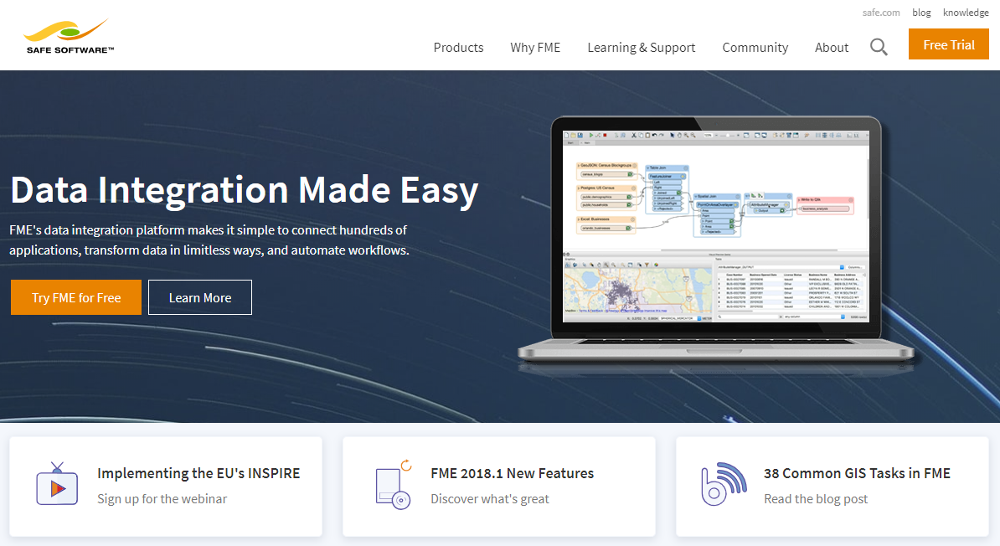

# Module Wrap-up

Congratulations on finishing the Introduction to FME Desktop module. You are now prepared to continue on your FME journey.

## Learning Objectives Review

Here are the learning objectives you have met by completing the module:

After completing the [Getting Started unit](..\1.getting-started\1.01.getting-started.md), you are able to:
- Describe FME and what it does.
- Distinguish between FME Desktop, FME Server, and FME Cloud.
- Explain the difference between FME Workbench and FME Data Inspector.
- Open a workspace.
- Run a workspace.

After completing the [FME Translations unit](..\2.fme.translations\2.01.fme-translations.md), you are able to:
- Define what a workspace is and generate one in FME Workbench.
- Inspect data using FME Data Inspector.
- Explain what a schema is and edit it in FME Workbench.
- Explain what schema mapping is and do it using transformers.
- Turn feature caching on and off and use it when building a workspace.

After completing [FME Transformations unit](..\3.fme-transformations\3.01.fme-transformations.md), you are able to:
- Explain what transformers do in FME.
- Discuss common transformer categories.
- Locate and place transformers using Quick Add.
- Set transformer parameters.

After completing this [FME Workflows unit](..\4.fme-workflows\4.01.fme-workflows.md), you are able to:
- Understand how data flows through a workspace.
- Create a workspace with multiple formats.
- Create a workspace with multiple feature types.
- Use partial runs to debug your workspace.
- Employ basic best practice techniques (bookmarks and annotations) in building your workspaces.

# Product Information and Resources #

Here are some resources to learn more about FME.

## Safe Software Web Site ##

The **[Safe Software web site](https://www.safe.com/ "Safe Software web site")** is the official information source for all things FME. It includes information on FME products, Safe Software services, FME solutions, FME support and Safe Software itself.

## Safe Support Team ##

Behind FME are passionate, fun, and knowledgeable experts, ready to help you succeed, with **[a support team](https://support.safe.com/knowledgeSubmitCase "FME Support Team page")** philosophy built on the principle of knowledge transfer.

You can request product support through a Support Case (web/email) or using a Live Chat.

## Your Local Partner ##

Safe Software has partners and resellers around the world to provide expertise and services in your region and your language.

You can find a list of official partners on the **[Safe Software Partners Page](http://www.safe.com/partners/ "FME Partners Page")**.

## Safe Software Blog ##

The **[Safe Software blog](http://blog.safe.com/ "Safe Software Blog")** provides technical information and general thoughts about FME, customers' use cases, and spatial data interoperability. It includes articles, videos, and podcasts.

## FME Manuals and Documentation ##

Use the Help function in FME Workbench to access help and other documentation for FME Desktop. Alternatively, look on our website under the **[Knowledge Center section](https://support.safe.com/KnowledgeDocumentation "FME Product Documentation")**.

# Community Information and Resources #

Safe Software actively promotes users of FME to become part of the FME Community.

## The FME Knowledge Center ##

The **[FME Knowledge Center](https://knowledge.safe.com/ "FME Knowledge Center")** is our community website - a one-stop shop for all community resources, plus tools for browsing documentation and downloads.

### Knowledge Base ###

The FME Knowledge Base contains a wealth of information; including tips, tricks, examples, and FAQs. There are sections on both FME Desktop and FME Server, with articles on topics from installation and licensing to the most advanced translation and transformation tasks.

### Q&A Forum ###

FME community members post FME-related messages, ask questions, and share in answering other users’ questions. Members earn "reputation" and "badges," and there is a leaderboard of the top-participating users. Come and see how they can help with your FME projects!

### Ideas Exchange ###

FME development is very much user-driven. The Ideas Exchange gives users the chance to post their ideas for new FME functionality, or improvements to existing functionality, and allows everyone to vote on the proposed ideas. The more votes an idea gets, the more likely it is to be implemented!

## The FME Channel ##

This **[FME YouTube channel](https://www.youtube.com/user/FMEchannel "FME YouTube Channel")** is for those demos that can only be properly appreciated through a screencast or movie. Besides this, there are a host of explanatory and helpful videos, including recordings of most training and tutorials.

