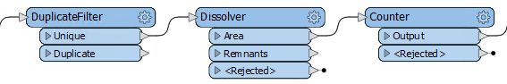
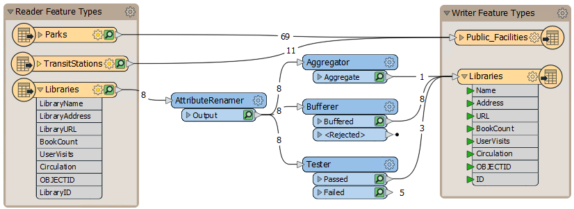
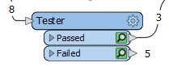
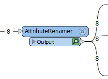
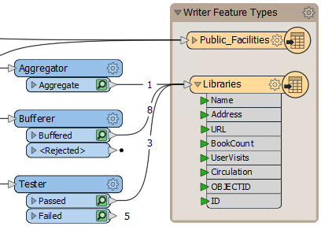

# The Workflow

<!-- How data moves across canvas, looping -->

# Transformers in Series

Much like a set of components in an electrical circuit, a series of Workbench transformers can be connected to have a cumulative effect on a set of features.

Even with the large number of transformers available in FME, users frequently need a combination - or chain of transformers - instead of a single one.

A string of transformers that graphically represent an overall workflow is a crucial concept of FME:

In this example, a DuplicateFilter transformer removes duplicate polygon features. A Dissolver transformer merges each remaining (unique) polygon with its neighbor where there is a common boundary. Finally, each merged area gains an ID number from the Counter transformer.

# Transformers in Parallel

A ***stream*** is a flow of data represented by connections in the workspace. A key concept in FME is the ability to have multiple parallel streams within a workspace.

## Multiple Streams

Multiple streams are useful when a user needs to process the same data but in many different ways. A workspace author can turn one stream into several, or combine several streams of data into one, as required:

Here an author is creating three data streams, each of which is processed separately then combined back into a single stream.

## Creating Multiple Streams

Creating multiple data streams can occur in several ways. Sometimes a transformer with multiple output ports (a Tester transformer is a good illustration of this) will divide (or filter) data with several possible output streams:

Here data is divided into two streams, one of which is not connected to anything.

Additionally, a full stream of data can be duplicated by simply making multiple connections out of a single output port. This method creates a set of data for each connection:

Here FME reads eight features but, because there are multiple connections, creates multiple copies of the data.

## Bringing Together Multiple Streams

When multiple streams connect to the same input port, the features accumulate. This operation is often called a *union*.

Here, three streams of data converge into a writer feature type:

The data accumulates into 12 distinct features in the output dataset.

If you wanted to combine or merge these features in some way, you need to carry out a *join*, also known as an *intersection*. This requires that the feature share a common attribute, or key, upon which to base the join. For example, if you had a table with neighborhood demographic data and points of libraries (including an attribute of which neighborhood they were in), you could join the table of demographic data to the libraries based on their shared neighborhood name attribute. Then your library points would have neighborhood demographic data as attributes.

To carry out this joining of data requires a specific transformer such as the [FeatureMerger](http://docs.safe.com/fme/html/FME_Desktop_Documentation/FME_Transformers/Transformers/featuremerger.htm) or [FeatureJoiner](http://docs.safe.com/fme/html/FME_Desktop_Documentation/FME_Transformers/Transformers/featurejoiner.htm).
