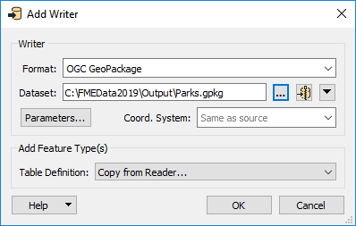
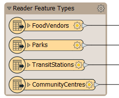
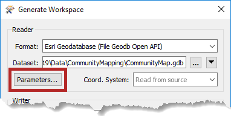
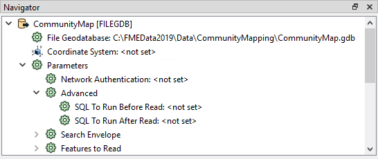
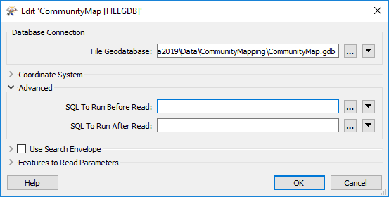

# Multiple Readers and Writers

An FME workspace is not limited to any particular number of readers or writers; it can have any number of readers and writers, use any number of formats, and does not need to contain an equal number of readers and writers.

For example, the Navigator window shows this workspace contains two readers and three writers, of different data types and formats!





It's important to note that readers and writers don’t appear as objects on the Workbench canvas. Their feature types do, but readers and writers do not.

Instead, they are represented by entries in the Navigator window, as in the above screenshot.



## Adding Readers and Writers

Additional readers or writers are added to a translation using the Quick Add menu:

...Or by selecting Readers &gt; Add Reader (Writers &gt; Add Writer) from the menu bar:

This action opens a dialog, similar to the Generate Workspace dialog, in which you can define the parameters for the new reader or writer:

You can add as many readers and writers as you require in this way.



A reader can also be added by dragging a dataset from a file system explorer and dropping it onto the Workbench canvas.



## Removing a Reader or Writer

If a reader or writer is no longer required, then it can be removed using options on the menu bar:

Alternatively, it's possible to right-click a reader/writer in the Navigator window and choose the Delete option.

---

# Multiple Feature Types

Adding new readers and writers lets you read or write a new file. However, sometimes you want to read or write data to a different layer or table within an existing dataset. You can accomplish this by adding feature types. Remember, feature types belong to a reader or a writer.

You can add a feature type to an existing reader or writer by picking Readers > Import Feature Types or Writers > Add Feature Type:

Adding a reader feature type lets you read a new layer or table from the dataset of an existing reader; adding a writer feature type lets you write a new layer or table in the dataset of an existing writer.

## Reader Parameters

As we know, a workspace contains a reader to read a dataset, and each layer in that dataset is shown in the workspace canvas:

To control how that reader operates requires the use of **reader parameters**.

### Finding Reader Parameters

Reader parameters can be located and set by clicking Parameters when a new workspace is being generated:

They can also be found in the Navigator window in Workbench:

Because parameters refer to specific components and characteristics of the related format, readers of different formats have a different set of control parameters.

### Setting Reader Parameters

To edit a parameter in the Navigator window, double-click on any of the parameters. Doing so opens up a dialog where the parameter’s value may be set:



Reader parameters control all feature types in the dataset. Think of it like brewing a pot of coffee. The strength control on the coffee machine affects all the cups that are poured.

Because reader parameters can affect how feature types appear on the canvas, some may <strong>only</strong> be set when adding the reader and cannot be edited later without removing and re-adding the reader.

If you ever add a reader and your feature types or their attributes do not look as you expected, you likely need to make some changes to your reader parameters.

You can also set <strong>writer parameters</strong> the same way. These can control how the output data is formatted or structured. We won't be covering them in this training, however.


