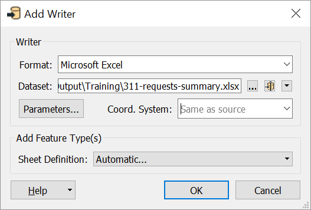
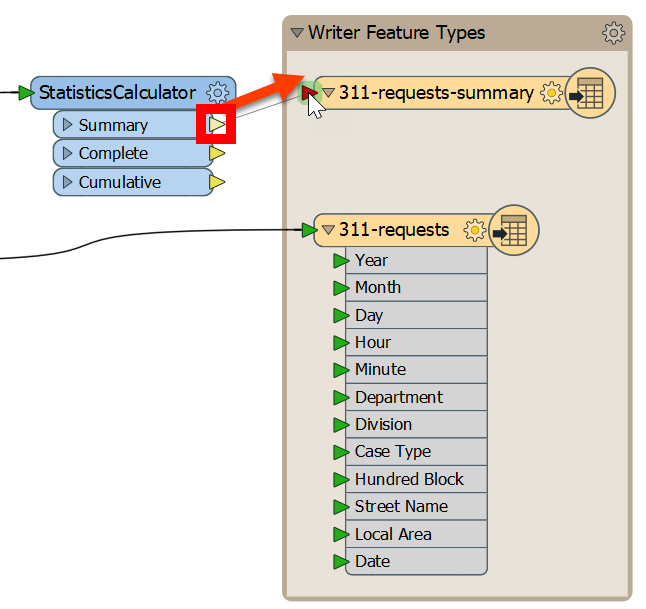



{{ template.exercise(4.1,
               "Multiple Readers, Writers, and Feature Types",
               "3-1-1 case location details (XLS hosted on FTP)",
               "Add additional readers and writers Join features using the FeatureJoiner",
               "Creating more complex FME workflows",
               "C:\\FMEData2019\\Workspaces\\IntroToDesktop\\Ex4.1-Begin.fmw",
               "C:\\FMEData2019\\Workspaces\\IntroToDesktop\\Ex4.1-Complete.fmw")
}}

We have already added the FeatureJoiner, but now we need to add the data to be joined. This task requires adding two readers and one writer to our workspace, which we will do in this exercise.

# 1) Start Workbench

Start Workbench (if necessary) and open the workspace from Exercise 3.3. Alternatively, you can open C:\\FMEData2019\\Workspaces\\IntroToDesktop\\Ex4.1-Begin.fmw.

# 2) Add an Excel Writer

Because your manager wants both the original data with a new schema _and_ the summary table, we need a new feature type for the results of the StatisticsCalculator. Let's write it back to Excel; many FME workflows write back to the same format they read!

Click Writers > Add Writer:

Then fill the Add Writer dialog out:

<table style="border: 0px">

  <tr>
    <td style="font-weight: bold">Format</td>
    <td style="">Microsoft Excel</td>
  </tr>

  <tr>
    <td style="font-weight: bold">Dataset</td>
    <td style="">C:\FMEData2019\Output\Training\311-requests-summary.xlsx</td>
  </tr>

  <tr>
    <td style="font-weight: bold">Sheet Definition</td>
    <td style="">Automatic</td>
  </tr>

</table>

Your dialog should look like this:

Because we want our feature type to copy the attributes coming out of the StatisticsCalculator Summary port, we changed the Sheet Definition method from Manual to Automatic. Feature types using this mode will automatically adjust their schema to match connected features.

Click OK. The Feature Type dialog will open and you will be prompted to enter the feature type name. Type in 311-requests-summary and click OK.

Move this new feature type above the original feature type and connect it to the Summary output port of the StatisticsCalculator:

Now we have a new Excel writer feature type that will write out the results of the StatisticsCalculator. We'll use this in the next exercise.

# 3) Add an HTML Writer

Here is another way to add a reader or writer: click on a blank space on the canvas and type HTML. You can use the mouse or <kbd>&#x2191;</kbd> and <kbd>&#x2193;</kbd> to browse the Quick Add menu. You should see HTML listed as an option under Writers:

Double-click it or press <kbd>Enter</kbd> to add an HTML writer. Use the following parameters:

<table style="border: 0px">

  <tr>
    <td style="font-weight: bold">Writer Format</td>
    <td style="">HTML</td>
  </tr>

  <tr>
    <td style="font-weight: bold">Writer Dataset</td>
    <td style="">C:\FMEData2019\Output\Training\report.html</td>
  </tr>

</table>

Your dialog should look like this:

Click OK to add the writer feature type to your canvas. Click and drag to move it above your 311-requests-summary writer feature type:

# 4) Add a FeatureJoiner

# 3) View FeatureJoiner Parameters

Double-click the FeatureJoiner to open its parameters.

Fill them in like this:

|Parameter|Value|
|-|-|
|Group By|`Department` and `Local Area`|
|Attributes to Analyze|`Case Type`|
|Total Count Attribute|`Cases`|

Additionally, make sure you remove the values from all the other Calculated Attributes (Minimum Attribute, Maximum Attribute, etc.). You can do this by selecting the parameter and deleting it with the <kbd>Delete</kbd> or <kbd>Backspace</kbd> key, or by clicking the drop-down arrow and selecting Clear Value:

When finished, your parameters should look like this:

Click OK and use Run To This on the StatisticsCalculator type to summarize your data.

With these parameters, the transformer will add an attribute, `Cases`, to your data, which sums count of `Case Type`. By setting Group By to `Department` and `Local Area`, we get the total count for each unique combination of department and local area.

# 4) Inspect the Cache

Let's inspect the cache to ensure our data looks correct. Click on the green inspect cache icon on the **Summary** output port of the StatisticsCalculator. The StatisticsCalculator illustrates that transformers vary in the number of input and output ports they have. The Summary port outputs a summary table of the results, resulting in a new stream of features (here, 329), while the Complete and Cumulative ports add the results of the summary to every incoming feature (here, 93,223).

In the Data Inspector, you should see this in the Table View:

This result is a good start, but now that our data's schema has changed, we have different attributes than those on our existing writer feature type. We can add a new writer feature type to write the summary table to. We'll do that in the next section.

REMOVE IMAGES:

To create an HTML report, we will use an HTMLReportGenerator. We want to add it after the StatisticsCalculator, so it uses our summarized data, but we don't want to write out to Excel. So, we'll branch our data stream. Add an HTMLReportGenerator and connect it to the Summary port of the StatisticsCalculator. Then, connect the Output port of the HTMLReportGenerator to the HTML writer feature type:

Double-click the HTMLReportGenerator to open its parameters. First, set the Group By to `Local Area`. Doing so will tell the transformer to create a report for each local area separately.

Next, click where it says Chart (Bar) under Page Contents. This table is used to add elements to the report. From the drop-down, select Header:

Click somewhere under Content Settings to update the parameters for a Header block. For Text, choose the `Local Area` attribute. For Header Level, pick H1. These settings give us a header with the local area name in each section of the report. Your dialog should look like this:

Click the cell under Header in Page Contents and select Table from the drop-down:

Click somewhere under Content Settings to update the parameters for a Table block. Under Column settings, we'll create two columns, one for Department and one for Cases. Notice that if you type "Department" or "Cases" into the Column Name, FME will automatically choose the attribute value instead of a constant. To fix this, right-click the cell and choose Open Text Editor, then type in the name of the column. This method will store a constant value instead of supplying an attribute. Your dialog should look like this:

These settings will make an HTML table listing the number of cases by department.

Finally, let's add a Chart (Bar) to the Page Contents. Fill out the parameters like this:

Click OK. You can Run To This on the HTMLReportGenerator and inspect the cache, but all you will be able to see is the raw HTML in Data Inspector. We need to write this data out to an HTML file to view it in a browser.

----

# 5) Save your Workspace

Don't forgot to save your workspace regularly.

# 6) View Your HTML Report

Click on the HTML feature type and select Run To This. Once it has run, click on the Open Containing Folder button to open C:\FMEData2019\Output\Training\. You should see `reports.html`. Open it with your preferred web browser to inspect the heading, tables, and charts:

Perfect! The planning department can use this report to allocate resources for the next year.



<ul>
  <li>Work with multiple writers</li>
  <li>Generate a report using HTMLReportGenerator</li>
</ul>


