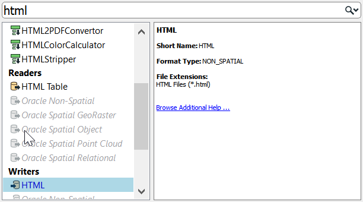
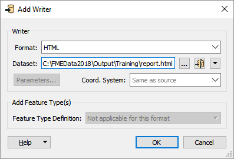
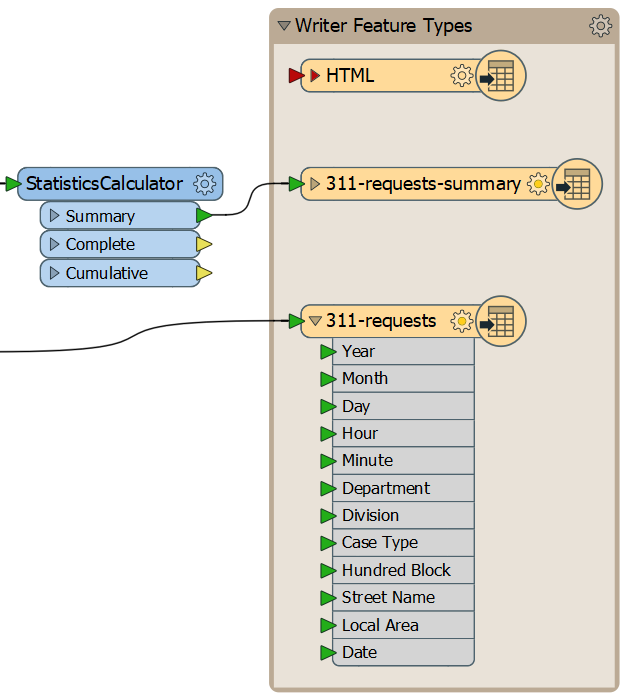
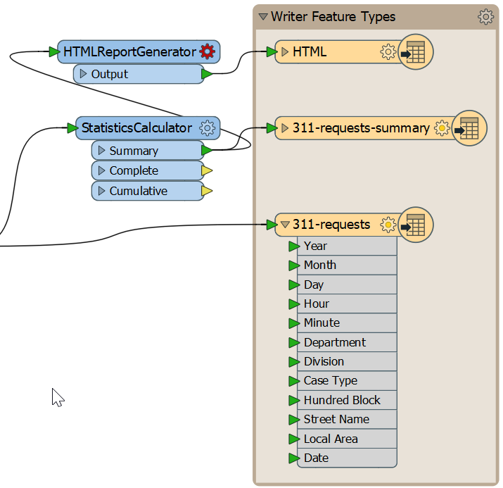
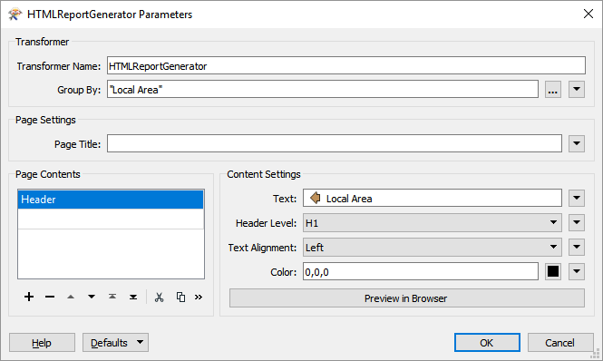
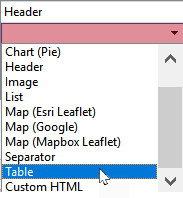



{{ template.exercise(4.1,
               "Multiple Readers, Writers, and Feature Types",
               "3-1-1 case location details (XLS hosted on FTP)",
               "Add additional readers and writers Create a report using the HTMLReportGenerator",
               "Creating more complex FME workflows",
               "C:\\FMEData2018\\Workspaces\\IntroToDesktop\\Ex4.1-Begin.fmw",
               "C:\\FMEData2018\\Workspaces\\IntroToDesktop\\Ex4.1-Complete.fmw")
}}

City planners are undertaking strategic planning and want to know which local planning areas will need additional resources. They have requested reports of the 3-1-1 requests organized by local planning areas with tables and charts.

You have decided to create an HTML report with tables and charts to share with them. This task requires adding an additional writer to our workspace. In this exercise, we will add an HTML writer feature type and a transformer to generate the HTML report.

# 1) Start Workbench

Start Workbench (if necessary) and open the workspace from Exercise 3.3. Alternatively, you can open C:\\FMEData2018\\Workspaces\\IntroToDesktop\\Ex4.1-Begin.fmw.

# 2) Add an HTML Writer

Here is another way to add a reader or writer: click on a blank space on the canvas and type HTML. You can use the mouse or <kbd>&#x2191;</kbd> and <kbd>&#x2193;</kbd> to browse the Quick Add menu. You should see HTML listed as an option under Writers:

Double-click it or press <kbd>Enter</kbd> to add an HTML writer. Use the following parameters:

<table style="border: 0px">

  <tr>
    <td style="font-weight: bold">Writer Format</td>
    <td style="">HTML</td>
  </tr>

  <tr>
    <td style="font-weight: bold">Writer Dataset</td>
    <td style="">C:\FMEData2018\Output\Training\report.html</td>
  </tr>

</table>

Your dialog should look like this:

Click OK to add the writer feature type to your canvas. Click and drag to move it above your 311-requests-summary writer feature type:

# 3) Add an HTMLReportGenerator

To create an HTML report, we will use an HTMLReportGenerator. We want to add it after the StatisticsCalculator, so it uses our summarized data, but we don't want to write out to CSV. So, we'll branch our data stream. Add an HTMLReportGenerator and connect it to the Summary port of the StatisticsCalculator. Then, connect the Output port of the HTMLReportGenerator to the HTML writer feature type:

Double-click the HTMLReportGenerator to open its parameters. First, set the Group By to `Local Area`. Doing so will tell the transformer to create a report for each local area separately.

Next, click where it says Chart (Bar) under Page Contents. This table is used to add elements to the report. From the drop-down, select Header:

Click somewhere under Content Settings to update the parameters for a Header block. For Text, choose the `Local Area` attribute. For Header Level, pick H1. These settings give us a header with the local area name in each section of the report. Your dialog should look like this:

Click the cell under Header in Page Contents and select Table from the drop-down:

Click somewhere under Content Settings to update the parameters for a Table block. Under Column settings, we'll create two columns, one for Department and one for Cases. Notice that if you type "Department" or "Cases" into the Column Name, FME will automatically choose the attribute value instead of a constant. To fix this, right-click the cell and choose Open Text Editor, then type in the name of the column. This method will store a constant value instead of supplying an attribute. Your dialog should look like this:

These settings will make an HTML table listing the number of cases by department.

Finally, let's add a Chart (Bar) to the Page Contents. Fill out the parameters like this:

Click OK. You can Run to This on the HTMLReportGenerator and inspect the cache, but all you will be able to see is the raw HTML in Data Inspector. We need to write this data out to an HTML file to view it in a browser.

# 4) View Your HTML Report

Click on the HTML feature type and select Run to This. Once it has run, click on the Open Containing Folder button to open C:\FMEData2018\Output\Training\. You should see `reports.html`. Open it with your preferred web browser to inspect the heading, tables, and charts:



<ul>
  <li>Work with multiple writers</li>
  <li>Generate a report using HTMLReportGenerator</li>
</ul>


