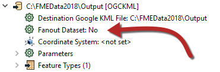

# Fanouts

Fanouts are one of the most powerful pieces of functionality within FME, capable of producing impressive results with minimal effort.

## What is a Fanout?

A **fanout** is a tool applied to a writer in FME. They are a way for the workspace author to write data divided into groups of features in the output dataset.

The groups are defined by either the value of a single attribute or a string constructed from a combination of attributes and fixed strings.

For example, here an author is “fanning-out” a set of data into multiple outputs depending on a feature’s elevation attribute:

Because a fanout occurs as the data is written, it does not require multiple flows of data inside the workspace. Therefore this technique makes it easy to create groups with minimal impact on the workspace canvas.

There are two types of fanout: **Feature Type Fanout** and **Dataset Fanout**.

## Feature Type Fanout

A Feature Type Fanout delivers data to multiple feature types (layers/tables) within a single dataset. Taking the elevation example, here the output is a different feature type for each elevation value:

The result of this fanout is a DXF CAD dataset containing multiple layers of data.

### Setting a Feature Type Fanout

A feature type fanout is defined in the Feature Type parameters by selecting an attribute for the feature type name, like so:

The Feature Type Name then changes to match what is selected:

In this case, each park record with a different neighborhood gets written to a different sheet of the output Excel workbook.

## Dataset Fanout

A Dataset Fanout delivers data to the same feature type, but in multiple datasets. Using the elevation example again, here the output is a different dataset for each elevation value:

The result of this fanout is multiple DXF CAD datasets, each of which has the data from one elevation class.

### Setting a Dataset Fanout

A Dataset Fanout is defined in the Navigator window in Workbench, just below the writer’s dataset parameter:

Double-clicking the Fanout Dataset parameter opens a dialog in which to define the folder to write to and the Fanout Expression to use. It defaults to the original file name:

To achieve a fanout, edit the Fanout Expression to include an attribute name, such as this:

In this case, each different neighborhood produces a separate file of park features.

For more information, see the [FME Help on fanouts](http://docs.safe.com/fme/2019.0/html/FME_Desktop_Documentation/FME_Workbench/Workbench/fanout_about.htm).
