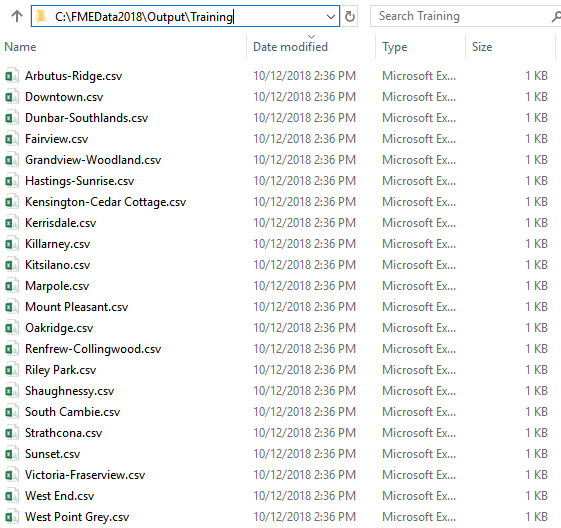



{{ template.exercise(4.2,
               "Debugging with Feature Caching and Partial Runs",
               "3-1-1 case location details (XLS hosted on FTP)",
               "Use partial runs to debug a workspace Add a dataset fanout",
               "Incremental development and best practice",
               "None",
               "None")
}}

- They like the summary table made earlier, but instead of a single CSV, they want a CSV for each planning area to send to local planners

To get the summarized 3-1-1 data into our KML data, we have to join the data streams. We will use the FeatureJoiner transformer to do that. Then we'll use partial runs to test our workspace incrementally. Finally, we'll style our KML using some format-specific transformers.

# 1) Conduct a Dataset Fanout on the CSV Writer Feature Type

As the last step, we will fulfill the planners' request to have a separate CSV file for each local area. We could add an AttributeFilter and 23 distinct CSV feature types, but that would be very inefficient. Instead, we can make use of an FME feature known as fanouts. There are two ways to set up a fanout.

A **feature type fanout** creates multiple _layers_ in the written file based on attribute values:

A **dataset fanout** creates multiple _files_ based on attribute values:

For more information, see the [FME Help on fanouts](http://docs.safe.com/fme/2018.1/html/FME_Desktop_Documentation/FME_Workbench/Workbench/fanout_about.htm).

In this exercise we'll do a dataset fanout. Double-click on the 311-requests-summary writer feature type to open its parameters. Telling FME to write separate files is as simple as setting an attribute to the file name. Click the drop-down arrow next to CSV File Name and select Attribute Value > `Local Area`:

Click OK to make the change and then select the CSV writer feature type and use Run to This to write out the separate files. Click the Open Containing Folder button. Now in C:\\FMEData2018\\Output\\Training you should see 23 separate `.csv` files:

Now we can supply these files to the local planners that need them.

# 2) Use Partial Runs to Test

We can use partial runs to see if our join is working as anticipated. Click the FeatureJoiner to select it, then click the Run to This button. Once the translation has run, click the green magnifying glass icon on Joined to inspect the results of the join:

In Data Inspector you should see the HTML table data joined to each local area polygon, under the `html_content` attribute:

You can expand the contents of a multi-line attribute by clicking the gray ellipsis button next to the cell to view the value in a new window:

This window shows the full value of `html_content` for that local area. When we add this to our KML features, it will display as rendered HTML.

Next, connect the Joined port to your KML writer feature type:

Then, click the local_areas_region writer feature type and select Run to This. Once the translation has run, click the Open Containing Folder button. Open `LocalAreas.kml` in Google Earth. You can click on the local area polygons and view a table summarizing the 3-1-1 requests in that area:

However, there are still some undesired attributes in the bubble.



<ul>
  <li>Use feature caching</li>
  <li>Use partial runs</li>
  <li>Conduct a dataset fanout</li>
</ul>


