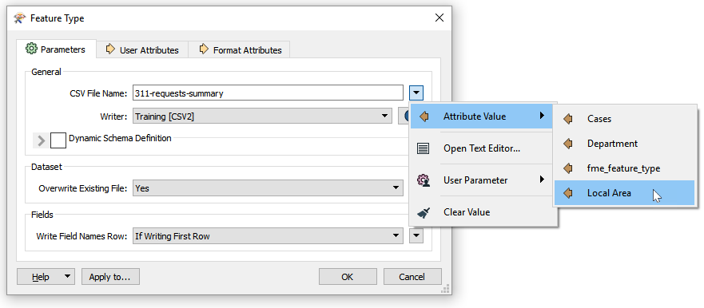



{{ template.exercise(4.2,
               "Adding a Fanout",
               "3-1-1 case location details (XLS hosted on FTP)",
               "Add a fanout",
               "Incremental development and best practice",
               "C:\\FMEData2019\\Workspaces\\IntroToDesktop\\Ex4.2-Begin.fmw",
               "C:\\FMEData2019\\Workspaces\\IntroToDesktop\\Ex4.2-Complete.fmw")
}}

The planning department likes the HTML summary report made earlier. They can use that to show an overview of all the 3-1-1 calls. However, they also want an Excel spreadsheet broken into separate sheets for each planning area to send to local planners. We'll create that for them in this exercise.



Remember that for Excel, FME feature types correspond to Excel workbook sheets (i.e., tables).



# 1) Conduct a Fanout on the Excel Writer Feature Type

We could manually add 23 distinct Excel feature types, but that would be very inefficient. Instead, we can make use of a **feature type fanout**.

Double-click on the 311-requests-summary writer feature type to open its parameters. Telling FME to write separate files is as simple as setting an attribute to the file name. Click the drop-down arrow next to Sheet Name and select Attribute Value > `Local Area`:

Click OK to make the change and then select the Excel writer feature type and use Run To This to write out the separate files.

# 2) Inspect Fanout Results

Click the Open Containing Folder button. Now in C:\\FMEData2019\\Output\\Training\\311-requests-summary.xlsx you should see 23 separate sheets, each with the name of a local area:

Now we can supply these this file to the local planners that need it.



<ul>
  <li>Conduct a feature type fanout</li>
</ul>


