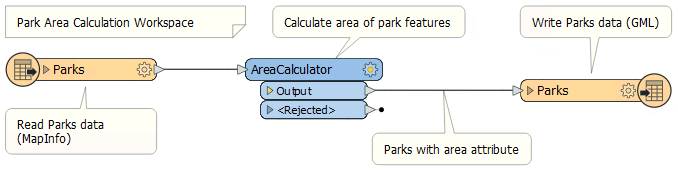
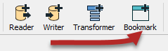
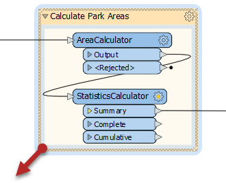
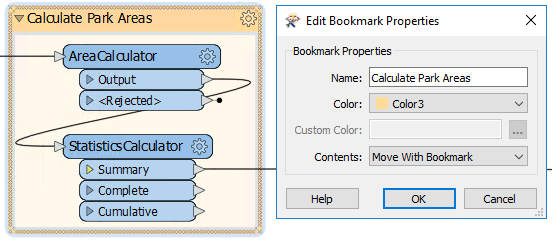

# Best Practice

If a workspace runs to completion and produces the output you want, it can’t be bad, can it? Well, yes it can. It's not enough just to put together a functioning workspace; it's also vital to use FME in a manner that is both efficient and scalable.

## What is Best Practice?

In general terms Best Practice means the best way of doing something; in other words, carrying out a task effectively and efficiently.

Despite the word 'best,' we're not presuming the ideas here will meet every need and occasion. The best description of this concept I've heard – and one that fits well here – is:

> “a very good practice to consider in this situation based on past experience and analysis.”

In this section we'll talk about a small aspect of best practice - using annotations and bookmarks to make your workspace understandable to others. Both of these methods allow you to document **how** and **why** your workspace works as it does. They allow other users - or yourself in the future - to understand what each section does.

## Annotation

Annotation is a crucial method for a clear and comprehensible design.

Annotation helps other users understand what is supposed to be happening in the translation and also supports the creator when returning to a workspace after a long interval.

User annotation is a comment created by the user. It can be connected to a workspace object (transformer or feature type), can be connected to a workspace connection, or can float freely within the workspace.

### Adding Annotation

To create user annotation, right-click the canvas and select Add Annotation, or use the shortcut <kbd>Ctrl</kbd>+<kbd>K</kbd>. You can attach annotation to canvas objects (feature types, transformers, etc.) by doing the above with an object selected.

## Bookmarks

A bookmark, like its real-world namesake, is a means of putting a marker down for easy access.

With FME the bookmark covers an area of the workspace that is usually carrying out a specific task, so a user can pick it out of a broader set of transformers and move to it with relative ease.

### Adding a Bookmark

To add a bookmark, click the Bookmark icon on the toolbar.

Whereas a traditional bookmark marks just a single page in a book, the FME bookmark can cover a wide area of the canvas. Multiple bookmarks can divide a single workspace into different sections.





If you have any objects on the workspace canvas selected when you create a bookmark, the bookmark is automatically expanded to include those items.



### Resizing a Bookmark

To resize a bookmark hover over a corner or edge and then drag the cursor to change the bookmark size or shape.

Double-click on the bookmark cogwheel to edit its properties:

