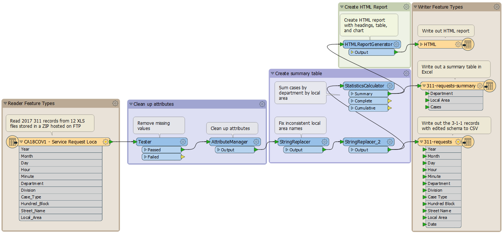



{{ template.exercise("4.2b",
               "Best Practice: Bookmarks and Annotations",
               "3-1-1 case location details (XLS hosted on FTP)",
               "Use bookmarks and annotations to organize your workspace",
               "Following best practice in developing FME workspaces",
               "C:\\FMEData2019\\Workspaces\\IntroToDesktop\\Ex4.2-Begin.fmw",
               "C:\\FMEData2019\\Workspaces\\IntroToDesktop\\Ex4.2-Complete.fmw")
}}

Is your workspace now following best practice for bookmarks and annotation? It should look something like this  (click to expand):

You can also check your workspace against the Complete exercise listed above.



<ul>
  <li>Add, edit, and remove bookmarks</li>
  <li>Add, edit, and remove user annotation</li>
</ul>


